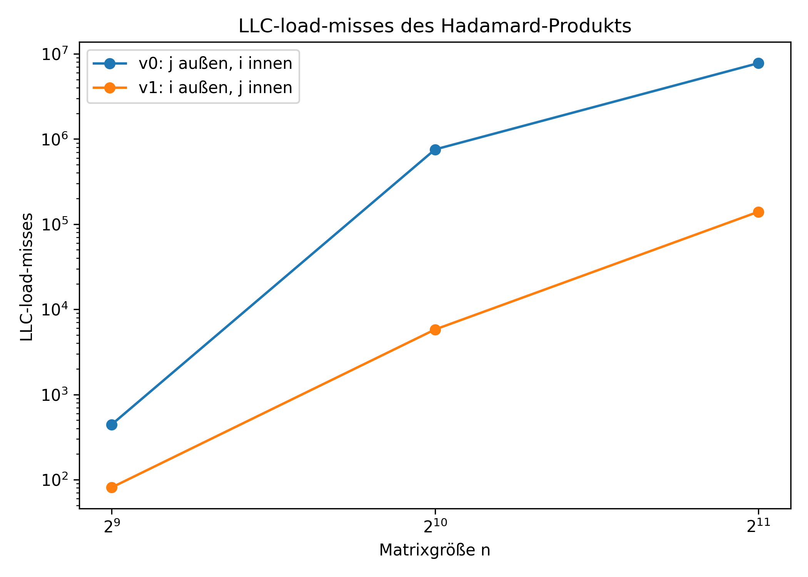
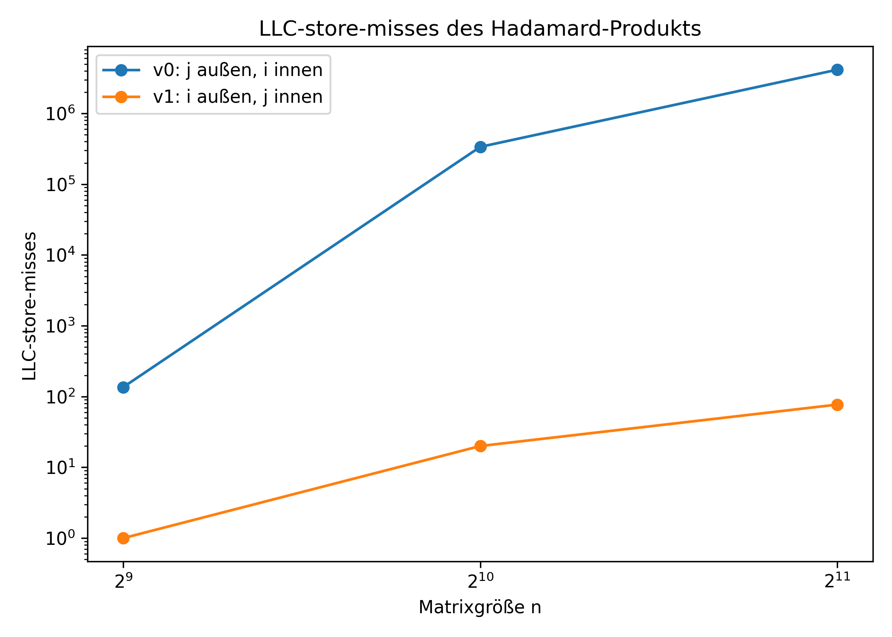
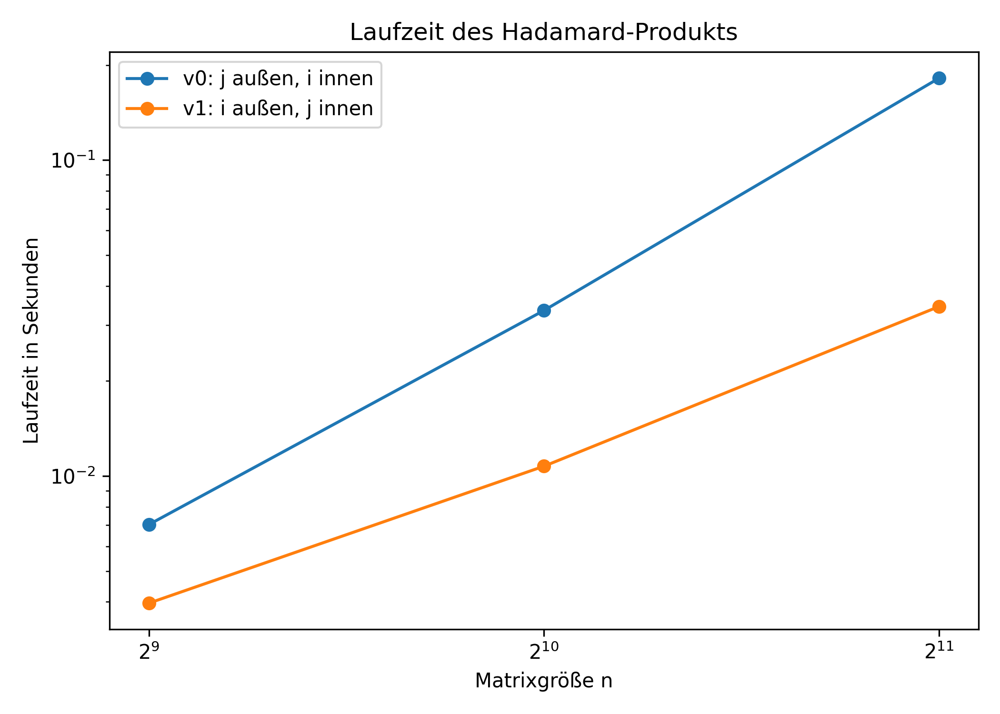

# Assignment 4

## Exercise 1

### 1) Implement a parallelized version of the mandelbrot calculation using `Posix Threads`

Was gleich bleiben konnte:
- Für jedes Pixel (px, py) werden cx und cy auf den Mandelbrot-Bereich abgebildet
- Die while Schleife läuft durch bis der Punkt divergiert oderr MAX_ITER erreicht ist
- Die Iterationszahl wird auf einen Grauwert von 0..255 abgebildet

Was ich erweitert habe:
1. pthread.h wurde eingebunden
2. Eine worker_args_t-Struktur enthält image, start_row und end_row (einfacher um es dem Thread als einem Argument zu übergeben)
3. Die Berechnung habe ich in eine Thread-Funktion verschoben  
    - Früher `calc_mandelbrot(image)`: eine Funktion berechnet das ganze Bild
    - Jetzt `calc_rows(void *arg)`: Jeder Thread berechnet nur einen Teil des Bildes (seine Zeilen start_row bis end_row)
    = Die äußere Schleife über py wird aufgeteilt
4. Die Arbeit wird zeilenweise auf Threads verteilt
    - `start_row = (t * Y) / thread_count`
    - `end_row = ((t + 1) * Y) / thread_count``
    -> Dadurch werden die Y Bildzeilen möglichst gleichmäßig verteilt
    -> Jeder Thread schreibt in einem eigenen Bereich des Arrays - vermeidet Datenkonflikte beim Schreiben
5. Thread-Anzahl als Programmargument eingelesen und durch parse_thread_count(...) geprüft
6. Dynamische Arrays für Threads und deren Argumente (`pthread_t *threads` und `worker_args_t *args`)
7. Threads werden gestartet und wieder eingesammelt
    - pthread_create startet parallele Ausführung
    - pthread_join stellt sicher, dass das Hauptprogramm erst weitermacht, wenn alle Threads fertig sind

Der Vorteil dieser Lösung ist, dass keine Threads dieselben Pixel schreiben. Jeder Thread schreibt nur in seine eigenen Zeilen, konkret in `args->image[py][px]`. Deshalb braucht man keine Locks oder andere Synchronisation während der Berechnung. Synchronisiert werden die Threads erst am Ende über `pthread_join(...)`, wenn das Hauptprogramm wartet, bis alle Threads fertig sind.

Diese Aufteilung ist außerdem einfach und effizient, weil die große Rechenarbeit in der doppelten Schleife über `py` und `px` und vor allem in der inneren `while`-Schleife steckt. Genau diese Arbeit wird auf mehrere Threads verteilt, während der restliche Programmteil nur noch Thread-Erzeugung, Warten und das Schreiben des PNGs umfasst.

### 2) Benchmark-Ergebnisse für 1, 2, 4, 8 und 12 Threads

Für jede Thread-Anzahl wurden 10 Läufe ausgeführt. Ausgewertet wurden die `real`-Zeiten aus `results/time_results.csv`.

| Threads | Mittlere Laufzeit [s] | Median [s] | Standardabweichung [s] | Speedup gegenüber 1 Thread | Effizienz |
| ---: | ---: | ---: | ---: | ---: | ---: |
| 1 | 9.810 | 9.815 | 0.023 | 1.000 | 1.000 |
| 2 | 4.928 | 4.930 | 0.004 | 1.991 | 0.995 |
| 4 | 4.121 | 4.120 | 0.009 | 2.380 | 0.595 |
| 8 | 2.542 | 2.540 | 0.004 | 3.859 | 0.482 |
| 12 | 1.796 | 1.790 | 0.010 | 5.462 | 0.455 |

- Die mittlere Laufzeit ist der Durchschnitt der 10 Messungen für eine feste Thread-Anzahl
- Der Median ist der mittlere Wert der sortierten Messreihe. Er ist nützlich, weil einzelne Ausreißer den Median weniger stark beeinflussen als den Durchschnitt
- Die Standardabweichung beschreibt, wie stark die einzelnen Messungen um den Mittelwert streuen
- Der Speedup gibt an, um welchen Faktor die parallele Version schneller ist als die Version mit 1 Thread
- Die Effizienz berechnet sich als `Speedup / Thread-Anzahl`. Sie zeigt, wie gut die zusätzlich eingesetzten Threads tatsächlich ausgenutzt werden

Beispiel für die Berechnung des Speedups bei 2 Threads:

- mittlere Laufzeit bei 1 Thread: `9.810 s`
- mittlere Laufzeit bei 2 Threads: `4.928 s`
- Speedup: `9.810 / 4.928 = 1.991`

Das ist fast der ideale Wert 2. Die Parallelisierung funktioniert hier also sehr gut.

Beispiel für die Berechnung des Speedups bei 12 Threads:

- mittlere Laufzeit bei 1 Thread: `9.810 s`
- mittlere Laufzeit bei 12 Threads: `1.796 s`
- Speedup: `9.810 / 1.796 = 5.462`

Beispiel für die Effizienz bei 12 Threads:

- Speedup bei 12 Threads: `5.462`
- Effizienz: `5.462 / 12 = 0.455`

Das bedeutet: Mit 12 Threads läuft das Programm etwa 5.46-mal schneller als mit einem Thread, aber die 12 Threads werden nicht ideal ausgenutzt. Bei perfekter linearer Skalierung läge der Speedup bei 12 und die Effizienz bei 1.0.

Inhaltlich passen die Ergebnisse gut zum Aufbau des Programms. Von 1 auf 2 Threads halbiert sich die Laufzeit fast von `9.810 s` auf `4.928 s`. Das ist plausibel, weil die eigentliche Rechenarbeit komplett unabhängig pro Pixel erfolgt. Solange nur wenige Threads gleichzeitig arbeiten, ist der Parallelisierungsaufwand im Verhältnis zur Rechenzeit klein.

Ab 4 Threads sieht man aber, dass die Skalierung schwächer wird. Die Laufzeit sinkt zwar weiter auf `4.121 s`, `2.542 s` und `1.796 s`, aber der zusätzliche Gewinn pro weiterem Thread wird kleiner. Ursachen:

- Die Threads arbeiten unabhängig, greifen aber alle auf denselben großen Bildpuffer `image[Y][X]` zu
- Jeder Thread führt dieselben rechenintensiven Schleifen aus, konkurriert dabei aber mit den anderen Threads um gemeinsame Hardware-Ressourcen wie Caches, Speicherbandbreite und Recheneinheiten
- Das Starten und Einsammeln der Threads kostet ebenfalls Zeit, die in der seriellen Version nicht anfällt

Ein weiterer wichtiger Punkt ist die Lastverteilung. Im Programm werden die Zeilen statisch und nach Anzahl gleichmäßig aufgeteilt. Formal ist das fair, aber nicht jede Bildzeile ist gleich teuer. In Bereichen der Mandelbrot-Menge läuft die `while`-Schleife unter Umständen viel länger als in Bereichen, in denen die Punkte schnell divergieren. Dadurch kann es passieren, dass einige Threads früher fertig sind, während andere noch an aufwendigeren Zeilen arbeiten. Die Aufteilung ist also einfach und korrekt, aber nicht perfekt lastbalanciert.

- 1 Thread: `9.810 s`
- 12 Threads: `1.796 s`

### 3) Visualisierung der Messwerte

#### Laufzeit in Abhängigkeit von der Thread-Anzahl


Die erste Grafik zeigt die einzelnen Messläufe, den Mittelwert und die Streuung. Man erkennt, dass die Punkte für jede Thread-Anzahl sehr eng beieinander liegen. Das bedeutet, dass die Messungen stabil und gut reproduzierbar sind. Besonders wichtig ist dabei die kleine Standardabweichung: Die Unterschiede zwischen den 10 Läufen sind also gering und die Mittelwerte damit aussagekräftig.

Außerdem sieht man an der Kurve sehr gut das typische Verhalten einer Parallelisierung. Am Anfang fällt die Laufzeit stark ab, später wird die Kurve flacher. Genau daran erkennt man, dass zusätzliche Threads zwar weiterhelfen, aber nicht mehr proportional denselben Nutzen bringen.

#### Speedup und Effizienz


Die zweite Grafik macht noch deutlicher, wie weit das reale Verhalten vom idealen linearen Verlauf entfernt ist. Der Speedup steigt kontinuierlich an, bleibt aber klar unter der Idealgeraden. Das heißt: Die Parallelisierung funktioniert, aber nicht perfekt.

Die Effizienz sinkt von `0.995` bei 2 Threads auf `0.455` bei 12 Threads. Anders formuliert: Bei 12 Threads kommt weniger als die Hälfte der theoretisch möglichen Zusatzleistung tatsächlich an. Das ist für diese Implementierung nicht überraschend. Der Code ist gut parallelisierbar, aber praktische Grenzen wie Thread-Overhead, gemeinsame Nutzung von Speicherhierarchie und leichte Ungleichgewichte in der Arbeitsverteilung verhindern eine perfekte Skalierung.


## Exercise 2


### 1) Anzahl der Daten-Cache-Read-Misses 

Wichtige Annahmen:
- Matrizen sind $n \times n$
- Elementtyp ist int32_t => 4 Byte pro Element
- Speicherung in row-major order *(Elemente liegen in einer Zeile zusammenhängen im Speicher)*
- Cache-Line-Größe sei s in Byte

Also pro Cache-line $L = \frac{s}{4}$ Matrixelemente.

- Matrizen sind viel größer als der Cache: $n >> s$
- Cache ist 8-way set-associative


Note: Cache-Lokalität hängt davon ab, ob man **zeilenweise** oder **spaltenweise** durchläuft

#### Variante A
```C
for (size_t j = 0; j < n; ++j) {
    for (size_t i = 0; i < n; ++i) {
        c[i][j] = a[i][j] * b[i][j];
    }
}
```
Hier läuft die innere Schleife über `i` \
Für festes `j` werden gelesen:\
a[0][j]\
a[1][j]\
a[2][j]\
...\
a[n-1][j]\
Das ist **spaltenweiser Zugriff**.

Das ist schlecht, weil bei row-major leigen die Elemente einer Zeile zusammenhängend, nicht die einer Spalte.

Somit ist der Abstand zischen zwei Zugriffen:

$a[i + 1][j] - a[i][j] = n\ Integer = 4n\  Byte$ \
-> viel größer als eine Cache-Line

Also:
- jeder Zugriff spring in eine andere Cache-Line
- gibt praktisch keine räumliche Lokalität


Man könnte denken:
- `a[i][j]` und `a[i][j+1]` liegen vielleicht in derselben Cache-Line \
Stimmt zwar im Speicher, aber: 
- zwischen `a[i][j]` und `a[i][j+1]` wird erst die ganze Spalte durchlaufen
- dazwischen werden sehr viele andere Cache-Lines von `a`,`b` und auch `c` benutzt
- wegen großer Matrizen und nur 8-facher Assoziativität bleibt die alte Line nicht im Cache \
Deshalb kann man unter der Annahme $n >> s$ annehmen:

**Jeder Lesezugriff auf `a` und `b` ist ein Miss**

##### Anzahl der Misses
Es gibt insgesamt
- $n^2$ Lesezugriffe auf a
- $n^2$ Lesezugriffe auf b

Also

$f_1(n,s) = n^2 + n^2 = 2n^2$

#### Variante B
```C
for (size_t i = 0; i < n; ++i) {
    for (size_t j = 0; j < n; ++j) {
        c[i][j] = a[i][j] * b[i][j];
    }
}
```
Hier läuft die innere Schleife über `j` \
Für festes `i` werden nacheinander gelesen:\
a[i][0], a[i][1], a[i][2], ..., a[i][n-1]\

Das ist optimal für row-major, weil die Elemente einer Zeile im Speicher direkt hintereinander liegen.

##### Cache-Verhalten pro Zeile
eine Cache-Line enthälte $L = \frac{s}{4} Integer$ \
Beim Durchlauf einer Zeile gilt:
- das erste Element einer Cache-Line verursacht einen **Miss**
- die restlichen $L-1$ Elemente derselben Line sind **Hits**

Also braucht eine Zeile mit $n$ Elementen: $\lceil \frac{n}{L} \rceil$ Cache-Lines -> gilt für a und b.

Also misses pro Zeile: \
$2 \times \lceil \frac{n}{L} \rceil$

Da es n Zeilen gibt: \
$f_2(n,s)= 2n \times \lceil \frac{n}{L} \rceil$ mit $L = \frac{s}{4}$

Somit ist die Formel:
$f_2(n,s)= 2n \times \lceil \frac{4n}{s} \rceil$ 

Falls $s$ ein Vielfaches von 4 ist und $n$ passend aufgeht, näherungsweise:

$f_2(n,s)\approx \frac{8n^2}{s}$ 

Note: 8-way-Set-Associativity spielt hier kaum eine Rolle, weil
- bei der guten Variante (B) werden Cache-Lines direkt nacheinander ausgenutzt
- bei der schlechten (A) ist der Abstand der Wiederverwendung so groß, dass die line vorher verdrängt wird
- 8-way hilft nur, wenn wenige konkurrierende lines pro Set gleichzeitg aktiv sind

Also ist die Speicherzugriffsreihenfolge entscheidend und nicht primär die genaue Zahl der Wege.

### 2) C-Implementierung beider Versionen
Die Matrizen werden als eindimensionale Arrays im row-major Format gespeichert. Der Zugriff erfolgt über die Indexberechnung $i \times n + j$. Beide Implementierungen unterscheiden sich nur in der Reihenfolge der Schleifen, wodurch der Einfluss der Speicherzugriffsreihenfolge auf das Cacheverhalten gezielt untersucht werden kann. [Code ansehen](./hadamard/hadamard.c)

### 3) LCC3 + Analyse mit cachegrind und perf
#### Beobachtungen

Beide Implementierungen liefern für alle getesteten Matrixgrößen identische Checksummen. Damit ist sichergestellt, dass beide Varianten funktional korrekt sind.

#### Ergebnisse mit perf

Die mit `perf` gemessenen LLC-load-misses und LLC-store-misses zeigen einen deutlichen Unterschied zwischen den beiden Varianten:

##### Für n = 512
- Variante 0: 444 LLC-load-misses, 136 LLC-store-misses  
- Variante 1: 81 LLC-load-misses, 1 LLC-store-misses  

##### Für n = 1024
- Variante 0: 753962 LLC-load-misses, 336807 LLC-store-misses  
- Variante 1: 5799 LLC-load-misses, 20 LLC-store-misses  

##### Für n = 2048
- Variante 0: 7780523 LLC-load-misses, 4146135 LLC-store-misses  
- Variante 1: 139804 LLC-load-misses, 77 LLC-store-misses 

#### Visualisierung der Ergebnisse

#### LLC Load Misses


#### LLC Store Misses


#### Laufzeit


Es ist klar erkennbar, dass die Variante mit Schleifenreihenfolge **j außen, i innen** deutlich mehr Cache-Misses verursacht als die Variante **i außen, j innen**. Dieser Unterschied wächst stark mit der Matrixgröße.

Auch die Laufzeitmessungen zeigen dasselbe Verhalten: Die zeilenweise Implementierung ist deutlich schneller als die spaltenweise.

#### Ergebnisse mit cachegrind

Bei der Ausführung von `cachegrind` wurden im vorliegenden Output hauptsächlich die `I refs` (Instruction References) ausgegeben. Diese messen die Anzahl der ausgeführten Instruktionszugriffe und sind für die Analyse des Daten-Cache-Verhaltens nur eingeschränkt geeignet.

Für eine direkte Validierung der theoretischen Analyse wären insbesondere Werte wie `D1 misses` oder `LLd misses` notwendig gewesen. Diese sind im aktuellen Output jedoch nicht enthalten, weshalb cachegrind hier keine detaillierte Aussage über die Daten-Cache-Misses erlaubt.

#### Validierung der Theorie

Die theoretische Analyse sagt voraus, dass die spaltenweise Implementierung (Variante 0) deutlich mehr Cache-Misses verursacht als die zeilenweise Implementierung (Variante 1), da sie nicht zur row-major Speicheranordnung passt.

Die Messergebnisse mit `perf` bestätigen diese Erwartung eindeutig:

- Variante 0 zeigt eine sehr hohe Anzahl an Cache-Misses, die mit wachsendem n stark zunimmt.  
- Variante 1 weist deutlich weniger Cache-Misses auf und skaliert wesentlich besser.  

Damit stimmen die experimentellen Ergebnisse qualitativ sehr gut mit der theoretischen Analyse überein.

#### Vergleich von cachegrind und perf

`perf` misst reale Hardware-Ereignisse und liefert direkt die Anzahl der LLC-load-misses und LLC-store-misses. Diese Werte sind sehr gut geeignet, um das Cache-Verhalten der beiden Implementierungen zu vergleichen.

`cachegrind` hingegen ist ein Simulator, der detaillierte Cache-Informationen liefern kann. In der vorliegenden Messung wurden jedoch nur Instruktionsreferenzen (`I refs`) ausgegeben, sodass keine direkte Analyse der Daten-Cache-Misses möglich war.

Trotzdem liefern beide Tools konsistente Hinweise:

- `perf` zeigt klar den Unterschied im Cache-Verhalten.  
- `cachegrind` zeigt, dass sich auch die Anzahl der Instruktionszugriffe zwischen den Varianten unterscheidet, allerdings ist dieser Effekt deutlich geringer als der Unterschied bei den Cache-Misses.  

#### Fazit

Die Ergebnisse zeigen eindeutig, dass die Schleifenreihenfolge einen großen Einfluss auf das Cache-Verhalten hat. Die zeilenweise Implementierung (**i außen, j innen**) ist cache-freundlich und deutlich effizienter, während die spaltenweise Implementierung (**j außen, i innen**) viele Cache-Misses verursacht.

Die Messungen mit `perf` bestätigen die theoretischen Erwartungen klar. `cachegrind` wurde ebenfalls verwendet, konnte in dieser Messung jedoch nur eingeschränkt zur Validierung beitragen, da die relevanten Daten-Cache-Metriken nicht im Output enthalten waren.

#### Nachtrag zu Cachegrind
## Nachtrag zur Cachegrind-Auswertung

Nach der Abgabe habe ich mich noch einmal genauer mit den von `cachegrind` erzeugten Dateien beschäftigt und dabei den Grund gefunden, warum in der ersten Auswertung nur eingeschränkt verwertbare Daten sichtbar waren.

Im ersten Schritt wurde `valgrind --tool=cachegrind` wie in der Aufgabenstellung verwendet, jedoch wurden die relevanten Daten-Cache-Metriken nicht in der geeigneten Form ausgewertet. In der zunächst betrachteten Datei war lediglich der Event-Typ `Ir` sichtbar. `Ir` steht für *Instruction references*, also Instruktionszugriffe. Damit lässt sich hauptsächlich das Instruktionsverhalten analysieren, nicht jedoch das Daten-Cache-Verhalten der Matrizen.

Bei der erneuten Auswertung zeigte sich, dass `cachegrind` die benötigten Daten tatsächlich liefert, wenn der vollständige Bericht betrachtet wird. In den später ausgewerteten Ausgaben waren folgende Kennzahlen enthalten:

- `D refs`: gesamte Datenzugriffe  
  - aufgeteilt in `rd` (*reads*) und `wr` (*writes*)
- `D1 misses`: Misses im L1-Datencache  
  - ebenfalls getrennt nach Lese- und Schreibmisses
- `LLd misses`: Misses im Last-Level-Datencache
- `LL refs`: alle Zugriffe, die bis zum Last-Level-Cache weitergereicht wurden
- `LL misses`: Misses auch im Last-Level-Cache

Für die Aufgabenstellung sind insbesondere die **Read-Misses** relevant. Daher sind vor allem die Werte `D1 misses (rd)` sowie ergänzend `LLd misses (rd)` von Interesse.

### Analyse der Cachegrind-Ergebnisse

Die neuen `cachegrind`-Ausgaben bestätigen die theoretische Erwartung deutlich. Für alle getesteten Matrixgrößen erzeugt die Variante mit Schleifenreihenfolge **`j` außen, `i` innen** wesentlich mehr Daten-Read-Misses als die Variante **`i` außen, `j` innen`**.

Beispielsweise für `n = 1024` ergeben sich im L1-Datencache:

- Variante 0 (`j` außen, `i` innen): **2,165,384 Read Misses**
- Variante 1 (`i` außen, `j` innen): **199,289 Read Misses**

Für `n = 2048` ist der Unterschied noch deutlicher:

- Variante 0: **8,653,464 Read Misses**
- Variante 1: **789,113 Read Misses**

Damit verursacht die spaltenweise Variante ungefähr eine Größenordnung mehr Lese-Misses als die zeilenweise Variante.

### Interpretation

Der Grund liegt in der Speicheranordnung der Matrizen. Diese sind in **row-major order** gespeichert, also zeilenweise im Speicher abgelegt. Die Variante mit `i` außen und `j` innen greift entlang zusammenhängender Speicherbereiche zu und nutzt die räumliche Lokalität des Caches optimal aus. Mehrere aufeinanderfolgende Elemente befinden sich innerhalb derselben Cache-Line.

Die Variante mit `j` außen und `i` innen greift hingegen spaltenweise auf eine row-major gespeicherte Matrix zu. Dabei springt der Zugriff jeweils um eine ganze Zeile weiter. Der Abstand zwischen zwei Zugriffen beträgt `n * sizeof(int32_t)` Byte, also `n * 4` Byte. Für große Matrizen ist dieser Abstand deutlich größer als eine Cache-Line, sodass viele geladene Cache-Lines kaum wiederverwendet werden. Dadurch entstehen deutlich mehr Cache-Misses.

### Vergleich mit perf

Auch die `perf`-Messungen zeigen denselben Trend. Die absoluten Werte unterscheiden sich von `cachegrind`, da `perf` reale Hardware-Ereignisse im Last-Level-Cache misst, während `cachegrind` eine Simulation verwendet. Qualitativ stimmen beide Werkzeuge jedoch überein: Die zeilenweise Implementierung ist deutlich cache-freundlicher als die spaltenweise.

### Fazit

Die vollständige Auswertung von `cachegrind` bestätigt die theoretische Analyse zusätzlich. Der anfängliche Eindruck, dass `cachegrind` keine brauchbaren Daten liefere, lag nicht daran, dass das Tool ungeeignet wäre, sondern daran, dass zunächst nur ein unvollständig ausgewerteter Ausschnitt betrachtet wurde. Mit den vollständigen `D1`- und `LLd`-Metriken zeigt `cachegrind` denselben klaren Unterschied zwischen beiden Implementierungen wie `perf`.