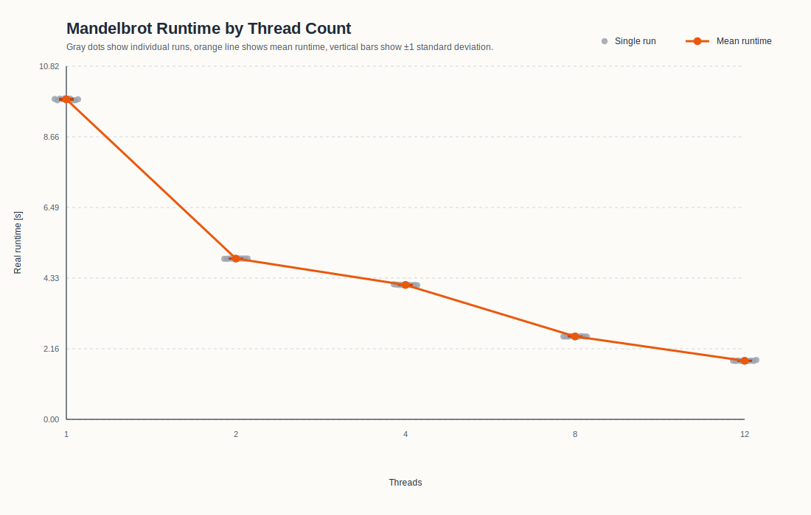
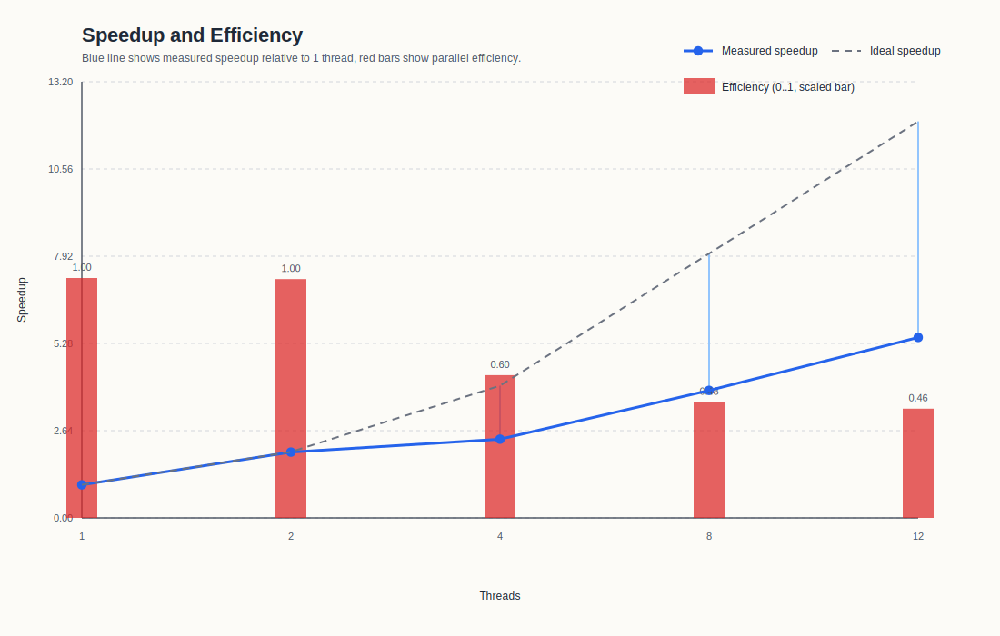

# Assignment 4

## Exercise 1

### 1) Implement a parallelized version of the mandelbrot calculation using `Posix Threads`

Was gleich bleiben konnte:
- Für jedes Pixel (px, py) werden cx und cy auf den Mandelbrot-Bereich abgebildet
- Die while Schleife läuft durch bis der Punkt divergiert oderr MAX_ITER erreicht ist
- Die Iterationszahl wird auf einen Grauwert von 0..255 abgebildet

Was ich erweitert habe:
1. pthread.h wurde eingebunden
2. Eine worker_args_t-Struktur enthält image, start_row und end_row (einfacher um es dem Thread als einem Argument zu übergeben)
3. Die Berechnung habe ich in eine Thread-Funktion verschoben  
    - Früher `calc_mandelbrot(image)`: eine Funktion berechnet das ganze Bild
    - Jetzt `calc_rows(void *arg)`: Jeder Thread berechnet nur einen Teil des Bildes (seine Zeilen start_row bis end_row)
    = Die äußere Schleife über py wird aufgeteilt
4. Die Arbeit wird zeilenweise auf Threads verteilt
    - `start_row = (t * Y) / thread_count`
    - `end_row = ((t + 1) * Y) / thread_count``
    -> Dadurch werden die Y Bildzeilen möglichst gleichmäßig verteilt
    -> Jeder Thread schreibt in einem eigenen Bereich des Arrays - vermeidet Datenkonflikte beim Schreiben
5. Thread-Anzahl als Programmargument eingelesen und durch parse_thread_count(...) geprüft
6. Dynamische Arrays für Threads und deren Argumente (`pthread_t *threads` und `worker_args_t *args`)
7. Threads werden gestartet und wieder eingesammelt
    - pthread_create startet parallele Ausführung
    - pthread_join stellt sicher, dass das Hauptprogramm erst weitermacht, wenn alle Threads fertig sind

Der Vorteil dieser Lösung ist, dass keine Threads dieselben Pixel schreiben. Jeder Thread schreibt nur in seine eigenen Zeilen, konkret in `args->image[py][px]`. Deshalb braucht man keine Locks oder andere Synchronisation während der Berechnung. Synchronisiert werden die Threads erst am Ende über `pthread_join(...)`, wenn das Hauptprogramm wartet, bis alle Threads fertig sind.

Diese Aufteilung ist außerdem einfach und effizient, weil die große Rechenarbeit in der doppelten Schleife über `py` und `px` und vor allem in der inneren `while`-Schleife steckt. Genau diese Arbeit wird auf mehrere Threads verteilt, während der restliche Programmteil nur noch Thread-Erzeugung, Warten und das Schreiben des PNGs umfasst.

### 2) Benchmark-Ergebnisse für 1, 2, 4, 8 und 12 Threads

Für jede Thread-Anzahl wurden 10 Läufe ausgeführt. Ausgewertet wurden die `real`-Zeiten aus `results/time_results.csv`.

| Threads | Mittlere Laufzeit [s] | Median [s] | Standardabweichung [s] | Speedup gegenüber 1 Thread | Effizienz |
| ---: | ---: | ---: | ---: | ---: | ---: |
| 1 | 9.810 | 9.815 | 0.023 | 1.000 | 1.000 |
| 2 | 4.928 | 4.930 | 0.004 | 1.991 | 0.995 |
| 4 | 4.121 | 4.120 | 0.009 | 2.380 | 0.595 |
| 8 | 2.542 | 2.540 | 0.004 | 3.859 | 0.482 |
| 12 | 1.796 | 1.790 | 0.010 | 5.462 | 0.455 |

- Die mittlere Laufzeit ist der Durchschnitt der 10 Messungen für eine feste Thread-Anzahl.
- Der Median ist der mittlere Wert der sortierten Messreihe. Er ist nützlich, weil einzelne Ausreißer den Median weniger stark beeinflussen als den Durchschnitt.
- Die Standardabweichung beschreibt, wie stark die einzelnen Messungen um den Mittelwert streuen.
- Der Speedup gibt an, um welchen Faktor die parallele Version schneller ist als die Version mit 1 Thread.
- Die Effizienz berechnet sich als `Speedup / Thread-Anzahl`. Sie zeigt, wie gut die zusätzlich eingesetzten Threads tatsächlich ausgenutzt werden.

Beispiel für die Berechnung des Speedups bei 2 Threads:

- mittlere Laufzeit bei 1 Thread: `9.810 s`
- mittlere Laufzeit bei 2 Threads: `4.928 s`
- Speedup: `9.810 / 4.928 = 1.991`

Das ist fast der ideale Wert 2. Die Parallelisierung funktioniert hier also sehr gut.

Beispiel für die Berechnung des Speedups bei 12 Threads:

- mittlere Laufzeit bei 1 Thread: `9.810 s`
- mittlere Laufzeit bei 12 Threads: `1.796 s`
- Speedup: `9.810 / 1.796 = 5.462`

Beispiel für die Effizienz bei 12 Threads:

- Speedup bei 12 Threads: `5.462`
- Effizienz: `5.462 / 12 = 0.455`

Das bedeutet: Mit 12 Threads läuft das Programm etwa 5.46-mal schneller als mit einem Thread, aber die 12 Threads werden nicht ideal ausgenutzt. Bei perfekter linearer Skalierung läge der Speedup bei 12 und die Effizienz bei 1.0.

Inhaltlich passen die Ergebnisse gut zum Aufbau des Programms. Von 1 auf 2 Threads halbiert sich die Laufzeit fast von `9.810 s` auf `4.928 s`. Das ist plausibel, weil die eigentliche Rechenarbeit komplett unabhängig pro Pixel erfolgt. Solange nur wenige Threads gleichzeitig arbeiten, ist der Parallelisierungsaufwand im Verhältnis zur Rechenzeit klein.

Ab 4 Threads sieht man aber, dass die Skalierung schwächer wird. Die Laufzeit sinkt zwar weiter auf `4.121 s`, `2.542 s` und `1.796 s`, aber der zusätzliche Gewinn pro weiterem Thread wird kleiner. Ursachen:

- Die Threads arbeiten unabhängig, greifen aber alle auf denselben großen Bildpuffer `image[Y][X]` zu
- Jeder Thread führt dieselben rechenintensiven Schleifen aus, konkurriert dabei aber mit den anderen Threads um gemeinsame Hardware-Ressourcen wie Caches, Speicherbandbreite und Recheneinheiten
- Das Starten und Einsammeln der Threads kostet ebenfalls Zeit, die in der seriellen Version nicht anfällt

Ein weiterer wichtiger Punkt ist die Lastverteilung. Im Programm werden die Zeilen statisch und nach Anzahl gleichmäßig aufgeteilt. Formal ist das fair, aber nicht jede Bildzeile ist gleich teuer. In Bereichen der Mandelbrot-Menge läuft die `while`-Schleife unter Umständen viel länger als in Bereichen, in denen die Punkte schnell divergieren. Dadurch kann es passieren, dass einige Threads früher fertig sind, während andere noch an aufwendigeren Zeilen arbeiten. Die Aufteilung ist also einfach und korrekt, aber nicht perfekt lastbalanciert.

- 1 Thread: `9.810 s`
- 12 Threads: `1.796 s`

### 3) Visualisierung der Messwerte

#### Laufzeit in Abhängigkeit von der Thread-Anzahl

Die erste Grafik zeigt die einzelnen Messläufe, den Mittelwert und die Streuung. Man erkennt, dass die Punkte für jede Thread-Anzahl sehr eng beieinander liegen. Das bedeutet, dass die Messungen stabil und gut reproduzierbar sind. Besonders wichtig ist dabei die kleine Standardabweichung: Die Unterschiede zwischen den 10 Läufen sind also gering und die Mittelwerte damit aussagekräftig.

Außerdem sieht man an der Kurve sehr gut das typische Verhalten einer Parallelisierung. Am Anfang fällt die Laufzeit stark ab, später wird die Kurve flacher. Genau daran erkennt man, dass zusätzliche Threads zwar weiterhelfen, aber nicht mehr proportional denselben Nutzen bringen.

#### Speedup und Effizienz

Die zweite Grafik macht noch deutlicher, wie weit das reale Verhalten vom idealen linearen Verlauf entfernt ist. Der Speedup steigt kontinuierlich an, bleibt aber klar unter der Idealgeraden. Das heißt: Die Parallelisierung funktioniert, aber nicht perfekt.

Die Effizienz sinkt von `0.995` bei 2 Threads auf `0.455` bei 12 Threads. Anders formuliert: Bei 12 Threads kommt weniger als die Hälfte der theoretisch möglichen Zusatzleistung tatsächlich an. Das ist für diese Implementierung nicht überraschend. Der Code ist gut parallelisierbar, aber praktische Grenzen wie Thread-Overhead, gemeinsame Nutzung von Speicherhierarchie und leichte Ungleichgewichte in der Arbeitsverteilung verhindern eine perfekte Skalierung.