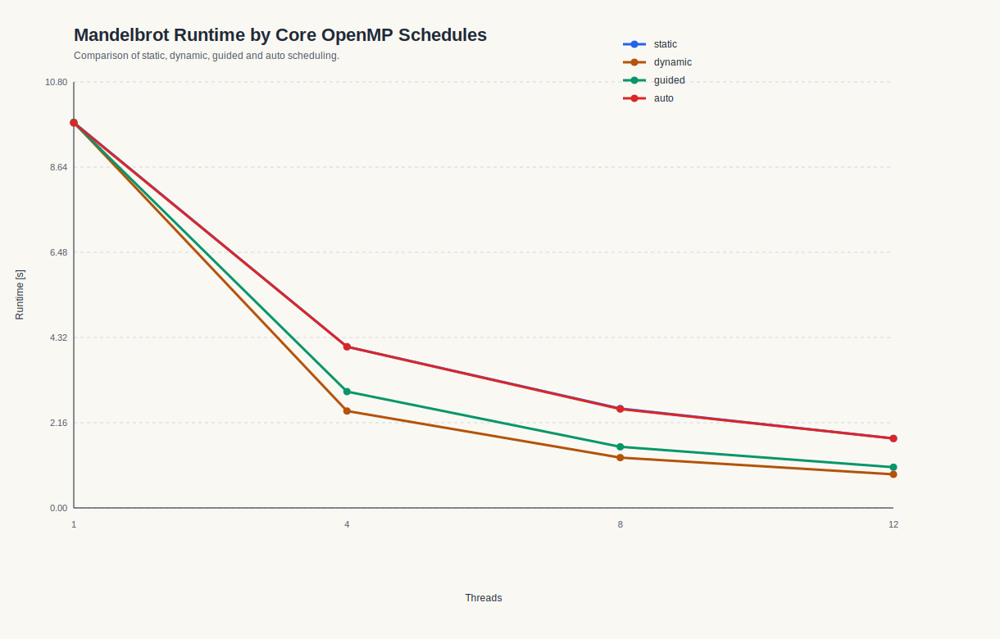
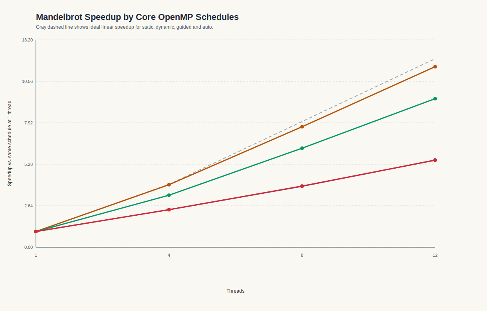
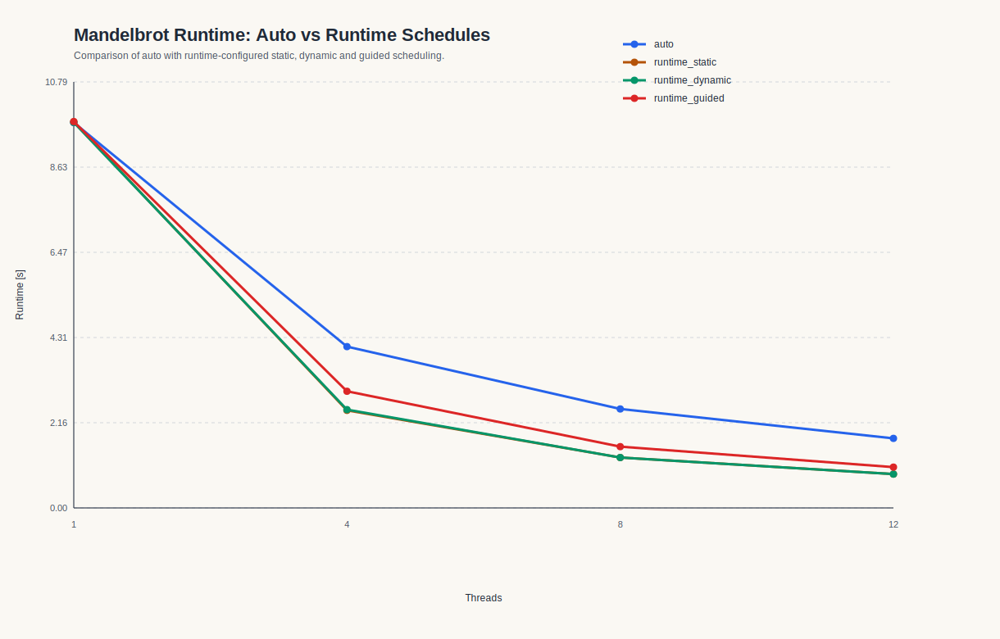
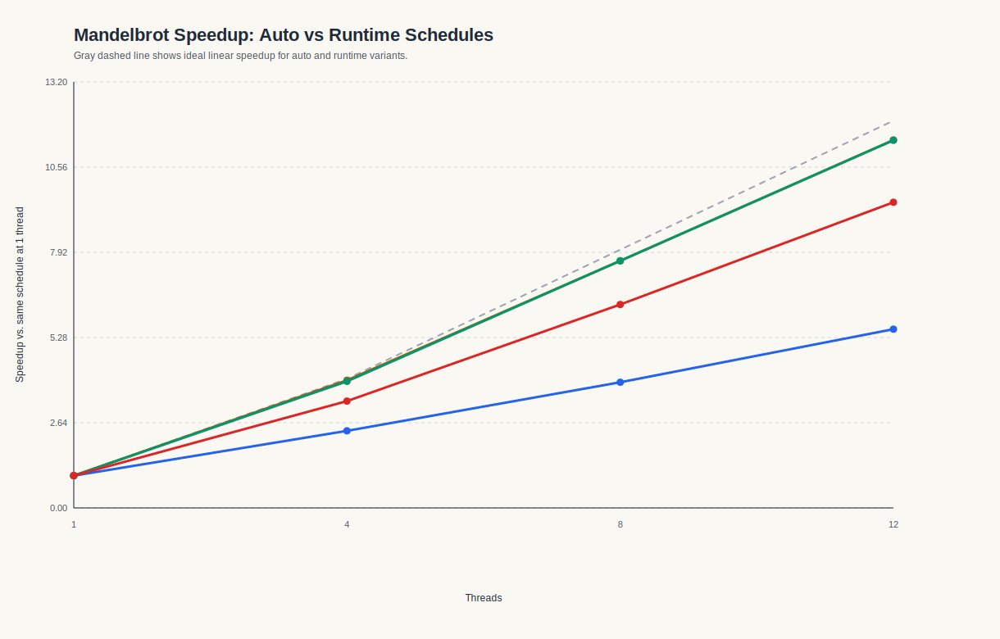

# Assignment 6

## Exercise 1

### 1) Implementierung der drei OpenMP-Varianten


- `critical`: [06/ex1/critical.c](/Users/mayakrumholz/Desktop/Uni/5_Semester/Parallele_Programmierung/ps_parprog_2026/06/ex1/critical.c)
- `atomic`: [06/ex1/atomic.c](/Users/mayakrumholz/Desktop/Uni/5_Semester/Parallele_Programmierung/ps_parprog_2026/06/ex1/atomic.c)
- `reduction`: [06/ex1/reduction.c](/Users/mayakrumholz/Desktop/Uni/5_Semester/Parallele_Programmierung/ps_parprog_2026/06/ex1/reduction.c)

Serielle Version:

- `serial`: [06/ex1/serial.c](/Users/mayakrumholz/Desktop/Uni/5_Semester/Parallele_Programmierung/ps_parprog_2026/06/ex1/serial.c)

Die ursprüngliche Vorlage:

- `serial_origin`: [06/ex1/serial_origin.c](/Users/mayakrumholz/Desktop/Uni/5_Semester/Parallele_Programmierung/ps_parprog_2026/06/ex1/serial_origin.c)

`serial.c` habe ich überarbeitet, damit die serielle Basisversion sauber mit den OpenMP-Varianten verglichen und vom Jobskript genauso ausgewertet werden kann. 

Konkret habe ich `serial.c` in diesen Punkten angepasst:

- `n` ist nicht mehr fest im Quelltext verdrahtet, sondern kann als Programmargument übergeben werden. Dadurch kann das Jobskript dieselbe Problemgröße für alle Varianten einheitlich setzen.
- Die Ausgabe wurde vereinheitlicht, sodass `job.sh` die Werte für `pi` und `elapsed_seconds` direkt auslesen und in die CSV schreiben kann.
- Die Laufzeitmessung mit `omp_get_wtime()` wurde genauso strukturiert wie in den parallelen Versionen, damit die Messwerte konsistent vergleichbar sind.
- Statt `rand()` wird derselbe einfache Pseudozufallszahlengenerator verwendet wie in den parallelen Varianten. Dadurch misst der Vergleich vor allem den Einfluss von `critical`, `atomic` und `reduction` und nicht zusätzlich Unterschiede durch verschiedene Zufallszahlengeneratoren.


Alle Varianten arbeiten nach demselben Prinzip:

1. Es werden `n` Zufallspunkte im Quadrat `[0,1] x [0,1]` erzeugt.
2. Für jeden Punkt wird geprüft, ob `x^2 + y^2 <= 1` gilt.
3. Falls ja, wird der Zähler `inside_circle` erhöht.
4. Am Ende wird Pi über `pi = 4 * inside_circle / n` approximiert.

Wie in der Aufgabenstellung wird der Zähler in den parallelen Versionen direkt in der Schleife erhöht und nicht zuerst in einer privaten Hilfsvariable gesammelt.

#### Warum ein eigener Zufallszahlengenerator?

Die serielle Vorlage verwendet `rand()`. Für die parallelen Varianten ist das ungünstig, weil `rand()` globalen Zustand benutzt. Dadurch würden zusätzliche Synchronisationseffekte oder undefiniertes Verhalten in die Messung hineinspielen. Deshalb nutzt jede Variante einen einfachen thread-lokalen Pseudozufallszahlengenerator mit eigenem Seed pro Thread. So bleibt die Messung auf den Unterschied zwischen `critical`, `atomic` und `reduction` fokussiert.

### 2) Unterschied zwischen `critical`, `atomic` und `reduction`

#### `critical`

Bei `critical` darf immer nur ein Thread gleichzeitig den geschützten Abschnitt betreten:

```c
#pragma omp critical
inside_circle++;
```

Das ist korrekt, aber teuer. Jeder Treffer innerhalb des Viertelkreises führt zu Konkurrenz um genau dieselbe kritische Sektion.

#### `atomic`

Bei `atomic` wird nur das eigentliche Update atomar ausgeführt:

```c
#pragma omp atomic update
inside_circle++;
```

Das ist günstiger als `critical`, weil nur eine einzelne Speicheroperation geschützt werden muss und keine allgemeine kritische Sektion aufgebaut wird.

#### `reduction`

Bei `reduction` arbeitet jeder Thread zunächst mit einem privaten Zähler. Erst am Ende werden diese Teilzähler zusammengeführt:

```c
#pragma omp parallel reduction(+ : inside_circle)
```

Innerhalb der Schleife bleibt das Inkrement einfach:

```c
inside_circle++;
```

Dadurch entfällt die globale Synchronisation bei jedem einzelnen Treffer.

### 3) Benchmark auf LCC3

Das Jobskript liegt hier:

- [06/ex1/job.sh](/Users/mayakrumholz/Desktop/Uni/5_Semester/Parallele_Programmierung/ps_parprog_2026/06/ex1/job.sh)

Es kompiliert alle Programme mit `-O3` und `-fopenmp`, setzt `OMP_NUM_THREADS` auf `1`, `4`, `8` und `12` und führt jede Konfiguration `5` mal aus. Die Laufzeit wird in allen Programmen mit `omp_get_wtime()` gemessen.


### 4) Messergebnisse

#### Serielle Referenz

| Variante | Threads | Läufe | Mittelwert [s] | Median [s] | Standardabweichung [s] | Mittelwert Pi |
| --- | ---: | ---: | ---: | ---: | ---: | ---: |
| serial | 1 | 5 | 10.329242 | 10.317538 | 0.025297 | 3.141543377143 |

Die serielle Referenz liefert stabile Laufzeiten um etwa `10.33 s`.

#### Parallelvarianten

| Variante | Threads | Läufe | Mittelwert [s] | Median [s] | Standardabweichung [s] | Speedup | Effizienz |
| --- | ---: | ---: | ---: | ---: | ---: | ---: | ---: |
| critical | 1 | 5 | 13.058123 | 13.074368 | 0.028417 | 1.000 | 1.000 |
| critical | 4 | 5 | 81.623944 | 80.161164 | 3.508038 | 0.160 | 0.040 |
| critical | 8 | 5 | 116.987222 | 116.784357 | 0.621107 | 0.112 | 0.014 |
| critical | 12 | 5 | 130.567646 | 130.519957 | 0.334099 | 0.100 | 0.008 |
| atomic | 1 | 5 | 13.131688 | 13.123281 | 0.017160 | 1.000 | 1.000 |
| atomic | 4 | 5 | 17.408867 | 19.336035 | 3.788088 | 0.754 | 0.189 |
| atomic | 8 | 5 | 18.950448 | 19.083951 | 0.494881 | 0.693 | 0.087 |
| atomic | 12 | 5 | 23.319474 | 18.014226 | 11.410478 | 0.563 | 0.047 |
| reduction | 1 | 5 | 10.328627 | 10.337248 | 0.021081 | 1.000 | 1.000 |
| reduction | 4 | 5 | 2.659021 | 2.653033 | 0.031841 | 3.884 | 0.971 |
| reduction | 8 | 5 | 1.348012 | 1.347815 | 0.000570 | 7.662 | 0.958 |
| reduction | 12 | 5 | 1.018369 | 0.912487 | 0.199609 | 10.142 | 0.845 |


### 5) Visualisierung

#### Laufzeiten nach OpenMP-Konstrukt


#### Speedup nach OpenMP-Konstrukt


### 6) Beobachtungen und Interpretation

Die Ergebnisse zeigen sehr klar, dass sich die drei Synchronisationsmechanismen fundamental unterscheiden.

#### `critical`

`critical` ist die mit Abstand schlechteste Variante. Schon bei `1` Thread ist sie mit `13.06 s` deutlich langsamer als die serielle Referenz mit `10.33 s`. Der Grund ist, dass selbst ohne echte Konkurrenz jeder Treffer noch durch die OpenMP-Kritikalsektion laufen muss.

Mit mehr Threads wird die Laufzeit nicht kürzer, sondern massiv länger:

- `4` Threads: `81.62 s`
- `8` Threads: `116.99 s`
- `12` Threads: `130.57 s`

Das ist ein klassischer Fall von negativer Skalierung. Alle Threads konkurrieren permanent um denselben geschützten Zähler. Die eigentliche Arbeit pro Iteration ist sehr klein, aber die Synchronisationskosten sind extrem hoch. Dadurch verbringt das Programm den Großteil seiner Zeit mit Warten statt mit Rechnen.

#### `atomic`

`atomic` ist besser als `critical`, aber immer noch klar unvorteilhaft. Auch hier ist bereits die `1`-Thread-Variante mit `13.13 s` langsamer als die serielle Referenz. Der atomare Zugriff ist zwar leichtergewichtig als eine kritische Sektion, bleibt aber trotzdem ein global synchronisierter Zugriff auf dieselbe Variable.

Mit mehr Threads verbessert sich die Laufzeit nicht, sondern verschlechtert sich ebenfalls:

- `4` Threads: `17.41 s`
- `8` Threads: `18.95 s`
- `12` Threads: `23.32 s`

Damit liegt der Speedup sogar unter `1`. Auch `atomic` erzeugt also zu viel Synchronisationsaufwand, nur halt weniger extrem als `critical`.

Auffällig ist die größere Streuung bei `atomic`, besonders bei `12` Threads mit einer Standardabweichung von `11.41 s`. In den Rohdaten sieht man einen Ausreißer von `43.71 s`, während die übrigen Läufe eher bei etwa `18 s` liegen. Das deutet darauf hin, dass diese Variante empfindlich auf Laufzeitschwankungen und Scheduling-Effekte reagiert.

#### `reduction`

`reduction` ist klar die beste Variante. Schon bei `1` Thread ist sie mit `10.33 s` praktisch gleich schnell wie die serielle Referenz. Das ist plausibel, weil hier innerhalb der Schleife kein globaler Synchronisationspunkt existiert.

Mit steigender Thread-Zahl skaliert `reduction` sehr gut:

- `4` Threads: `2.66 s`
- `8` Threads: `1.35 s`
- `12` Threads: `1.02 s`

Die Speedups sind entsprechend hoch:

- `3.884` bei `4` Threads
- `7.662` bei `8` Threads
- `10.142` bei `12` Threads

Auch die Effizienz ist sehr gut:

- `0.971` bei `4` Threads
- `0.958` bei `8` Threads
- `0.845` bei `12` Threads

Das ist nahe an idealer Skalierung. Der Grund ist, dass jeder Thread lokal zählen kann und die Zusammenführung erst am Ende erfolgt. Genau dadurch wird die Konkurrenz auf einen gemeinsamen Zähler während der Schleife vermieden.

### 7) Vergleich der Konstrukte

Die Reihenfolge der Varianten ist sowohl theoretisch als auch praktisch eindeutig:

```text
reduction  >  atomic  >  critical
```

Begründung:

- `critical` schützt einen ganzen kritischen Abschnitt und serialisiert dadurch alle Updates sehr stark.
- `atomic` schützt nur die einzelne Speicheroperation und ist deshalb leichtergewichtig, aber immer noch global synchronisiert.
- `reduction` vermeidet die Synchronisation innerhalb der Schleife fast vollständig und führt die Teilresultate erst am Ende zusammen.


## Exercise 2

### 1) OpenMP-Implementierung der Mandelbrot-Berechnung

Die Grundidee der Berechnung bleibt unverändert:

1. Für jedes Pixel `(px, py)` werden die Koordinaten `cx` und `cy` im komplexen Zahlenraum bestimmt.
2. Danach wird iterativ geprüft, wie schnell der Punkt aus der Mandelbrot-Menge divergiert.
3. Die Iterationszahl wird auf einen Grauwert im Bild abgebildet.

Parallelisiert wird die äußere Schleife über die Bildzeilen `py`. Das ist naheliegend, weil:

- jede Zeile unabhängig von den anderen berechnet werden kann
- jeder Thread in einen anderen Bereich des Bildarrays schreibt
- keine Synchronisation beim Schreiben einzelner Pixel nötig ist

Meistens so:

```c
#pragma omp parallel for schedule(...)
for (int py = 0; py < Y; ++py) {
    for (int px = 0; px < X; ++px) {
        ...
        image[py][px] = ...;
    }
}
```

### 2) Verwendete Scheduling-Varianten

Im Programm können mehrere OpenMP-Scheduling-Varianten getestet werden:

- `static`
- `dynamic`
- `guided`
- `auto`
- `runtime`

Für `runtime` wird die konkrete Policy im Programm gesetzt, sodass im Benchmark mehrere Laufvarianten verglichen werden können:

- `runtime_static`
- `runtime_dynamic`
- `runtime_guided`

Damit lässt sich gut beobachten, dass `runtime` selbst keine feste Strategie ist, sondern die Entscheidung an die Laufzeitkonfiguration delegiert.

### 3) Jobscript

- es kompiliert das Programm
- es testet `1`, `4`, `8` und `12` Threads
- es führt jede Konfiguration `5` mal aus
- es schreibt alle Messwerte in `results/time_results.csv`

Getestete Varianten im Skript:

- `static`
- `dynamic`
- `guided`
- `auto`
- `runtime_static`
- `runtime_dynamic`
- `runtime_guided`

### 4) Ergebnistabellen 

#### Tabelle der Messwerte

| Variante | Threads | Mittelwert [s] | Median [s] | Standardabweichung [s] | Speedup | Effizienz |
| --- | ---: | ---: | ---: | ---: | ---: | ---: |
| static | 1 | 9.768482 | 9.776715 | 0.018019 | 1.000 | 1.000 |
| static | 4 | 4.085424 | 4.085619 | 0.005626 | 2.391 | 0.598 |
| static | 8 | 2.517991 | 2.508092 | 0.014150 | 3.879 | 0.485 |
| static | 12 | 1.760753 | 1.760656 | 0.001363 | 5.548 | 0.462 |
| dynamic | 1 | 9.775214 | 9.752230 | 0.039735 | 1.000 | 1.000 |
| dynamic | 4 | 2.456005 | 2.455745 | 0.002048 | 3.980 | 0.995 |
| dynamic | 8 | 1.274836 | 1.274843 | 0.000286 | 7.668 | 0.958 |
| dynamic | 12 | 0.850369 | 0.850292 | 0.000244 | 11.495 | 0.958 |
| guided | 1 | 9.763315 | 9.758531 | 0.012783 | 1.000 | 1.000 |
| guided | 4 | 2.948721 | 2.956956 | 0.014586 | 3.311 | 0.828 |
| guided | 8 | 1.549154 | 1.550375 | 0.002544 | 6.302 | 0.788 |
| guided | 12 | 1.032178 | 1.031881 | 0.000733 | 9.459 | 0.788 |
| auto | 1 | 9.757247 | 9.750061 | 0.014200 | 1.000 | 1.000 |
| auto | 4 | 4.084650 | 4.085974 | 0.003267 | 2.389 | 0.597 |
| auto | 8 | 2.506206 | 2.507177 | 0.003401 | 3.893 | 0.487 |
| auto | 12 | 1.761671 | 1.761932 | 0.001553 | 5.539 | 0.462 |
| runtime_static | 1 | 9.776532 | 9.778774 | 0.028937 | 1.000 | 1.000 |
| runtime_static | 4 | 2.471400 | 2.472567 | 0.004052 | 3.956 | 0.989 |
| runtime_static | 8 | 1.276462 | 1.276768 | 0.001120 | 7.659 | 0.957 |
| runtime_static | 12 | 0.857614 | 0.853951 | 0.008975 | 11.400 | 0.950 |
| runtime_dynamic | 1 | 9.760834 | 9.750055 | 0.016179 | 1.000 | 1.000 |
| runtime_dynamic | 4 | 2.488253 | 2.491038 | 0.007005 | 3.923 | 0.981 |
| runtime_dynamic | 8 | 1.274972 | 1.275045 | 0.000369 | 7.656 | 0.957 |
| runtime_dynamic | 12 | 0.856859 | 0.852606 | 0.008041 | 11.391 | 0.949 |
| runtime_guided | 1 | 9.781497 | 9.780579 | 0.003023 | 1.000 | 1.000 |
| runtime_guided | 4 | 2.954057 | 2.958776 | 0.015552 | 3.311 | 0.828 |
| runtime_guided | 8 | 1.551885 | 1.550834 | 0.004492 | 6.303 | 0.788 |
| runtime_guided | 12 | 1.032719 | 1.032929 | 0.000758 | 9.472 | 0.789 |


#### Grafiken

#### Grafiken zu `static`, `dynamic`, `guided` und `auto`





#### Grafiken zu `auto` und `runtime`






### 5) Beobachtung und Interpretation

#### Was machen die Scheduling-Methoden?

- `static`: Die Iterationen werden von Anfang an fest auf die Threads verteilt.
- `dynamic`: Threads bekommen neue Arbeit erst dann, wenn sie ihre aktuelle Arbeit beendet haben.
- `guided`: Wie `dynamic`, aber mit anfangs größeren und später kleineren Paketen.
- `auto`: Die Entscheidung über den Schedule wird der OpenMP-Laufzeit bzw. dem Compiler überlassen.
- `runtime`: Die konkrete Strategie wird nicht fest im Quelltext vorgegeben, sondern erst zur Laufzeit gesetzt.

Für Mandelbrot ist das wichtig, weil nicht jede Bildzeile gleich teuer ist. Bereiche nahe am Rand der Mandelbrot-Menge benötigen oft deutlich mehr Iterationen als einfache Bereiche außerhalb. Deshalb spielt Lastverteilung hier eine große Rolle.

#### Vergleich von `static`, `dynamic`, `guided` und `auto`

Bei `1` Thread liegen alle vier Varianten fast gleichauf, jeweils ungefähr bei `9.76 s` bis `9.78 s`. Das ist plausibel, weil bei nur einem Thread noch kein echter Effekt der Arbeitsverteilung zwischen mehreren Threads auftritt.

Mit mehreren Threads trennt sich das Verhalten jedoch klar:

- `dynamic` ist am schnellsten
- `guided` liegt dazwischen
- `static` und `auto` sind deutlich langsamer

##### `static`

`static` skaliert zwar, aber deutlich schlechter als `dynamic` und `guided`:

- `4` Threads: `4.085424 s`
- `8` Threads: `2.517991 s`
- `12` Threads: `1.760753 s`

Der Speedup bei `12` Threads beträgt `5.548`, die Effizienz `0.462`.

Beobachtung: `static` wird mit mehr Threads schneller, aber deutlich schwächer als die flexibleren Schedules.

Erklärung: Bei `static` werden die Zeilen fest auf die Threads verteilt. Dadurch können einige Threads früher fertig sein, während andere noch aufwendigeren Zeilen zugeteilt sind. Genau dieses Lastungleichgewicht kostet Leistung.

##### `dynamic`

`dynamic` liefert die besten Ergebnisse:

- `4` Threads: `2.456005 s`
- `8` Threads: `1.274836 s`
- `12` Threads: `0.850369 s`

Der Speedup bei `12` Threads liegt bei `11.495`, die Effizienz bei `0.958`.

Beobachtung: `dynamic` ist in allen Parallelfällen die schnellste Variante.

Erklärung: Sobald ein Thread eine Zeile fertig bearbeitet hat, bekommt er die nächste. Dadurch wird das Lastungleichgewicht der Mandelbrot-Berechnung sehr gut abgefangen. In dieser Aufgabe ist der Vorteil der besseren Verteilung klar größer als der zusätzliche Overhead des Schedulings.

Auch die Streuung ist sehr klein. Bei `12` Threads beträgt die Standardabweichung nur `0.000244 s`. Die Messungen sind also sehr stabil.

##### `guided`

`guided` ist ebenfalls deutlich besser als `static`, aber etwas schlechter als `dynamic`:

- `4` Threads: `2.948721 s`
- `8` Threads: `1.549154 s`
- `12` Threads: `1.032178 s`

Der Speedup bei `12` Threads beträgt `9.459`, die Effizienz `0.788`.

Beobachtung: `guided` ist ein guter Mittelweg zwischen `static` und `dynamic`.

Erklärung: Bei `guided` werden anfangs größere und später kleinere Arbeitspakete vergeben. Das reduziert den Verwaltungsaufwand gegenüber rein dynamischem Scheduling, bleibt aber flexibler als `static`. In den Messungen ist das klar besser als `static`, aber nicht so gut wie `dynamic`.

##### `auto`

`auto` verhält sich in diesen Messungen fast genauso wie `static`:

- `auto`, `12` Threads: `1.761671 s`
- `static`, `12` Threads: `1.760753 s`

Auch bei `4` und `8` Threads liegen die Werte praktisch übereinander.

Beobachtung: `auto` war hier nicht besonders gut, sondern fast identisch zu `static`.

Erklärung: `auto` bedeutet nicht automatisch optimale Performance. Es bedeutet nur, dass die Entscheidung dem System überlassen wird. Auf diesem Cluster wurde offenbar eine Strategie gewählt, die sich sehr ähnlich zu `static` verhält.

#### Was machen `auto` und `runtime`, und was kann man beobachten?

`auto` überlässt die Entscheidung der Laufzeit bzw. dem Compiler. `runtime` ist noch expliziter: Dort steht im Quelltext nur `schedule(runtime)`, und die tatsächliche Policy wird erst zur Laufzeit gesetzt. `runtime` ist also kein eigener Scheduling-Algorithmus, sondern ein Mechanismus zur späteren Konfiguration.

##### `runtime`

Das zeigt sich direkt in den Messwerten:

- `runtime_dynamic` verhält sich fast wie `dynamic`
- `runtime_guided` verhält sich fast wie `guided`
- `runtime_static` ist deutlich schneller als das direkte `static`

Für `runtime_dynamic` und `dynamic` bei `12` Threads:

- `dynamic`: `0.850369 s`
- `runtime_dynamic`: `0.856859 s`

Für `guided` und `runtime_guided` bei `12` Threads:

- `guided`: `1.032178 s`
- `runtime_guided`: `1.032719 s`

Beobachtung: `runtime_dynamic` und `runtime_guided` liegen jeweils sehr nahe an den direkt kodierten Varianten.

Erklärung: Das bestätigt genau die Bedeutung von `runtime`: Die tatsächliche Strategie kommt aus der Laufzeitkonfiguration.

Auffällig ist allerdings `runtime_static`:

- `runtime_static`, `12` Threads: `0.857614 s`
- `static`, `12` Threads: `1.760753 s`

Der Grund ist hier sehr wahrscheinlich die konkrete Konfiguration. In der `runtime`-Variante wurde `omp_set_schedule(..., 1)` verwendet. Bei `runtime_static` bedeutet das eine statische Verteilung mit Chunk-Größe `1`. Das ist nicht dasselbe wie das direkte `schedule(static)` ohne explizite Chunk-Größe. Durch die feinere Verteilung der Zeilen wird das Lastungleichgewicht deutlich besser abgefangen. Deshalb liegt `runtime_static` in diesen Messungen viel näher an `dynamic` als an der einfachen Blockverteilung von `static`.

