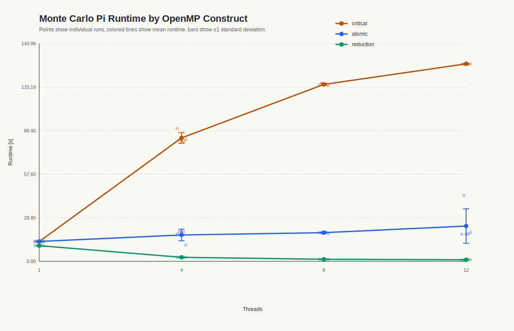
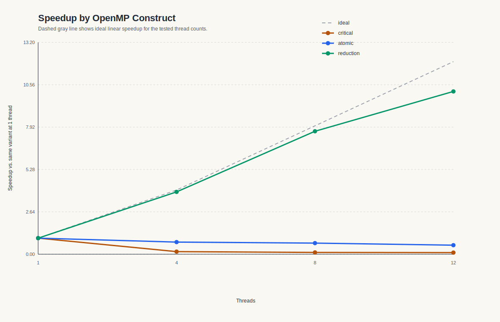

# Assignment 6

## Exercise 1

### 1) Implementierung der drei OpenMP-Varianten


- `critical`: [06/ex1/critical.c](/Users/mayakrumholz/Desktop/Uni/5_Semester/Parallele_Programmierung/ps_parprog_2026/06/ex1/critical.c)
- `atomic`: [06/ex1/atomic.c](/Users/mayakrumholz/Desktop/Uni/5_Semester/Parallele_Programmierung/ps_parprog_2026/06/ex1/atomic.c)
- `reduction`: [06/ex1/reduction.c](/Users/mayakrumholz/Desktop/Uni/5_Semester/Parallele_Programmierung/ps_parprog_2026/06/ex1/reduction.c)

Serielle Version:

- `serial`: [06/ex1/serial.c](/Users/mayakrumholz/Desktop/Uni/5_Semester/Parallele_Programmierung/ps_parprog_2026/06/ex1/serial.c)

Die ursprüngliche Vorlage:

- `serial_origin`: [06/ex1/serial_origin.c](/Users/mayakrumholz/Desktop/Uni/5_Semester/Parallele_Programmierung/ps_parprog_2026/06/ex1/serial_origin.c)

`serial.c` habe ich überarbeitet, damit die serielle Basisversion sauber mit den OpenMP-Varianten verglichen und vom Jobskript genauso ausgewertet werden kann. 

Konkret habe ich `serial.c` in diesen Punkten angepasst:

- `n` ist nicht mehr fest im Quelltext verdrahtet, sondern kann als Programmargument übergeben werden. Dadurch kann das Jobskript dieselbe Problemgröße für alle Varianten einheitlich setzen.
- Die Ausgabe wurde vereinheitlicht, sodass `job.sh` die Werte für `pi` und `elapsed_seconds` direkt auslesen und in die CSV schreiben kann.
- Die Laufzeitmessung mit `omp_get_wtime()` wurde genauso strukturiert wie in den parallelen Versionen, damit die Messwerte konsistent vergleichbar sind.
- Statt `rand()` wird derselbe einfache Pseudozufallszahlengenerator verwendet wie in den parallelen Varianten. Dadurch misst der Vergleich vor allem den Einfluss von `critical`, `atomic` und `reduction` und nicht zusätzlich Unterschiede durch verschiedene Zufallszahlengeneratoren.


Alle Varianten arbeiten nach demselben Prinzip:

1. Es werden `n` Zufallspunkte im Quadrat `[0,1] x [0,1]` erzeugt.
2. Für jeden Punkt wird geprüft, ob `x^2 + y^2 <= 1` gilt.
3. Falls ja, wird der Zähler `inside_circle` erhöht.
4. Am Ende wird Pi über `pi = 4 * inside_circle / n` approximiert.

Wie in der Aufgabenstellung wird der Zähler in den parallelen Versionen direkt in der Schleife erhöht und nicht zuerst in einer privaten Hilfsvariable gesammelt.

#### Warum ein eigener Zufallszahlengenerator?

Die serielle Vorlage verwendet `rand()`. Für die parallelen Varianten ist das ungünstig, weil `rand()` globalen Zustand benutzt. Dadurch würden zusätzliche Synchronisationseffekte oder undefiniertes Verhalten in die Messung hineinspielen. Deshalb nutzt jede Variante einen einfachen thread-lokalen Pseudozufallszahlengenerator mit eigenem Seed pro Thread. So bleibt die Messung auf den Unterschied zwischen `critical`, `atomic` und `reduction` fokussiert.

### 2) Unterschied zwischen `critical`, `atomic` und `reduction`

#### `critical`

Bei `critical` darf immer nur ein Thread gleichzeitig den geschützten Abschnitt betreten:

```c
#pragma omp critical
inside_circle++;
```

Das ist korrekt, aber teuer. Jeder Treffer innerhalb des Viertelkreises führt zu Konkurrenz um genau dieselbe kritische Sektion.

#### `atomic`

Bei `atomic` wird nur das eigentliche Update atomar ausgeführt:

```c
#pragma omp atomic update
inside_circle++;
```

Das ist günstiger als `critical`, weil nur eine einzelne Speicheroperation geschützt werden muss und keine allgemeine kritische Sektion aufgebaut wird.

#### `reduction`

Bei `reduction` arbeitet jeder Thread zunächst mit einem privaten Zähler. Erst am Ende werden diese Teilzähler zusammengeführt:

```c
#pragma omp parallel reduction(+ : inside_circle)
```

Innerhalb der Schleife bleibt das Inkrement einfach:

```c
inside_circle++;
```

Dadurch entfällt die globale Synchronisation bei jedem einzelnen Treffer.

### 3) Benchmark auf LCC3

Das Jobskript liegt hier:

- [06/ex1/job.sh](/Users/mayakrumholz/Desktop/Uni/5_Semester/Parallele_Programmierung/ps_parprog_2026/06/ex1/job.sh)

Es kompiliert alle Programme mit `-O3` und `-fopenmp`, setzt `OMP_NUM_THREADS` auf `1`, `4`, `8` und `12` und führt jede Konfiguration `5` mal aus. Die Laufzeit wird in allen Programmen mit `omp_get_wtime()` gemessen.


### 4) Messergebnisse

#### Serielle Referenz

| Variante | Threads | Läufe | Mittelwert [s] | Median [s] | Standardabweichung [s] | Mittelwert Pi |
| --- | ---: | ---: | ---: | ---: | ---: | ---: |
| serial | 1 | 5 | 10.329242 | 10.317538 | 0.025297 | 3.141543377143 |

Die serielle Referenz liefert stabile Laufzeiten um etwa `10.33 s`.

#### Parallelvarianten

| Variante | Threads | Läufe | Mittelwert [s] | Median [s] | Standardabweichung [s] | Speedup | Effizienz |
| --- | ---: | ---: | ---: | ---: | ---: | ---: | ---: |
| critical | 1 | 5 | 13.058123 | 13.074368 | 0.028417 | 1.000 | 1.000 |
| critical | 4 | 5 | 81.623944 | 80.161164 | 3.508038 | 0.160 | 0.040 |
| critical | 8 | 5 | 116.987222 | 116.784357 | 0.621107 | 0.112 | 0.014 |
| critical | 12 | 5 | 130.567646 | 130.519957 | 0.334099 | 0.100 | 0.008 |
| atomic | 1 | 5 | 13.131688 | 13.123281 | 0.017160 | 1.000 | 1.000 |
| atomic | 4 | 5 | 17.408867 | 19.336035 | 3.788088 | 0.754 | 0.189 |
| atomic | 8 | 5 | 18.950448 | 19.083951 | 0.494881 | 0.693 | 0.087 |
| atomic | 12 | 5 | 23.319474 | 18.014226 | 11.410478 | 0.563 | 0.047 |
| reduction | 1 | 5 | 10.328627 | 10.337248 | 0.021081 | 1.000 | 1.000 |
| reduction | 4 | 5 | 2.659021 | 2.653033 | 0.031841 | 3.884 | 0.971 |
| reduction | 8 | 5 | 1.348012 | 1.347815 | 0.000570 | 7.662 | 0.958 |
| reduction | 12 | 5 | 1.018369 | 0.912487 | 0.199609 | 10.142 | 0.845 |


### 5) Visualisierung

#### Laufzeiten nach OpenMP-Konstrukt



#### Speedup nach OpenMP-Konstrukt



### 6) Beobachtungen und Interpretation

Die Ergebnisse zeigen sehr klar, dass sich die drei Synchronisationsmechanismen fundamental unterscheiden.

#### `critical`

`critical` ist die mit Abstand schlechteste Variante. Schon bei `1` Thread ist sie mit `13.06 s` deutlich langsamer als die serielle Referenz mit `10.33 s`. Der Grund ist, dass selbst ohne echte Konkurrenz jeder Treffer noch durch die OpenMP-Kritikalsektion laufen muss.

Mit mehr Threads wird die Laufzeit nicht kürzer, sondern massiv länger:

- `4` Threads: `81.62 s`
- `8` Threads: `116.99 s`
- `12` Threads: `130.57 s`

Das ist ein klassischer Fall von negativer Skalierung. Alle Threads konkurrieren permanent um denselben geschützten Zähler. Die eigentliche Arbeit pro Iteration ist sehr klein, aber die Synchronisationskosten sind extrem hoch. Dadurch verbringt das Programm den Großteil seiner Zeit mit Warten statt mit Rechnen.

#### `atomic`

`atomic` ist besser als `critical`, aber immer noch klar unvorteilhaft. Auch hier ist bereits die `1`-Thread-Variante mit `13.13 s` langsamer als die serielle Referenz. Der atomare Zugriff ist zwar leichtergewichtig als eine kritische Sektion, bleibt aber trotzdem ein global synchronisierter Zugriff auf dieselbe Variable.

Mit mehr Threads verbessert sich die Laufzeit nicht, sondern verschlechtert sich ebenfalls:

- `4` Threads: `17.41 s`
- `8` Threads: `18.95 s`
- `12` Threads: `23.32 s`

Damit liegt der Speedup sogar unter `1`. Auch `atomic` erzeugt also zu viel Synchronisationsaufwand, nur halt weniger extrem als `critical`.

Auffällig ist die größere Streuung bei `atomic`, besonders bei `12` Threads mit einer Standardabweichung von `11.41 s`. In den Rohdaten sieht man einen Ausreißer von `43.71 s`, während die übrigen Läufe eher bei etwa `18 s` liegen. Das deutet darauf hin, dass diese Variante empfindlich auf Laufzeitschwankungen und Scheduling-Effekte reagiert.

#### `reduction`

`reduction` ist klar die beste Variante. Schon bei `1` Thread ist sie mit `10.33 s` praktisch gleich schnell wie die serielle Referenz. Das ist plausibel, weil hier innerhalb der Schleife kein globaler Synchronisationspunkt existiert.

Mit steigender Thread-Zahl skaliert `reduction` sehr gut:

- `4` Threads: `2.66 s`
- `8` Threads: `1.35 s`
- `12` Threads: `1.02 s`

Die Speedups sind entsprechend hoch:

- `3.884` bei `4` Threads
- `7.662` bei `8` Threads
- `10.142` bei `12` Threads

Auch die Effizienz ist sehr gut:

- `0.971` bei `4` Threads
- `0.958` bei `8` Threads
- `0.845` bei `12` Threads

Das ist nahe an idealer Skalierung. Der Grund ist, dass jeder Thread lokal zählen kann und die Zusammenführung erst am Ende erfolgt. Genau dadurch wird die Konkurrenz auf einen gemeinsamen Zähler während der Schleife vermieden.

### 7) Vergleich der Konstrukte

Die Reihenfolge der Varianten ist sowohl theoretisch als auch praktisch eindeutig:

```text
reduction  >  atomic  >  critical
```

Begründung:

- `critical` schützt einen ganzen kritischen Abschnitt und serialisiert dadurch alle Updates sehr stark.
- `atomic` schützt nur die einzelne Speicheroperation und ist deshalb leichtergewichtig, aber immer noch global synchronisiert.
- `reduction` vermeidet die Synchronisation innerhalb der Schleife fast vollständig und führt die Teilresultate erst am Ende zusammen.


## Exercise 2

### 1) OpenMP-Implementierung der Mandelbrot-Berechnung

Die Grundidee der Berechnung bleibt unverändert:

1. Für jedes Pixel `(px, py)` werden die Koordinaten `cx` und `cy` im komplexen Zahlenraum bestimmt.
2. Danach wird iterativ geprüft, wie schnell der Punkt aus der Mandelbrot-Menge divergiert.
3. Die Iterationszahl wird auf einen Grauwert im Bild abgebildet.

Parallelisiert wird die äußere Schleife über die Bildzeilen `py`. Das ist naheliegend, weil:

- jede Zeile unabhängig von den anderen berechnet werden kann
- jeder Thread in einen anderen Bereich des Bildarrays schreibt
- keine Synchronisation beim Schreiben einzelner Pixel nötig ist

Eine typische Form ist:

```c
#pragma omp parallel for schedule(...)
for (int py = 0; py < Y; ++py) {
    for (int px = 0; px < X; ++px) {
        ...
        image[py][px] = ...;
    }
}
```

### 2) Verwendete Scheduling-Varianten

Im Programm können mehrere OpenMP-Scheduling-Varianten getestet werden:

- `static`
- `dynamic`
- `guided`
- `auto`
- `runtime`

Für `runtime` wird die konkrete Policy im Programm gesetzt, sodass im Benchmark mehrere Laufvarianten verglichen werden können:

- `runtime_static`
- `runtime_dynamic`
- `runtime_guided`

Damit lässt sich gut beobachten, dass `runtime` selbst keine feste Strategie ist, sondern die Entscheidung an die Laufzeitkonfiguration delegiert.

### 3) Jobscript

- es kompiliert das Programm
- es testet `1`, `4`, `8` und `12` Threads
- es führt jede Konfiguration `5` mal aus
- es schreibt alle Messwerte in `results/time_results.csv`

Getestete Varianten im Skript:

- `static`
- `dynamic`
- `guided`
- `auto`
- `runtime_static`
- `runtime_dynamic`
- `runtime_guided`

### 4) Ausführung auf dem Cluster

Im Verzeichnis `06/ex2`:

```bash
sbatch job.sh
```

Nach dem Lauf sollten vor allem diese Dateien vorliegen:

- `06/ex2/results/time_results.csv`
- `06/ex2/ex2_job.log`
- erzeugte Bilder in `06/ex2/results/images`

### 5) Lokale Auswertung nach dem Push

Nach dem Zurückpushen der Ergebnisdateien lokal:

```bash
cd 06/ex2
python3 analyze_results.py
```

Das Skript erzeugt dann:

- `results/summary_stats.csv`
- `results/summary_table.md`
- `results/plots/runtime_by_schedule.svg`
- `results/plots/speedup_by_schedule.svg`

### 6) Ergebnistabellen zum Ausfüllen

#### Tabelle der Messwerte

| Variante | Threads | Mittelwert [s] | Median [s] | Standardabweichung [s] | Speedup | Effizienz |
| --- | ---: | ---: | ---: | ---: | ---: | ---: |
| static | 1 | TODO | TODO | TODO | TODO | TODO |
| static | 4 | TODO | TODO | TODO | TODO | TODO |
| static | 8 | TODO | TODO | TODO | TODO | TODO |
| static | 12 | TODO | TODO | TODO | TODO | TODO |
| dynamic | 1 | TODO | TODO | TODO | TODO | TODO |
| dynamic | 4 | TODO | TODO | TODO | TODO | TODO |
| dynamic | 8 | TODO | TODO | TODO | TODO | TODO |
| dynamic | 12 | TODO | TODO | TODO | TODO | TODO |
| guided | 1 | TODO | TODO | TODO | TODO | TODO |
| guided | 4 | TODO | TODO | TODO | TODO | TODO |
| guided | 8 | TODO | TODO | TODO | TODO | TODO |
| guided | 12 | TODO | TODO | TODO | TODO | TODO |
| auto | 1 | TODO | TODO | TODO | TODO | TODO |
| auto | 4 | TODO | TODO | TODO | TODO | TODO |
| auto | 8 | TODO | TODO | TODO | TODO | TODO |
| auto | 12 | TODO | TODO | TODO | TODO | TODO |
| runtime_static | 1 | TODO | TODO | TODO | TODO | TODO |
| runtime_static | 4 | TODO | TODO | TODO | TODO | TODO |
| runtime_static | 8 | TODO | TODO | TODO | TODO | TODO |
| runtime_static | 12 | TODO | TODO | TODO | TODO | TODO |
| runtime_dynamic | 1 | TODO | TODO | TODO | TODO | TODO |
| runtime_dynamic | 4 | TODO | TODO | TODO | TODO | TODO |
| runtime_dynamic | 8 | TODO | TODO | TODO | TODO | TODO |
| runtime_dynamic | 12 | TODO | TODO | TODO | TODO | TODO |
| runtime_guided | 1 | TODO | TODO | TODO | TODO | TODO |
| runtime_guided | 4 | TODO | TODO | TODO | TODO | TODO |
| runtime_guided | 8 | TODO | TODO | TODO | TODO | TODO |
| runtime_guided | 12 | TODO | TODO | TODO | TODO | TODO |

#### Grafiken

Nach der Auswertung können diese Grafiken eingebunden werden:


### 7) Leitfaden für die spätere Interpretation

Bei der Interpretation der Messwerte sollte besonders auf diese Punkte geachtet werden:

- Wie stark skaliert die Grundimplementierung von `1` auf `4`, `8` und `12` Threads?
- Ist `static` wegen geringer Scheduling-Kosten schnell oder leidet es unter Lastungleichgewicht?
- Verbessern `dynamic` oder `guided` die Lastverteilung sichtbar?
- Ist `guided` ein guter Kompromiss zwischen Lastbalancierung und Verwaltungsaufwand?
- Was macht `auto` konkret auf dem verwendeten System?
- Zeigt `runtime_*`, dass `runtime` keine eigene Strategie ist, sondern nur die Policy aus der Laufzeitumgebung übernimmt?

### 8) Beobachtung und Interpretation

Diesen Abschnitt formuliere ich sauber aus, sobald du mir die echten Cluster-Ergebnisse für Exercise 2 gibst.
