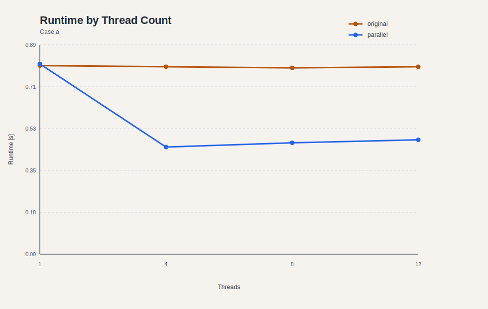
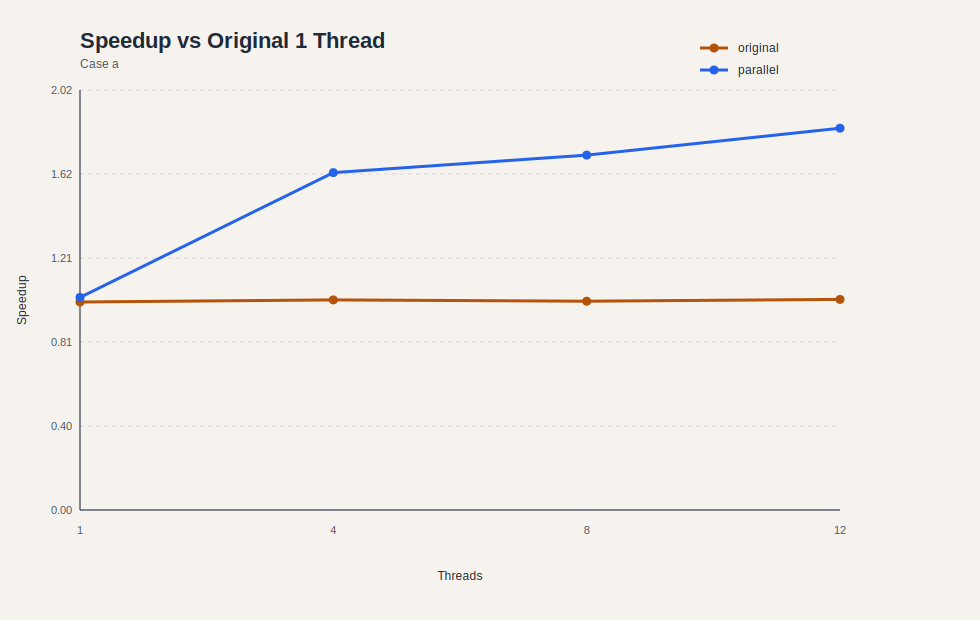
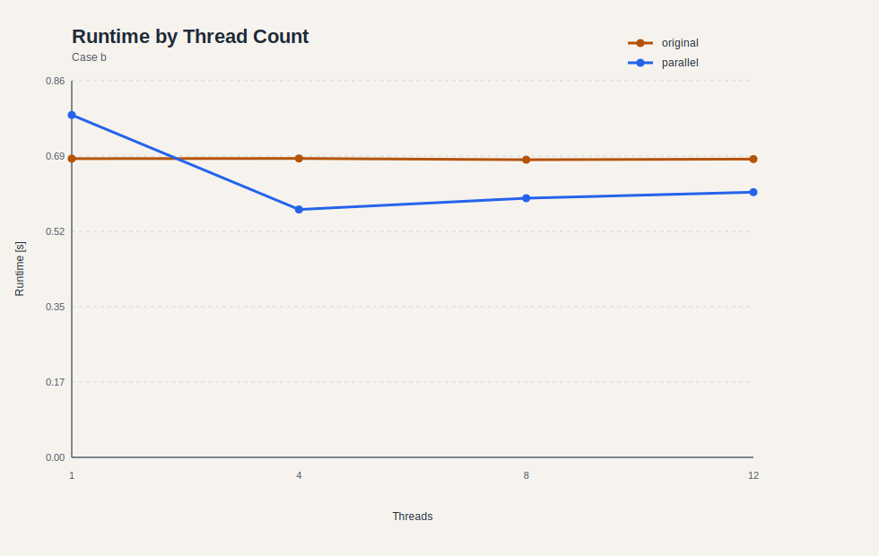
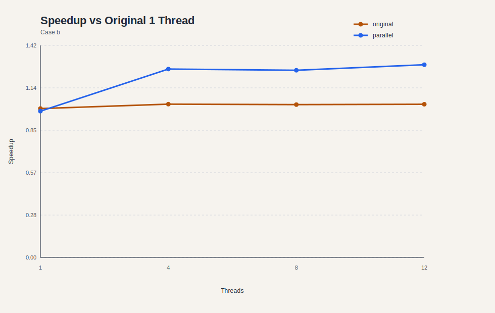
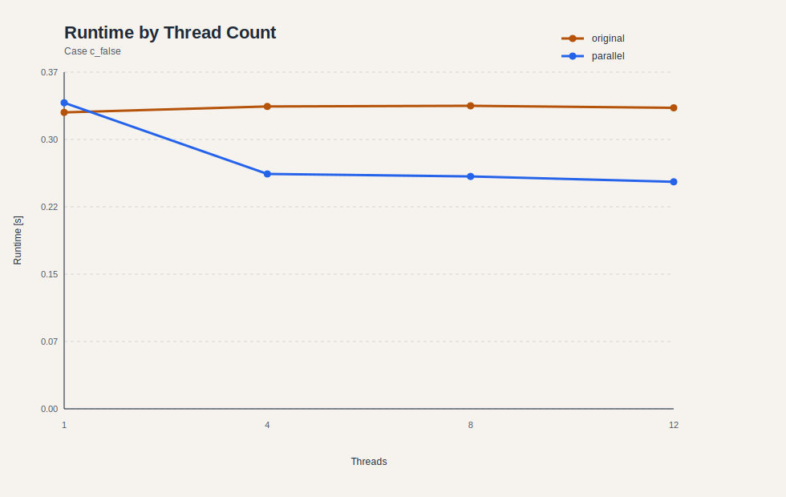
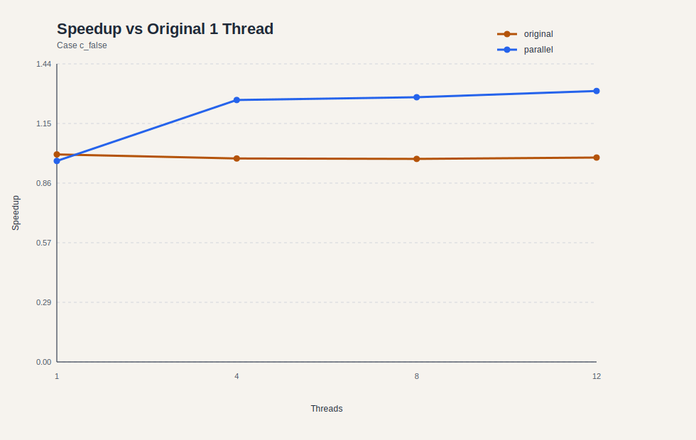
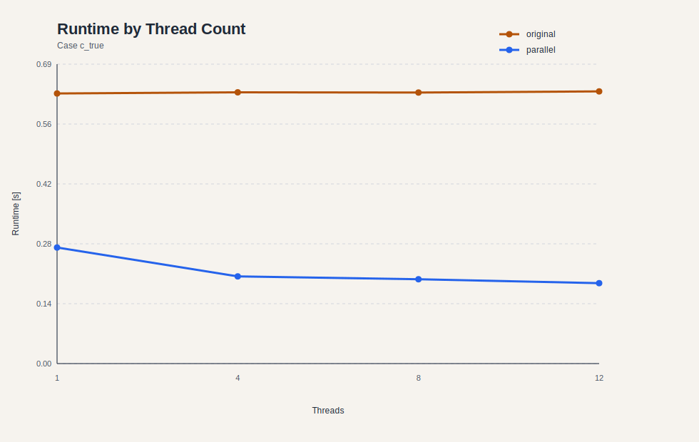
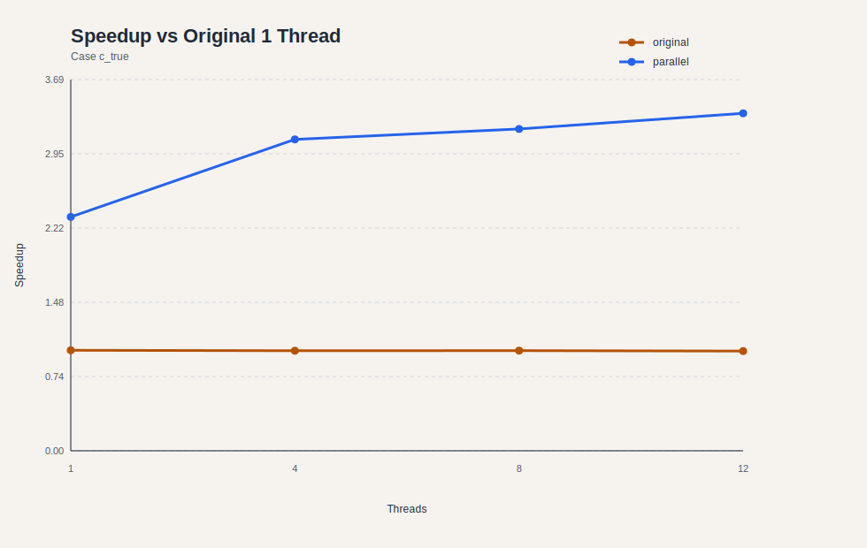

# Assignment 7

## Exercise 1

### Snippet 1

Gegeben:

```c
for (int i = 0; i < n - 1; i++) {
    x[i] = (y[i] + x[i + 1]) / 7;
}
```

#### 1) Datenabhängigkeiten

- `x[i]` wird in Iteration `i` geschrieben.
- Dieselbe Iteration liest `x[i + 1]`.
- Zwischen Iteration `i` und `i + 1` gibt es daher eine **loop-carried Anti-Dependence (WAR)** auf `x[i + 1]`.
- Es gibt **keine echte Flow-Dependence** von `x[i + 1]` nach `x[i]`, weil die Schleife den alten Wert `x[i + 1]` verwendet.

Konsequenz:

- Eine naive Parallelisierung über `i` wäre falsch, weil Threads sich gegenseitig Werte in `x` überschreiben könnten, die andere Iterationen noch lesen müssen.

#### 2) Parallelisierung und Optimierung

Saubere Lösung: den alten Zustand von `x` separat halten.

```c
double *x_old = malloc(n * sizeof(*x_old));
memcpy(x_old, x, n * sizeof(*x_old));

#pragma omp parallel for
for (int i = 0; i < n - 1; i++) {
    x[i] = (y[i] + x_old[i + 1]) / 7.0;
}

free(x_old);
```

Warum:

- jede Iteration liest nur aus `x_old`
- jede Iteration schreibt nur nach `x[i]`
- dadurch sind die Iterationen unabhängig


### Snippet 2

Gegeben:

```c
for (int i = 0; i < n; i++) {
    a = (x[i] + y[i]) / (i + 1);
    z[i] = a;
}

f = sqrt(a + k);
```

#### 1) Datenabhängigkeiten

- `z[i]` hängt nur von `x[i]` und `y[i]` derselben Iteration ab.
- Die Variable `a` wird in jeder Iteration überschrieben.
- Zwischen den Iterationen gibt es auf `a` eine **Output-Dependence (WAW)**.
- Nach der Schleife wird nur der letzte Wert von `a` verwendet.

Konsequenz:

- `z[i]` kann parallel berechnet werden.
- Für `f` braucht man nicht alle Zwischenwerte von `a`, sondern nur

```c
a_last = (x[n - 1] + y[n - 1]) / n;
```

#### 2) Parallelisierung und Optimierung

```c
#pragma omp parallel for
for (int i = 0; i < n; i++) {
    z[i] = (x[i] + y[i]) / (i + 1);
}

double a_last = (x[n - 1] + y[n - 1]) / n;
f = sqrt(a_last + k);
```

Optimierung:

- Die unnötige gemeinsame Variable `a` verschwindet ganz aus der Schleife.
- Dadurch gibt es keinen Race auf `a` und keine serielle Restabhängigkeit mehr.


### Snippet 3

Gegeben:

```c
for (int i = 0; i < n; i++) {
   x[i] = y[i] * 2 + b * i;
}

for (int i = 0; i < n; i++) {
   y[i] = x[i] + a / (i + 1);
}
```

#### 1) Datenabhängigkeiten

- Die erste Schleife schreibt `x[i]`.
- Die zweite Schleife liest `x[i]`.
- Damit gibt es eine **True/Flow-Dependence (RAW)** von Schleife 1 nach Schleife 2.
- Innerhalb jeder einzelnen Schleife sind die Iterationen unabhängig.

#### 2) Parallelisierung und Optimierung

```c
#pragma omp parallel
{
    #pragma omp for
    for (int i = 0; i < n; i++) {
        x[i] = y[i] * 2 + b * i;
    }

    #pragma omp for
    for (int i = 0; i < n; i++) {
        y[i] = x[i] + a / (i + 1);
    }
}
```

Warum:

- Die implizite Barriere am Ende des ersten `omp for` stellt sicher, dass alle `x[i]` fertig sind, bevor die zweite Schleife startet.


## Exercise 2

### 1) Datenabhängigkeiten und Parallelisierungsideen

#### a)

Gegeben:

```c
double factor = 1;

for (int i = 0; i < n; i++) {
    x[i] = factor * y[i];
    factor = factor / 2;
}
```

Abhängigkeit:

- `factor` hängt von der vorherigen Iteration ab.
- Das ist eine **loop-carried True-Dependence (RAW)** auf `factor`.

Beobachtung:

- Es gilt `factor(i) = 2^{-i}`.
- Damit kann die Schleife in eine unabhängige Form umgeschrieben werden.

Parallelisierung:

```c
#pragma omp parallel
{
    int tid = omp_get_thread_num();
    int tcount = omp_get_num_threads();
    size_t start = (size_t)tid * n / (size_t)tcount;
    size_t end = (size_t)(tid + 1) * n / (size_t)tcount;
    double factor = ldexp(1.0, -(int)start);

    for (size_t i = start; i < end; ++i) {
        x[i] = factor * y[i];
        factor *= 0.5;
    }
}
```

Vorteil:

- mathematisch äquivalent
- kein gemeinsamer Zustand zwischen Threads
- nur ein Startwert pro Block statt teurer Potenzberechnung pro Element


#### b)

Gegeben:

```c
for (int i = 1; i < n; i++) {
    x[i] = (x[i] + y[i - 1]) / 2;
    y[i] = y[i] + z[i] * 3;
}
```

Abhängigkeit:

- Iteration `i` liest `y[i - 1]`.
- Iteration `i - 1` schreibt `y[i - 1]`.
- Das ist eine **loop-carried True-Dependence (RAW)** auf `y`.

Wichtiger Punkt:

- Für `i = 1` wird `y[0]` gelesen, das in der Schleife nie geschrieben wird.
- Für `i >= 2` wird bereits das in der Vorgängeriteration aktualisierte `y[i - 1]` benötigt.

Parallelisierung durch Phasentrennung:

```c
#pragma omp parallel for
for (int i = 1; i < n; i++) {
    y[i] = y[i] + z[i] * 3;
}

#pragma omp parallel for
for (int i = 1; i < n; i++) {
    x[i] = (x[i] + y[i - 1]) / 2;
}
```

Warum:

- Nach Phase 1 enthält `y[i]` bereits die neuen Werte.
- Phase 2 liest damit genau dieselben Werte wie die serielle Originalschleife.


#### c)

Gegeben:

```c
x[0] = x[0] + 5 * y[0];
for (int i = 1; i < n; i++) {
    x[i] = x[i] + 5 * y[i];
    if (twice) {
        x[i - 1] = 2 * x[i - 1];
    }
}
```

##### Fall `twice == false`

Dann reduziert sich die Schleife auf unabhängige Updates:

```c
#pragma omp parallel for
for (int i = 0; i < n; i++) {
    x[i] = x[i] + 5 * y[i];
}
```

Es gibt dann **keine loop-carried Dependence**.

##### Fall `twice == true`

Abhängigkeit:

- Iteration `i` schreibt `x[i]`.
- Iteration `i + 1` verdoppelt danach genau dieses `x[i]`.
- Das ist eine **loop-carried True-Dependence** zwischen benachbarten Iterationen.

Geschlossene Form:

- Für `0 <= i < n - 1` ist der Endwert

```c
x[i] = 2 * (x[i] + 5 * y[i]);
```

- Für `i = n - 1` gibt es keine folgende Iteration mehr, also nur

```c
x[n - 1] = x[n - 1] + 5 * y[n - 1];
```

Parallelisierung:

```c
#pragma omp parallel for
for (int i = 0; i < n; i++) {
    double updated = x[i] + 5 * y[i];
    x[i] = (i + 1 < n) ? 2 * updated : updated;
}
```


### 2) Implementierung

Die vollständige Benchmark-Implementierung liegt hier:

- [07/ex2_benchmark.c](/Users/mayakrumholz/Desktop/Uni/5_Semester/Parallele_Programmierung/ps_parprog_2026/07/ex2_benchmark.c)

Build:

- [07/Makefile](/Users/mayakrumholz/Desktop/Uni/5_Semester/Parallele_Programmierung/ps_parprog_2026/07/Makefile)

Jobscript für reproduzierbare Läufe auf LCC3:

- [07/job.sh](/Users/mayakrumholz/Desktop/Uni/5_Semester/Parallele_Programmierung/ps_parprog_2026/07/job.sh)

Auswertung:

- [07/analyze_results.py](/Users/mayakrumholz/Desktop/Uni/5_Semester/Parallele_Programmierung/ps_parprog_2026/07/analyze_results.py)


### 3) Korrektheitsprüfung

Vor jedem Benchmark führt `job.sh` automatisch eine Verifikation aus:

```text
verify case=a n=2048 repetitions=4 status=ok
verify case=b n=4096 repetitions=5 status=ok
verify case=c_false n=4096 repetitions=6 status=ok
verify case=c_true n=4096 repetitions=5 status=ok
```

Dabei werden Original- und Parallelversion mit identischen Eingabedaten verglichen.


### 4) Benchmark-Setup

Für den Benchmark ist das bereitgestellte Jobscript `job.sh` vorgesehen:

- `gcc` bzw. auf LCC3 das Modul `gcc/12.2.0-gcc-8.5.0-p4pe45v`
- `-O3 -fopenmp`
- Thread-Zahlen `1`, `4`, `8`, `12`
- `5` Läufe pro Konfiguration

Verwendete Problemgrößen:

- `a`: `n = 12,000,000`, `32` Wiederholungen
- `b`: `n = 12,000,000`, `20` Wiederholungen
- `c_false`: `n = 16,000,000`, `16` Wiederholungen
- `c_true`: `n = 16,000,000`, `12` Wiederholungen

Wichtiger Hinweis:

- Ein erster LCC3-Lauf ist fehlgeschlagen, weil `gcc-15` auf dem Cluster nicht existiert.
- Deshalb sind die aktuell eingecheckten Dateien in `07/results/` noch **vorläufige Ergebnisse** und nicht der finale bestätigte Clusterlauf.
- Nach dem Fix in `Makefile` und `job.sh` muss der Job einmal neu auf LCC3 ausgeführt werden.


### 5) Messergebnisse

Rohdaten:

- [07/results/time_results.csv](/Users/mayakrumholz/Desktop/Uni/5_Semester/Parallele_Programmierung/ps_parprog_2026/07/results/time_results.csv)

Zusammenfassung:

- [07/results/summary_table.md](/Users/mayakrumholz/Desktop/Uni/5_Semester/Parallele_Programmierung/ps_parprog_2026/07/results/summary_table.md)

#### Fall a

| Variante | Threads | Mittelwert [s] | Speedup ggü. Original 1T |
| --- | ---: | ---: | ---: |
| original | 1 | 0.561424 | 1.000 |
| parallel | 1 | 0.549286 | 1.022 |
| parallel | 4 | 0.346099 | 1.622 |
| parallel | 8 | 0.328984 | 1.707 |
| parallel | 12 | 0.305795 | 1.836 |

#### Fall b

| Variante | Threads | Mittelwert [s] | Speedup ggü. Original 1T |
| --- | ---: | ---: | ---: |
| original | 1 | 0.612782 | 1.000 |
| parallel | 1 | 0.623753 | 0.982 |
| parallel | 4 | 0.484276 | 1.265 |
| parallel | 8 | 0.487457 | 1.257 |
| parallel | 12 | 0.473371 | 1.295 |

#### Fall `c_false`

| Variante | Threads | Mittelwert [s] | Speedup ggü. Original 1T |
| --- | ---: | ---: | ---: |
| original | 1 | 0.328548 | 1.000 |
| parallel | 1 | 0.339187 | 0.969 |
| parallel | 4 | 0.260301 | 1.262 |
| parallel | 8 | 0.257557 | 1.276 |
| parallel | 12 | 0.251606 | 1.306 |

#### Fall `c_true`

| Variante | Threads | Mittelwert [s] | Speedup ggü. Original 1T |
| --- | ---: | ---: | ---: |
| original | 1 | 0.625826 | 1.000 |
| parallel | 1 | 0.269002 | 2.326 |
| parallel | 4 | 0.202027 | 3.098 |
| parallel | 8 | 0.195464 | 3.202 |
| parallel | 12 | 0.186387 | 3.358 |


### 6) Visualisierung

#### Fall a





#### Fall b





#### Fall `c_false`





#### Fall `c_true`






### 7) Interpretation

#### Fall a

Die ursprüngliche Schleife ist wegen `factor` seriell. Durch die Umformung auf blockweise Startfaktoren wird sie parallelisierbar. Die Skalierung ist sichtbar vorhanden, aber nicht ideal:

- `4` Threads: Speedup `1.622`
- `8` Threads: Speedup `1.707`
- `12` Threads: Speedup `1.836`

Der Grund ist, dass pro Element nur sehr wenig Arbeit anfällt. Die Schleife ist daher eher speicher- bzw. overhead-limitiert als rechenlimitiert.

#### Fall b

Die Phasentrennung entfernt die Abhängigkeit korrekt, bringt aber nur einen moderaten Gewinn:

- `4` Threads: Speedup `1.265`
- `8` Threads: Speedup `1.257`
- `12` Threads: Speedup `1.295`

Hier sieht man gut, dass eine korrekte Parallelisierung nicht automatisch starke Skalierung bedeutet. Die Schleife besteht fast nur aus linearen Speicherzugriffen und wenigen arithmetischen Operationen.

#### Fall `c_false`

Ohne den `twice`-Zweig ist die Schleife praktisch ein einfacher Vektor-Update. Auch hier ist die Parallelisierung korrekt, aber nur mäßig wirksam:

- `4` Threads: Speedup `1.262`
- `8` Threads: Speedup `1.276`
- `12` Threads: Speedup `1.306`

Auch das spricht für eine eher speicherbandbreitenlimitierte Schleife.

#### Fall `c_true`

Dieser Fall ist am interessantesten. Die algebraische Umformung entfernt nicht nur die Schleifenabhängigkeit, sondern auch die ungünstige In-Place-Kette zwischen Nachbariterationen. Dadurch ist der Gewinn deutlich größer:

- `1` Thread: schon `2.326` mal schneller als das Original
- `4` Threads: `3.098`
- `8` Threads: `3.202`
- `12` Threads: `3.358`

Dass bereits die 1-Thread-Version schneller ist, liegt daran, dass die umgeformte Variante weniger serielle Kettenbildung besitzt und pro Element einfacher strukturiert ist.


### 8) Reproduktion auf LCC3

Zur erneuten Reproduktion der Messungen:

```bash
cd 07
sbatch job.sh
```

Danach stehen die Ergebnisse in:

- `07/results/time_results.csv`
- `07/results/summary_stats.csv`
- `07/results/summary_table.md`
- `07/results/plots/*.svg`


## Exercise 3

Gegeben:

```c
for (int i = 0; i < 4; ++i) {
    for (int j = 1; j < 4; ++j) {
        a[i + 2][j - 1] = b * a[i][j] + 4;
    }
}
```

### 1) Distanz- und Richtungsvektoren

Eine Abhängigkeit entsteht genau dann, wenn ein von einer Iteration geschriebenes Element später von einer anderen Iteration wieder gelesen wird.

Schreibzugriff einer Iteration `(i, j)`:

```text
a[i + 2][j - 1]
```

Lesezugriff einer Iteration `(p, q)`:

```text
a[p][q]
```

Für eine echte Abhängigkeit muss gelten:

```text
p = i + 2
q = j - 1
```

Also:

```text
(p, q) = (i + 2, j - 1)
```

Damit ist der Distanzvektor:

```text
(p - i, q - j) = (2, -1)
```

und der Richtungsvektor:

```text
(<, >)
```

weil

- die Senke einen größeren `i`-Wert hat
- aber einen kleineren `j`-Wert

Konkrete abhängige Iterationspaare:

| Quelliteration | Zieliteration | Distanzvektor | Richtungsvektor |
| --- | --- | --- | --- |
| `(0, 2)` | `(2, 1)` | `(2, -1)` | `(<, >)` |
| `(0, 3)` | `(2, 2)` | `(2, -1)` | `(<, >)` |
| `(1, 2)` | `(3, 1)` | `(2, -1)` | `(<, >)` |
| `(1, 3)` | `(3, 2)` | `(2, -1)` | `(<, >)` |

Alle anderen Iterationen erzeugen in diesem Schleifenbereich keine weitere gelesene Ausgabe.


### 2) Typ der Abhängigkeit

Es handelt sich um eine **True/Flow-Dependence (RAW)**:

- eine frühere Iteration schreibt einen Wert in `a`
- eine spätere Iteration liest genau diesen Wert wieder

Außerdem ist es eine **loop-carried dependence**, die über die Schleife in `i` getragen wird.


### 3) Parallelisierung

Eine naive Parallelisierung mit `collapse(2)` wäre falsch, weil abhängige Iterationen gleichzeitig laufen könnten.

Die einfachste korrekte Lösung ist ein separates Quell- und Zielarray:

```c
#pragma omp parallel for collapse(2)
for (int i = 0; i < 4; ++i) {
    for (int j = 1; j < 4; ++j) {
        a_new[i + 2][j - 1] = b * a_old[i][j] + 4;
    }
}
```

Dann:

- lesen alle Threads nur aus `a_old`
- schreiben nur nach `a_new`
- die Iterationen werden unabhängig

Falls zwingend in-place gearbeitet werden muss, braucht man stattdessen eine wellenförmige Abarbeitung der abhängigen Iterationen. Für diese Aufgabe ist die Variante mit temporärem Array aber die klarste und robusteste Parallelisierung.
