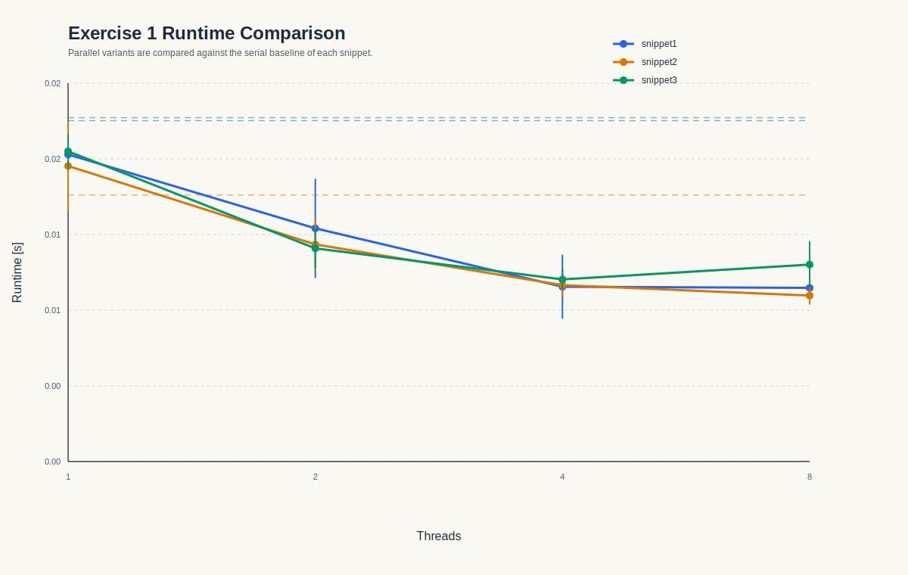
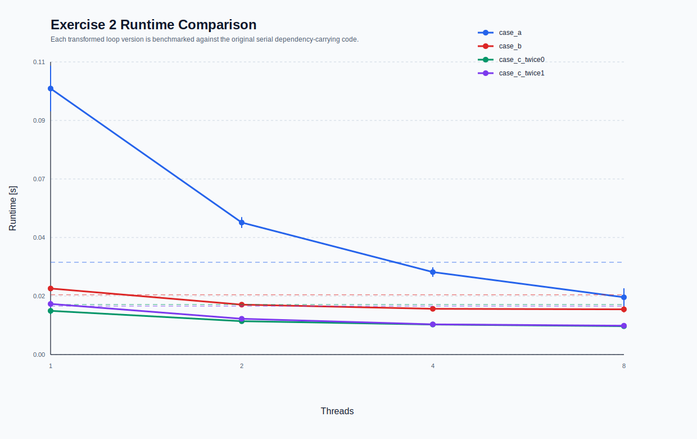
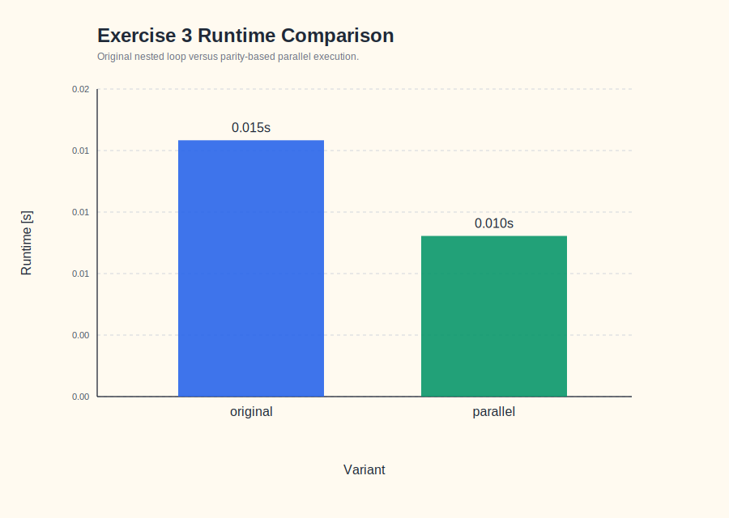

# Assignment 7

## Reproduzierbarkeit

Die Lösungen liegen in den Unterordnern:

- [ex1](./ex1)
- [ex2](./ex2)
- [ex3](./ex3)

Jeder Unterordner enthält:

- ein `Makefile`
- den C-Code mit Original- und transformierter/paralleler Variante
- ein Benchmark-Skript
- ein Analyse-Skript
- erzeugte Messdaten als CSV und Text
- ein SVG-Diagramm für den Vergleich

Wichtige Dateien:

- [ex1/benchmark.c](./ex1/benchmark.c)
- [ex2/benchmark.c](./ex2/benchmark.c)
- [ex3/benchmark.c](./ex3/benchmark.c)

Ausführung jeweils lokal:

```bash
cd 07/ex1 && make run analyze
cd 07/ex2 && make run analyze
cd 07/ex3 && make run analyze
```

Ich habe die Programme lokal kompiliert, ausgeführt und die Ergebnisdateien neu erzeugt. Da auf diesem Rechner kein nutzbares OpenMP verfügbar war, sind die Parallelvarianten portabel mit `pthreads` umgesetzt.

## Exercise 1

Code und Messpipeline:

- [ex1/benchmark.c](./ex1/benchmark.c)
- [ex1/run_benchmarks.py](./ex1/run_benchmarks.py)
- [ex1/analyze_results.py](./ex1/analyze_results.py)
- [ex1/results/time_results.csv](./ex1/results/time_results.csv)
- [ex1/results/summary_stats.csv](./ex1/results/summary_stats.csv)
- [ex1/results/summary_report.txt](./ex1/results/summary_report.txt)
- [ex1/results/plots/runtime_comparison.svg](./ex1/results/plots/runtime_comparison.svg)

### Snippet 1

Original:

```c
for (int i = 0; i < n - 1; i++) {
    x[i] = (y[i] + x[i + 1]) / 7;
}
```

Abhängigkeit:

- Keine echte loop-carried flow dependence.
- Es gibt eine loop-carried Anti-Dependence auf `x[i+1]`: Iteration `i` liest `x[i+1]`, Iteration `i+1` überschreibt `x[i+1]`.

Transformation:

```c
memcpy(x_old, x, sizeof(*x) * n);
parallel_for i in [0, n-2]:
    x[i] = (y[i] + x_old[i + 1]) / 7.0;
```

Idee:

- Die alte Version von `x` wird in `x_old` konserviert.
- Danach können alle Iterationen unabhängig parallel ausgeführt werden.

### Snippet 2

Original:

```c
for (int i = 0; i < n; i++) {
    a = (x[i] + y[i]) / (i + 1);
    z[i] = a;
}
f = sqrt(a + k);
```

Abhängigkeit:

- `a` hat eine output dependence zwischen allen Iterationen.
- Für `f` ist nur der letzte Wert von `a` relevant.

Transformation:

```c
parallel_for i in [0, n-1]:
    z[i] = (x[i] + y[i]) / (i + 1);

a = (x[n - 1] + y[n - 1]) / n;
f = sqrt(a + k);
```

Idee:

- `a` wird aus der Schleife herausgezogen.
- Die Schleife schreibt nur noch nach `z[i]` und ist damit unabhängig.

### Snippet 3

Original:

```c
for (int i = 0; i < n; i++) {
    x[i] = y[i] * 2 + b * i;
}

for (int i = 0; i < n; i++) {
    y[i] = x[i] + a / (i + 1);
}
```

Abhängigkeit:

- Innerhalb jeder Schleife gibt es keine loop-carried dependence.
- Zwischen den Schleifen gibt es eine echte flow dependence: die zweite Schleife braucht das vollständig berechnete `x`.

Transformation:

```c
parallel_for i in [0, n-1]:
    x[i] = y[i] * 2.0 + b * i;

barrier;

parallel_for i in [0, n-1]:
    y[i] = x[i] + a / (i + 1);
```

### Messergebnisse

| Snippet | Variante | Threads | Mittelwert [s] | Speedup vs. Original |
| --- | --- | ---: | ---: | ---: |
| 1 | original | 1 | 0.019567 | 1.000 |
| 1 | parallel | 2 | 0.013385 | 1.462 |
| 1 | parallel | 4 | 0.010033 | 1.950 |
| 1 | parallel | 8 | 0.009967 | 1.963 |
| 2 | original | 1 | 0.015301 | 1.000 |
| 2 | parallel | 2 | 0.012460 | 1.228 |
| 2 | parallel | 4 | 0.010126 | 1.511 |
| 2 | parallel | 8 | 0.009523 | 1.607 |
| 3 | original | 1 | 0.019743 | 1.000 |
| 3 | parallel | 2 | 0.012236 | 1.614 |
| 3 | parallel | 4 | 0.010457 | 1.888 |
| 3 | parallel | 8 | 0.011308 | 1.746 |

Beobachtung:

- Alle drei Snippets lassen sich nach kleiner Umformung parallel ausführen.
- `snippet1` und `snippet3` skalieren bis `4` Threads am besten.
- Bei `snippet3` ist `8` Threads bereits leicht schlechter als `4`, was zu dem kleinen Kernel und dem Thread-Overhead passt.



## Exercise 2

Code und Messpipeline:

- [ex2/benchmark.c](./ex2/benchmark.c)
- [ex2/run_benchmarks.py](./ex2/run_benchmarks.py)
- [ex2/analyze_results.py](./ex2/analyze_results.py)
- [ex2/results/time_results.csv](./ex2/results/time_results.csv)
- [ex2/results/summary_stats.csv](./ex2/results/summary_stats.csv)
- [ex2/results/summary_report.txt](./ex2/results/summary_report.txt)
- [ex2/results/plots/runtime_comparison.svg](./ex2/results/plots/runtime_comparison.svg)

### a)

Original:

```c
double factor = 1;
for (int i = 0; i < n; i++) {
    x[i] = factor * y[i];
    factor = factor / 2;
}
```

Abhängigkeit:

- `factor` trägt eine echte loop-carried dependence.

Transformation:

```c
parallel_for i in [0, n-1]:
    x[i] = ldexp(y[i], -i);
```

Begründung:

- `factor` ist exakt `2^{-i}`.
- Damit kann jede Iteration direkt berechnet werden.

### b)

Original:

```c
for (int i = 1; i < n; i++) {
    x[i] = (x[i] + y[i - 1]) / 2;
    y[i] = y[i] + z[i] * 3;
}
```

Abhängigkeit:

- `x[i]` liest `y[i-1]`.
- `y[i-1]` wird in der vorigen Iteration aktualisiert.
- Das ist eine echte loop-carried flow dependence.

Transformation:

```c
parallel_for i in [1, n-1]:
    y[i] = y[i] + z[i] * 3.0;

parallel_for i in [1, n-1]:
    x[i] = (x[i] + y[i - 1]) / 2.0;
```

Begründung:

- Die Aktualisierung von `y` wird zuerst komplett ausgeführt.
- Danach benutzt die zweite Schleife die bereits fertigen Werte.

### c)

Original:

```c
x[0] = x[0] + 5 * y[0];
for (int i = 1; i < n; i++) {
    x[i] = x[i] + 5 * y[i];
    if (twice) {
        x[i - 1] = 2 * x[i - 1];
    }
}
```

Abhängigkeit:

- Für `twice == 0` ist die Schleife unabhängig.
- Für `twice == 1` wird in Iteration `i` zusätzlich `x[i-1]` verändert.
- Das erzeugt eine echte loop-carried dependence.

Transformation für `twice == 1`:

```c
parallel_for i in [0, n-1]:
    updated = x[i] + 5.0 * y[i];
    if (i + 1 < n) {
        x[i] = 2.0 * updated;
    } else {
        x[i] = updated;
    }
```

Begründung:

- Jedes Element außer dem letzten wird genau einmal verdoppelt, und zwar nach seiner eigenen Aktualisierung.
- Das erlaubt eine geschlossene Formel ohne Iterationskette.

### Messergebnisse

| Fall | Variante | Threads | Mittelwert [s] | Speedup vs. Original |
| --- | --- | ---: | ---: | ---: |
| a | original | 1 | 0.035393 | 1.000 |
| a | parallel | 2 | 0.050618 | 0.699 |
| a | parallel | 4 | 0.031622 | 1.119 |
| a | parallel | 8 | 0.021966 | 1.611 |
| b | original | 1 | 0.022938 | 1.000 |
| b | parallel | 2 | 0.019143 | 1.198 |
| b | parallel | 4 | 0.017539 | 1.308 |
| b | parallel | 8 | 0.017355 | 1.322 |
| c, `twice=0` | original | 1 | 0.019170 | 1.000 |
| c, `twice=0` | parallel | 2 | 0.012788 | 1.499 |
| c, `twice=0` | parallel | 4 | 0.011520 | 1.664 |
| c, `twice=0` | parallel | 8 | 0.010882 | 1.762 |
| c, `twice=1` | original | 1 | 0.018580 | 1.000 |
| c, `twice=1` | parallel | 2 | 0.013713 | 1.355 |
| c, `twice=1` | parallel | 4 | 0.011591 | 1.603 |
| c, `twice=1` | parallel | 8 | 0.011075 | 1.678 |

Beobachtung:

- Fall `a` profitiert erst ab mehr Threads, weil `ldexp` plus Thread-Erzeugung für kleine Threadzahlen teurer ist als die sehr einfache serielle Rekurrenz.
- Fall `b` gewinnt moderat durch das Loop-Splitting.
- Fall `c` zeigt den klarsten Nutzen der algebraischen Umformung.



## Exercise 3

Code und Messpipeline:

- [ex3/benchmark.c](./ex3/benchmark.c)
- [ex3/run_benchmarks.py](./ex3/run_benchmarks.py)
- [ex3/analyze_results.py](./ex3/analyze_results.py)
- [ex3/results/time_results.csv](./ex3/results/time_results.csv)
- [ex3/results/summary_stats.csv](./ex3/results/summary_stats.csv)
- [ex3/results/summary_report.txt](./ex3/results/summary_report.txt)
- [ex3/results/plots/runtime_bar.svg](./ex3/results/plots/runtime_bar.svg)

Gegeben:

```c
for (int i = 0; i < 4; ++i) {
    for (int j = 1; j < 4; ++j) {
        a[i + 2][j - 1] = b * a[i][j] + 4;
    }
}
```

### Distanz- und Richtungsvektoren

Eine Vorgängeriteration existiert genau dann, wenn das aktuell gelesene Element `a[i][j]` vorher von einer Iteration `(i-2, j+1)` geschrieben wurde.

| Aktuelle Iteration `(i,j)` | Vorgänger | Distanzvektor | Richtungsvektor |
| --- | --- | --- | --- |
| (0,1) | keiner | - | - |
| (0,2) | keiner | - | - |
| (0,3) | keiner | - | - |
| (1,1) | keiner | - | - |
| (1,2) | keiner | - | - |
| (1,3) | keiner | - | - |
| (2,1) | (0,2) | (2,-1) | (<,>) |
| (2,2) | (0,3) | (2,-1) | (<,>) |
| (2,3) | keiner | - | - |
| (3,1) | (1,2) | (2,-1) | (<,>) |
| (3,2) | (1,3) | (2,-1) | (<,>) |
| (3,3) | keiner | - | - |

### Art der Abhängigkeit

- Es handelt sich um eine echte flow dependence.
- Die Dependence läuft über die äußere Schleife `i`.
- Genauer entstehen zwei unabhängige Ketten:
  - gerade `i`: `0 -> 2`
  - ungerade `i`: `1 -> 3`

### Parallelisierung

Sinnvolle Umformung:

- die geraden `i`-Zeilen werden als eine Kette verarbeitet
- die ungeraden `i`-Zeilen als zweite Kette
- beide Ketten können parallel laufen

Das ist genau die implementierte Variante in [ex3/benchmark.c](./ex3/benchmark.c).

### Vorher/Nachher

Original:

```c
for (size_t i = 0; i + 2 < rows; ++i) {
    for (size_t j = 1; j < cols; ++j) {
        a[i + 2][j - 1] = b * a[i][j] + 4.0;
    }
}
```

Parallel:

```c
worker(parity):
    for (size_t i = parity; i + 2 < rows; i += 2) {
        for (size_t j = 1; j < cols; ++j) {
            a[i + 2][j - 1] = b * a[i][j] + 4.0;
        }
    }
```

### Messergebnisse

| Variante | Threads | Mittelwert [s] | Speedup vs. Original |
| --- | ---: | ---: | ---: |
| original | 1 | 0.015470 | 1.000 |
| parallel | 2 | 0.009699 | 1.595 |

Beobachtung:

- Die Dependence verhindert freie Parallelisierung über alle `i`.
- Mit den zwei unabhängigen Paritätsketten ist trotzdem ein sauberer Speedup erreichbar.



## Fazit

- `ex1` zeigt vor allem Anti-Dependences, Scalar-Privatisierung und Schleifenbarrieren zwischen zwei unabhängigen `for`-Schleifen.
- `ex2` zeigt echte loop-carried dependences und deren Auflösung durch mathematische Umformung oder Loop-Splitting.
- `ex3` zeigt eine echte 2D-Dependence mit Distanzvektor `(2,-1)` und eine Parallelisierung entlang unabhängiger Dependence-Ketten.

Alle Benchmarks wurden lokal ausgeführt; die erzeugten CSV-, Text- und SVG-Dateien liegen in den jeweiligen `results/`-Unterordnern.
