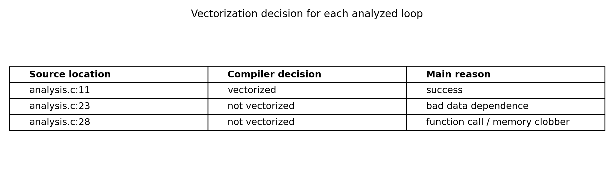
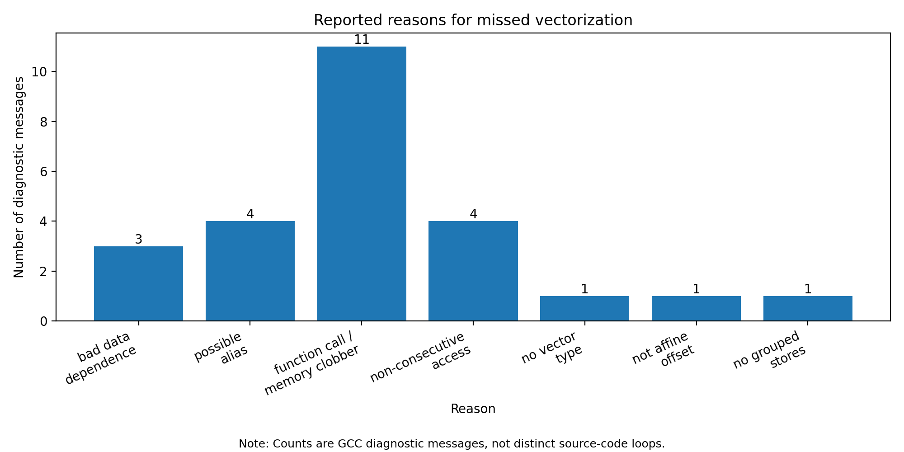
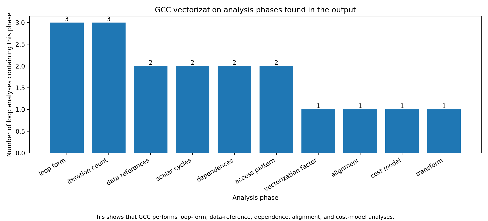

# Assignment 8
Team: Maya Krumholz & Marie Sagerer

## Exercise 1

### 1.Compile [analysis.c](./exc1/analysis.c)
comiled with:
- gcc 12.2.0
- -O2
- -ftree-vectorize - -fopt-info-vec-all-internals.

**-O2**\
enables a broad set of optimizations, but less aggressive then -O3.
Important to note tho it does not necessaserly enable all vectorization by default like -O3, so thats the reason why we needed to add -ftree-vectorize

**-ftree-vectorize**\
it enables two main forms:
- -ftree-loop-vectorize (obv. vectorizes loops)
- -ftree-slp-vectorize (SLP means "superword level parallelism". This vectorizes straight-line code inside a basic block, not necessarily a loop)

&rarr; try loop vectroization + try basic-block / SLP vectorization

**-fopt-info-vec-all-internal**\
here it makes the most sense to split it apart like so:\
-fopt-info &nbsp; -vec &nbsp; -all &nbsp; -internals

-fopt-info (ask Gcc to print optimization reports, be default, these reporst go to stderr, unless a file name is specified)

-vec (only print information related to vectorization, so I only get messages from vectorizer, not from every optimization pass)

-all (in this context it means: show all vectorziataion message categories: optimized, missed, note)\
Categories and their meaning:
- optimized (gcc successfully applied an optimization)
- missed (gcc considederd an optimization but could not do it)
- note (extra diagnostic/explanation detail)

-internals (this makes the output even more detailed. Without it, one would see high-level messages, which aren't that big of a help if one really wants to anaylse it)

What was used to compile and run the code:
- [Makefile](./exc1/Makefile)
- [jobscript](./exc1/job.sh)

### 2. Analysis of the Output

#### Dependence analysis
The most relevant part of the output for dependence analysis is the section called:\
`vect_analyze_data_ref_dependences`\
This section shows where GCC checks whether memory accesses in a loop depend on each other. This is important for vectorization because SIMD execution changes the way loop iterations are executed. Instead of executing strictly one iteration after another, the compiler tries to execute several iterations together. This is only correct if there are no dependencies that would make the original order important.

In my output, the clearest dependence problem appears in the loop at analysis.c:23. GCC reports messages such as:
```
missed: possible alias involving gather/scatter between a[_4] and a[i_47]
missed: bad data dependence
```
This means that GCC sees both a read and a write access to the array a, but it cannot prove that these accesses are independent. In other words, one iteration could write to an element that another iteration reads. If the compiler vectorized this loop, the order of these accesses could change, which might change the result of the program. Because of that, GCC correctly decides not to vectorize this loop.
So the main information I found about dependence analysis is that GCC explicitly checks the relationships between data references in the loop. If it cannot rule out aliasing or loop-carried dependencies, it treats the loop as unsafe for vectorization.\
This is summarized in the following graph:



The plot shows the compiler decision for each analyzed loop. The loop at `analysis.c:11` was vectorized successfully. The loop at `analysis.c:23` was not vectorized because of the data-dependence/aliasing problem. The loop at `analysis.c:28` was not vectorized because it contains a function call that clobbers memory.

#### Successful and unsuccessful vectorization
The output contains quite direct messages that indicate whether vectorization was successful or not.
For the loop at `analysis.c:11`, GCC prints:
```
optimized: loop vectorized using 16 byte vectors
note: LOOP VECTORIZE
```
This is the successful case. GCC was able to transform the scalar loop into a vectorized loop using 16-byte vectors. This means multiple scalar elements can be handled together in one SIMD operation.

For the loop at `analysis.c:23`, the output contains:
```
missed: couldn't vectorize loop
missed: bad data dependence
```
This is an unsuccessful vectorization attempt. The reason is not that GCC does not understand the loop, but that it cannot prove the memory accesses are independent. Therefore vectorizing it would not be safe.

For the loop at `analysis.c:28`, GCC reports messages related to memory clobbering and function calls, for example:
```
missed: statement clobbers memory
missed: not vectorized: loop contains function calls or data references that cannot be analyzed
```
This is caused by the printf inside the loop. A call like printf has side effects, and these side effects have to happen in the correct order. GCC therefore cannot simply group several iterations together into vector operations.
The second plot gives a better overview of the reported reasons for missed vectorization:


This plot counts diagnostic messages emitted by GCC. The largest group is related to function calls and memory clobbers, which matches the failed vectorization of the loop containing printf. The other important groups are possible aliasing and bad data dependence, which correspond to the failed loop at `analysis.c:23`.\
It is important to note that this plot counts messages, not separate loops. One loop can generate several related diagnostic messages, so the numbers should not be interpreted as “number of failed loops”. Instead, they show which types of problems GCC reported most often.

#### Further analysis performed by the compiler
The output also shows that GCC does much more than just checking dependencies and basic semantic correctness. Because -fopt-info-vec-all-internals was used, several internal vectorizer phases are visible.
Examples from the output are:
```
vect_analyze_loop_form
get_loop_niters
vect_analyze_data_refs
vect_analyze_scalar_cycles
vect_analyze_data_ref_dependences
vect_analyze_data_ref_accesses
vect_determine_vectorization_factor
vect_analyze_data_refs_alignment
Cost model analysis
vec_transform_loop
```

From these messages, it is visible that GCC first checks whether the loop has a suitable form for vectorization. It also tries to determine the number of loop iterations, because vectorized code usually processes multiple iterations at once and may need special handling for remaining iterations.\
GCC also analyzes the data references inside the loop. This includes recognizing array accesses, checking whether accesses are consecutive, and determining suitable vector types. It also analyzes scalar cycles and induction variables, such as loop counters, because these are needed to understand expressions like a[i].\
Another important part is the vectorization factor. This tells GCC how many scalar operations can be grouped into one vector operation. In the successful case, GCC reports vectorization with 16-byte vectors.\
The output also contains alignment-related analysis. This matters because aligned memory accesses are usually easier and more efficient to vectorize than unaligned or irregular accesses.\
Finally, GCC performs cost-model analysis. This shows that vectorization is not only a correctness question. Even if a loop can theoretically be vectorized, GCC still estimates whether the vectorized version is likely to be profitable. The output contains information such as vector costs, scalar costs, and profitability thresholds.\
The third plot visualizes these analysis phases:


This plot shows how often the main vectorization analysis phases appeared in the loop-analysis blocks. It supports the observation that GCC performs a whole sequence of analyses before making the final decision. The compiler checks loop structure, iteration count, data references, dependences, access patterns, vectorization factor, alignment, cost model, and finally whether the loop can actually be transformed.

GCC prüft nicht nur Abhängigkeiten, sondern noch mehr, zum Beispiel:
- Form der Schleife
- Anzahl der Iterationen
- Speicherzugriffe
- Alignment
- Kostenmodell

GCC fragt nicht nur „ist es korrekt?“, sondern auch „lohnt es sich überhaupt?“.


#### Summary
Overall, the output shows one successful and two unsuccessful vectorization attempts. The loop at `analysis.c:11` was vectorized using 16-byte vectors. The loop at `analysis.c:23` was rejected because GCC found a possible alias and a bad data dependence. The loop at `analysis.c:28` was rejected because it contains printf, which is a function call with side effects and memory-clobbering behavior.\
The key dependence-analysis information is found in the vect_analyze_data_ref_dependences section. This section shows that GCC checks whether memory accesses between loop iterations are independent. If this cannot be proven, GCC does not vectorize the loop.\
The output also shows that GCC performs several additional analyses beyond dependency and semantic checks. It analyzes loop form, iteration count, data references, scalar cycles, memory access patterns, alignment, vectorization factor, and profitability. Therefore, the compiler decision is based on both legality and performance considerations.


## Exercise 2 - Dependencies + Parallelization & Optimization

### 1. Safely Parallelization - Two methods

```C
void copy(double* x, double* y) {
    for(int i = 0; i < 1024; i++) {
        x[i] = y[i];
    }
}
```

#### Manual parallelization
The loop can be safely parallelized manually if we know that x and y do not overlap.

Each iteration copies one element:
```x[i] = y[i];```
So iteration i only writes to x[i] and reads from y[i]. If x and y point to different memory regions, then different loop iterations do not interfere with each other.

A manual parallel version could be:
```C
void copy(double* x, double* y) {
    #pragma omp parallel for
    for(int i = 0; i < 1024; i++) {
        x[i] = y[i];
    }
}
```

#### Compiler parallelization

The compiler usually cannot safely parallelize this automatically, because it does not know wheter x and y alias.

For example, x and y could point to overlapping memory
```
copy(a + 1, a);
```

Then the loop becomes
```
a[i+1]=a[i];
```

Now iteration i + 1 may read a value that was written by the iteration i, so there is a loop-carreid dependence.

Because of this possible aliasing, the compiler must be conservative and assume that parallelizatin might change the program behavior.

### 2. Normalize the following loop nest:
```C
for (int i=4; i<=N; i+=9) {
    for (int j=0; j<=N; j+=5) {
        A[i] = 0;
    }
}
```

#### Normalization 
Note: Loop normalization means transforming loops into a standard form where the loop varaibles start at `0`and increase by `1`in each iteration, while preserving the same iteration space.


For the outer loop, we introduce a new variable `k`\
When `k = 0`, the original values is `i = 4`.\
When `k = 1`, the original values is `i = 4 + 9`, therefore:
$$
i = 4 + 9k
$$

Original condition is: $i \leq N $\
Substituting $i = 4 + 9k$:
$$
4 + 9k \leq N
$$
Solving for `k`:
$$
9k \leq N - 4 \\[5pt]
k \leq \frac{N-4}{9}
$$

Therefore, the normalized outer loop is:
```C
for (int k=0; k<=(N-4) / 9; k++)
```

For the inner loop, introduce a new varaible `m`:
$$
j = 5m
$$

Original condition is: $j \leq N $\
Substituting $j = 5m$:
$$
5m \leq N
$$
Solving for `m`:
$$
m\leq \frac{N}{5}
$$

So, the normalized inner loop is:
```C
for (int m=0; m<= N / 5; m++)
```

This gives the normalized loop nest:
```C
if (N >= 4) {
    for (int k=0; k<=(N-4) / 9; k++) {
        for (int m=0; m<=N/5; m++) {
            A[4 + 9*k] = 0;
        }
    }
}
```
The guard `if (N >= 4)` is needed because the origianl outer loop only executes if its first value `i = 4` satisfies `i <= N`. Therefore, the outer loop only runs when:
$$
4 \leq N
$$
Without this guard, the normalized loop could incorrectly execute once for some values such as N = 0, because C integer division truncates toward zero. For example (0-4) / 9 evalutes to 0 in C, which would allow k = 0, event thought the original loop would not execute.


> Mental rule: If the normalized loop allows k = 0, then the origianl loop must allow its first value. Otherwise, a guard is needed.


#### Semantic simplification / optimization
The inner loop can also be analyzed semantically:
```C
for (int j=0; j<=N; i+=5) {
        A[i] = 0;
}
````
The variable j is not used inside the loop body. Therefore, the inner loop does not affect which array element is written to. It repeatedly writes the same value 0 to the same location A[i].

So, as long as the inner loop executes at leas once, all of its iterations are equivalen to a single assignment:
```A[i] = 0;```
The inner loop exectues at least once when its intial value j = 0 satisfies the condtion:

$$
0 \leq N
$$

So the condition is:
$$
N \geq 0
$$

Thus, a semantically simplified version is:
```C
if (N >=0) {
    for (int j=4; i<=N; i+=9) {
        A[i] = 0;
    }
}
```
However, this can be simplified further. Since the outer loop itself only executes when N >= 4, the condition N >= 0 is already implied whenever the outer loop actually runs. Therefore, the follwoing version is also sufficient:
```C
for (int i=4; i<=N; i+=9) {
    A[i] = 0;
}
```

### 3. Dependencies - Yes/No?
If no dependencies, how would you parallelize it?\
If yes, what are the distance and direction vectors?

```C
for(int i = 1; i < N; i++) {
    for(int j = 1; j < M; j++) {
        for(int k = 1; k < L; k++) {
            a[i+1][j][k-1] = a[i][j][k] + 5;
        }
    }
}
```
The loop contains a true (flow) dependence.

Each iteration `(i, j, k)``
- reads from a[i][j][k]
- writes to a[i+1][j][k-1]

The value written in iteration `(i, j, k)`is read in iteration `(i+1, j, k-1)`, since:
- `(i, j, k)` writes -> `a[i+1][j][k-1]`
- `(i+1, j, k-1)` reads -> `a[i+1][j][k-1]`

So there is a dependence: $(i, j, k) \rarr (i + 1, j, k - 1)$
This means later iterations rely on results from earlier ones.

Note: the computation does not depend on all previous iteration but only on a specific one.

#### Distance and Direction Vectors

Distance vector:
$$
(1, 0, -1)
$$

Direction vector:
$$
(<, =, >)
$$

- i: increases -> <
- j: unchanged -> =
- k: decreases -> >

#### Parallelization
Because of the dependence in the i dimension, the outer loop cannot be parallelized.\
However, for a fixed i, iteratins over j and k are independent. Therefore, those loops can be parallelized.

```C
for(int i = 1; i < N; i++) {
    #pragma omp parallel for collapse(2)
    for(int j = 1; j < M; j++) {
        for(int k = 1; k < L; k++) {
            a[i+1][j][k-1] = a[i][j][k] + 5;
        }
    }
}
```