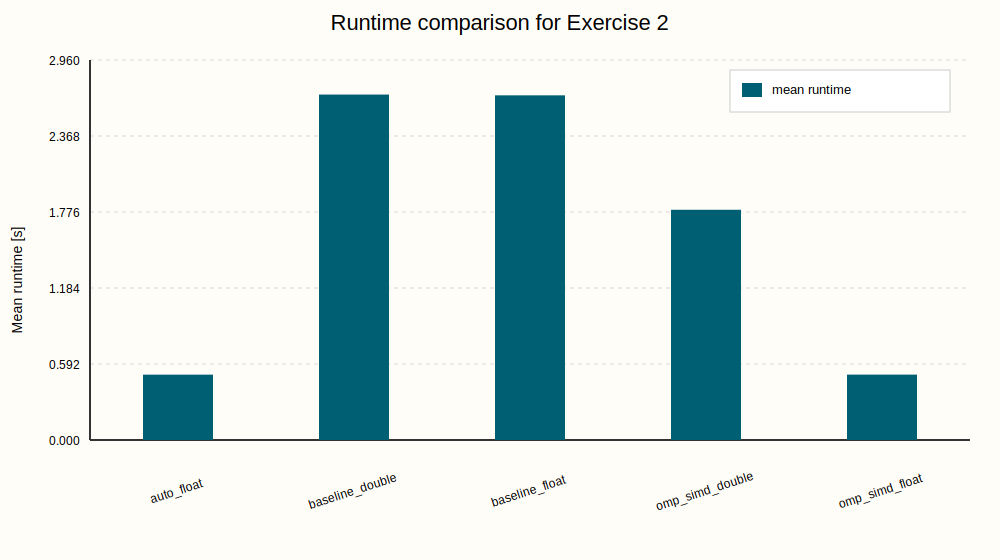
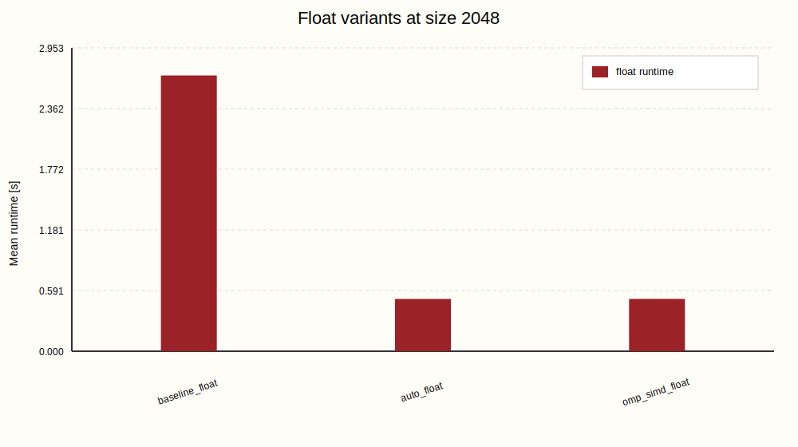
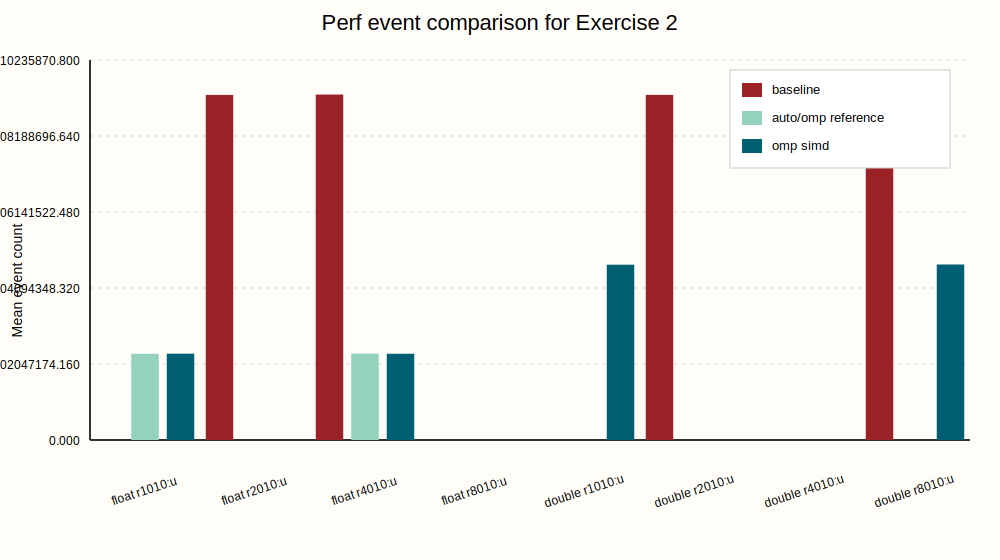
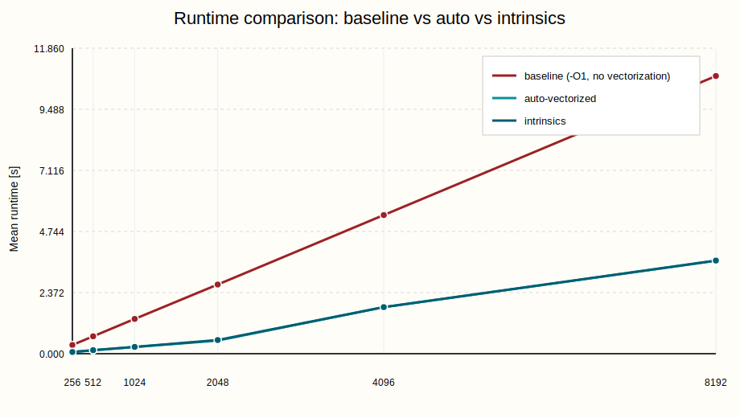
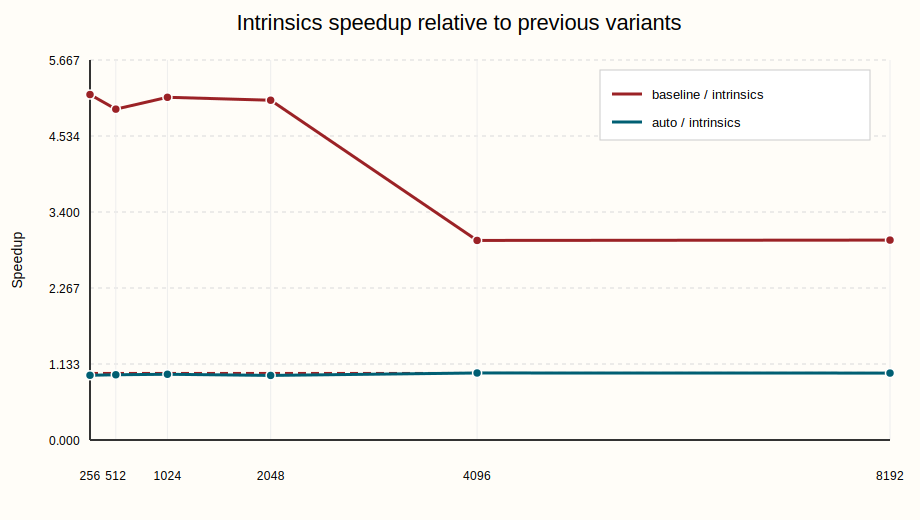
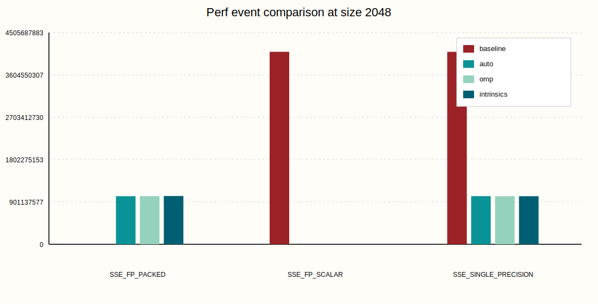

# Assignment 10

Team: Maya Krumholz & Marie Sagerer

## Exercise 1

### 1. Erklärung der Aufgabe

In dieser Aufgabe soll untersucht werden, ob sich eine einfache numerische Schleife allein durch Compiler-Auto-Vektorisierung deutlich beschleunigen lässt.

Die vorgegebene Rechenoperation ist:

```c
a[i] += b[i] * c[i];
```

Diese Schleife soll nicht nur einmal, sondern `1e6` mal ausgeführt werden. Danach soll die Laufzeit der reinen Berechnung gemessen werden. Die Aufgabe verlangt anschließend einen Vergleich zwischen:

- einer sequenziellen Referenzversion
- einer Version mit Compiler-Auto-Vektorisierung

Zusätzlich soll mit `perf` untersucht werden, woher ein möglicher Geschwindigkeitsunterschied kommt.

Die entscheidenden Fragen sind also:

1. Wird die Schleife tatsächlich vektorisiert?
2. Bleibt das Ergebnis korrekt?
3. Wie groß ist der Geschwindigkeitsgewinn?
4. Zeigen die `perf`-Zähler tatsächlich SIMD-Ausführung?


### 2. Was bedeutet Vektorisierung?

Bei einer normalen skalar ausgeführten Schleife wird pro Instruktion typischerweise nur **ein** Wert verarbeitet.

Bei SIMD-Vektorisierung verarbeitet eine Instruktion mehrere Werte gleichzeitig. Bei `float`-Daten kann ein 128-Bit-SSE-Register zum Beispiel vier `float`-Werte parallel verarbeiten.

Statt also konzeptionell nur

```text
a[i] += b[i] * c[i]
```

auszuführen, kann die CPU intern eher etwas in dieser Art machen:

```text
a[i..i+3] += b[i..i+3] * c[i..i+3]
```

Dadurch sinkt die Anzahl der benötigten Instruktionen deutlich.

#### Wann kann ein Compiler gut vektorisieren?

Eine Schleife ist besonders gut geeignet, wenn:

- jede Iteration unabhängig von den anderen ist
- die Speicherzugriffe regelmäßig und zusammenhängend sind
- keine komplizierten Seiteneffekte oder Funktionsaufrufe innerhalb der Schleife vorkommen

Die gegebene Schleife ist genau so ein günstiger Fall:

- `a[i]` hängt nur von `a[i]`, `b[i]` und `c[i]` ab
- es gibt keine offensichtige Abhängigkeit zwischen `i` und `i+1`
- alle Daten werden linear durchlaufen

#### Warum ist der Vergleich mit `-O1` wichtig?

Die Aufgabe verlangt, die Änderung möglichst auf die Vektorisierung zu beschränken. Deshalb wurde nicht einfach auf `-O3` gewechselt, sondern gezielt verglichen:

- `-O1 -fno-tree-vectorize`
- `-O1 -ftree-vectorize`

So bleibt die Grundoptimierung ähnlich, und der Unterschied ist hauptsächlich die Auto-Vektorisierung.

#### Warum ist `perf` hier hilfreich?

Die Laufzeit allein zeigt nur, **dass** eine Version schneller ist.

`perf` hilft dabei zu zeigen, **warum** sie schneller ist.

Besonders interessant sind dabei diese Ereignisse:

- `FP_COMP_OPS_EXE.SSE_FP`
- `FP_COMP_OPS_EXE.SSE_FP_PACKED`
- `FP_COMP_OPS_EXE.SSE_FP_SCALAR`
- `FP_COMP_OPS_EXE.SSE_SINGLE_PRECISION`

Diese Ereignisse zählen nicht einfach nur allgemein Instruktionen, sondern unterscheiden genauer, **in welcher Form Gleitkommaoperationen ausgeführt wurden**.

`FP_COMP_OPS_EXE.SSE_FP` ist dabei der allgemeine Oberbegriff für Gleitkommaoperationen, die über SSE-Instruktionen ausgeführt werden.

`FP_COMP_OPS_EXE.SSE_FP_PACKED` zählt **gepackte** SSE-Gleitkommaoperationen. Gepackt bedeutet hier, dass eine Instruktion mehrere Werte gleichzeitig verarbeitet. Bei `float` und 128-Bit-SSE sind das typischerweise vier Werte auf einmal. Genau das ist der eigentliche SIMD-Effekt: mehrere Datenwerte werden mit einer einzigen Instruktion bearbeitet.

`FP_COMP_OPS_EXE.SSE_FP_SCALAR` zählt dagegen **skalare** SSE-Gleitkommaoperationen. Skalar bedeutet, dass eine Instruktion nur einen einzelnen Wert verarbeitet. Diese Zählung ist deshalb wichtig, weil sie zeigt, ob die Berechnung noch weitgehend elementweise ausgeführt wird.

`FP_COMP_OPS_EXE.SSE_SINGLE_PRECISION` zählt SSE-Gleitkommaoperationen mit einfacher Genauigkeit, also `float`. Dieses Ereignis passt hier besonders gut zur Aufgabe, weil die verwendeten Arrays genau diesen Datentyp besitzen.

Für die Interpretation sind vor allem `SSE_FP_PACKED` und `SSE_FP_SCALAR` entscheidend:

- ein hoher Wert bei `SSE_FP_PACKED` bedeutet, dass viele Gleitkommaoperationen in SIMD-Paketen ausgeführt werden
- ein hoher Wert bei `SSE_FP_SCALAR` bedeutet, dass viele Operationen weiterhin skalar, also einzeln, ausgeführt werden

Wenn die vektorisierte Version wirklich SIMD nutzt, dann sollte deshalb:

- `SSE_FP_PACKED` deutlich steigen
- `SSE_FP_SCALAR` stark sinken

Genau das ist später ein sehr guter Nachweis dafür, dass eine Laufzeitverbesserung nicht zufällig entstanden ist, sondern tatsächlich aus der Umstellung von skalarer auf gepackte SIMD-Ausführung stammt.


### 3. Umsetzung mit dem Code

Verwendete Dateien:

- Programm: [10/ex1/vector_add.c](/Users/mayakrumholz/Desktop/Uni/5_Semester/Parallele_Programmierung/ps_parprog_2026/10/ex1/vector_add.c)
- Build-Datei: [10/ex1/Makefile](/Users/mayakrumholz/Desktop/Uni/5_Semester/Parallele_Programmierung/ps_parprog_2026/10/ex1/Makefile)
- Jobscript: [10/ex1/job.sh](/Users/mayakrumholz/Desktop/Uni/5_Semester/Parallele_Programmierung/ps_parprog_2026/10/ex1/job.sh)
- Auswertung: [10/ex1/analyze_results.py](/Users/mayakrumholz/Desktop/Uni/5_Semester/Parallele_Programmierung/ps_parprog_2026/10/ex1/analyze_results.py)

#### 3.1 Die eigentliche Rechenschleife

```c
__attribute__((noinline))
static void run_kernel(float *restrict a,
                       const float *restrict b,
                       const float *restrict c,
                       int size,
                       int repetitions) {
    for (int run = 0; run < repetitions; ++run) {
        for (int i = 0; i < size; ++i) {
            a[i] += b[i] * c[i];
        }
    }
}
```

Wichtige Punkte:

- `noinline`
  verhindert, dass der Compiler die Funktion einfach in `main` hineinzieht. Dadurch bleibt der zu messende Codebereich klar abgegrenzt.
- `restrict`
  sagt dem Compiler, dass `a`, `b` und `c` nicht auf denselben Speicher zeigen. Das hilft der Vektorisierungsanalyse, weil weniger konservative Alias-Annahmen nötig sind.
- zwei Schleifen
  die äußere Schleife mit `repetitions` sorgt dafür, dass die Laufzeit groß genug wird. Die innere Schleife ist die eigentlich interessante Datenparallelität über `i`.

#### 3.2 Initialisierung der Vektoren

```c
static void initialize_vectors(float *a, float *b, float *c, int size) {
    for (int i = 0; i < size; ++i) {
        a[i] = 1.0f;
        b[i] = 0.5f;
        c[i] = 0.25f;
    }
}
```

Diese Werte wurden bewusst so gewählt, dass:

- die Rechnung leicht nachvollziehbar bleibt
- kein Overflow entsteht
- die Korrektheit einfach überprüft werden kann

Denn pro Iteration gilt:

```text
b[i] * c[i] = 0.5 * 0.25 = 0.125
```

Nach `1e6` Wiederholungen ist damit für jedes Element zu erwarten:

```text
a[i] = 1.0 + 1000000 * 0.125 = 125001.0
```

#### 3.3 Speicherallokation

```c
float *a = xaligned_alloc(64, bytes);
float *b = xaligned_alloc(64, bytes);
float *c = xaligned_alloc(64, bytes);
```

Das ist für die Aufgabe nicht zwingend, aber sinnvoll:

- ausgerichtete Daten sind günstiger für SIMD-Zugriffe
- der Compiler und die Hardware bekommen damit bessere Voraussetzungen für regelmäßige Vektoroperationen

#### 3.4 Zeitmessung nur für die Berechnung

```c
double start = now_seconds();
run_kernel(a, b, c, size, repetitions);
double elapsed = now_seconds() - start;
```

Gemessen wird also nur:

- die eigentliche Schleifenrechnung

Nicht mitgemessen werden:

- Speicherallokation
- Initialisierung
- Korrektheitsprüfung
- Ausgabe

#### 3.5 Korrektheitsprüfung

```c
float expected_value = init_a + (float)repetitions * increment;
double expected_checksum = (double)size * (double)expected_value;
```

Zusätzlich werden Stichprobenwerte geprüft:

- `sample0`
- `samplemid`
- `samplelast`

und als Status `ok` oder `mismatch` ausgegeben.

#### 3.6 Zwei Compiler-Varianten

Der Vergleich wird mit zwei Programmen umgesetzt:

```make
baseline:
	gcc ... -O1 -fno-tree-vectorize ...

auto_vectorized:
	gcc ... -O1 -ftree-vectorize ...
```

Damit entsteht:

- `baseline` als Referenz ohne Auto-Vektorisierung
- `auto_vectorized` mit eingeschalteter Compiler-Vektorisierung

#### 3.7 Was das Jobscript auf LCC3 macht

Es macht im Wesentlichen diese Schritte:

1. beide Varianten bauen
2. mehrere Problemgrößen messen
3. jede Konfiguration `5` mal ausführen
4. alle Rohdaten in `results/time_results.csv` schreiben
5. `perf` für ausgewählte Größen ausführen
6. `perf`-Rohdaten in `results/perf_results.csv` sammeln
7. am Ende Tabellen und Grafiken erzeugen

Gemessene Größen:

```text
256, 512, 1024, 2048, 4096, 8192
```

Zusätzliche `perf`-Messungen:

```text
2048 und 8192
```


### 4. Was man vor den Ergebnissen erwarten kann und warum

Vor der Messung ist fachlich zu erwarten, dass die auto-vektorisierte Version schneller ist.

Der Grund:

- bei `float` kann SSE mehrere Werte gleichzeitig bearbeiten
- die Schleife hat keine problematischen Abhängigkeiten
- die Speicherzugriffe sind zusammenhängend

Man würde also vermuten:

1. Die Baseline nutzt vor allem skalare Gleitkommaoperationen.
2. Die auto-vektorisierte Version nutzt gepackte SIMD-Operationen.
3. Die Laufzeit sinkt deutlich.
4. Der Speedup hängt von der Problemgröße ab.

Warum hängt der Speedup von der Problemgröße ab?

- Bei kleineren Datenmengen dominiert eher die reine Rechenstruktur.
- Bei größeren Datenmengen spielen zusätzlich Speicherzugriffe, Cache-Verhalten und Bandbreite eine größere Rolle.

Deshalb ist kein konstanter Speedup zu erwarten.

Außerdem sollte das Compiler-Reporting zeigen, dass die **innere Schleife** vektorisiert wurde, auch wenn die äußere Wiederholungsschleife selbst nicht vektorisiert wird.


### 5. Ergebnisse und Einordnung

Die Messungen auf LCC3 wurden erfolgreich durchgeführt. Alle Läufe liefern `status=ok`.


#### 5.1 Laufzeitergebnisse

Die gemittelten Laufzeiten sind:

| Size | Baseline mean [s] | Auto-vectorized mean [s] | Speedup |
| --- | ---: | ---: | ---: |
| 256 | 0.338855 | 0.063496 | 5.337 |
| 512 | 0.675002 | 0.133095 | 5.072 |
| 1024 | 1.349851 | 0.258918 | 5.213 |
| 2048 | 2.685649 | 0.510449 | 5.261 |
| 4096 | 5.383164 | 1.807423 | 2.978 |
| 8192 | 10.781906 | 3.609614 | 2.987 |

#### 5.2 Analyse der Laufzeitgrafik

Die Grafik [runtime_by_size.svg](/Users/mayakrumholz/Desktop/Uni/5_Semester/Parallele_Programmierung/ps_parprog_2026/10/ex1/results/plots/runtime_by_size.svg:1) zeigt:


- beide Varianten werden mit wachsender Vektorgröße langsamer
- die auto-vektorisierte Version liegt durchgehend klar unter der Baseline

Das bestätigt, dass der Compiler aus derselben mathematischen Operation deutlich effizienteren Maschinencode erzeugen konnte.

Interessant ist außerdem:

- für `256` bis `2048` liegt der Speedup bei ungefähr Faktor `5`
- ab `4096` fällt er auf ungefähr Faktor `3`

#### 5.3 Analyse der Speedup-Grafik

Die Grafik [speedup_by_size.svg](/Users/mayakrumholz/Desktop/Uni/5_Semester/Parallele_Programmierung/ps_parprog_2026/10/ex1/results/plots/speedup_by_size.svg:1) macht genau diesen Effekt sichtbar.


Interpretation:

- Bei kleineren und mittleren Größen dominiert der Vorteil der SIMD-Rechenoperationen sehr stark.
- Bei größeren Größen begrenzen Speicherzugriffe und Datenbewegung den Gewinn stärker.

Das ist ein typisches Verhalten:

- Rechenoptimierung allein hilft besonders dann stark, wenn die Anwendung eher compute-lastig ist.
- Sobald Speicherverhalten wichtiger wird, sinkt der relative Vorteil.

#### 5.4 Analyse der `perf`-Ergebnisse

Die `perf`-Zusammenfassung zeigt für `size = 2048`:

Baseline:

- `cycles:u = 8221671739`
- `instructions:u = 14340876604`
- `r1010:u = 0`
- `r2010:u = 4096079894`

Auto-vectorized:

- `cycles:u = 1558282112`
- `instructions:u = 4616753590`
- `r1010:u = 1023529106`
- `r2010:u = 4`

Bedeutung:

- `r1010:u` entspricht `SSE_FP_PACKED`
- `r2010:u` entspricht `SSE_FP_SCALAR`

Damit sieht man sehr klar:

- Die Baseline verwendet praktisch **keine** gepackten SIMD-FP-Operationen.
- Die auto-vektorisierte Version verwendet sehr viele gepackte SIMD-FP-Operationen.
- Gleichzeitig verschwinden die skalaren FP-Operationen fast vollständig.

Genau das ist der erwartete Beweis dafür, dass die Beschleunigung wirklich aus Vektorisierung stammt.

Dasselbe Bild zeigt sich auch bei `size = 8192`:

- Baseline: `r1010:u = 0`
- Auto-vectorized: `r1010:u = 4135578372`

Die Grafik [perf_vector_events.svg](/Users/mayakrumholz/Desktop/Uni/5_Semester/Parallele_Programmierung/ps_parprog_2026/10/ex1/results/plots/perf_vector_events.svg:1) visualisiert diesen Unterschied sehr gut:


- rot: Baseline
- blau: auto-vektorisierte Version

Besonders wichtig ist dort:

- blau ist bei `SSE_FP_PACKED` sehr hoch
- rot ist dort praktisch null
- rot ist bei `SSE_FP_SCALAR` sehr hoch
- blau ist dort nahezu null

Diese Grafik eignet sich deshalb besonders gut für die Abgabe, weil sie den Kern der Aufgabe direkt sichtbar macht.

#### 5.5 Compiler-Report zur Vektorisierung

Der Compiler-Report in [10/ex1/report/raw/auto_vec_report.txt](/Users/mayakrumholz/Desktop/Uni/5_Semester/Parallele_Programmierung/ps_parprog_2026/10/ex1/report/raw/auto_vec_report.txt:1) enthält die entscheidenden Zeilen:

```text
vector_add.c:45:27: optimized: loop vectorized using 16 byte vectors
vector_add.c:45:27: optimized: loop vectorized using 8 byte vectors
```

Das zeigt:

- die innere Schleife wurde tatsächlich vektorisiert
- der Compiler hat also genau die relevante Rechenschleife erfolgreich in SIMD-Code umgesetzt

Außerdem steht dort:

```text
vector_add.c:44:27: missed: couldn't vectorize loop
vector_add.c:44:27: missed: not vectorized: control flow in loop.
```

Das ist unkritisch, weil sich diese Meldung auf die äußere Wiederholungsschleife bezieht. Für die Performance ist hier vor allem entscheidend, dass die innere Daten-Schleife vektorisiert wurde.


### 6. Fazit

Die Aufgabe zeigt sehr deutlich, dass Auto-Vektorisierung bei einer geeigneten Schleifenstruktur einen großen Geschwindigkeitsgewinn bringen kann.

Die wichtigsten Ergebnisse sind:

1. Die Berechnung bleibt korrekt.
2. Der Compiler vektorisiert die innere Schleife tatsächlich.
3. Für `size = 2048` ergibt sich ein Speedup von `5.261`.
4. Für kleinere und mittlere Größen liegt der Speedup ungefähr bei Faktor `5`.
5. Für größere Größen sinkt der Speedup auf ungefähr Faktor `3`, was auf stärkeren Einfluss des Speicherverhaltens hinweist.
6. Die `perf`-Zähler bestätigen, dass die auto-vektorisierte Variante gepackte SIMD-Instruktionen nutzt, während die Baseline überwiegend skalare FP-Operationen ausführt.

Insgesamt ist die Beobachtung also konsistent:

- Der Compiler erkennt die Schleife als guten SIMD-Kandidaten.
- Die erzeugten Vektoroperationen reduzieren die Zahl der benötigten Instruktionen und Zyklen deutlich.
- Der Performancegewinn ist real, messbar und durch `perf` sauber nachvollziehbar.


## Exercise 2

### 1. Erklärung der Aufgabe

In Exercise 2 soll dieselbe Grundrechnung nicht mehr durch Compiler-Auto-Vektorisierung, sondern **manuell mit OpenMP-SIMD** vektorisiert werden.

Die Aufgabenstellung verlangt dabei ausdrücklich:

- OpenMP für Vektorisierung zu verwenden
- **keine** thread-basierte Parallelisierung zu benutzen
- die OpenMP-SIMD-Version mit der sequenziellen Referenz und der Compiler-Version aus Exercise 1 zu vergleichen
- den Vergleich zusätzlich für `double` statt `float` zu wiederholen
- die Beobachtungen wieder mit `perf` zu überprüfen


### 2. Grundlegend

Der wichtige neue Punkt in Exercise 2 ist der Unterschied zwischen:

- OpenMP für **Threads**
- OpenMP für **SIMD**

Hier wird nicht `#pragma omp parallel for` verwendet, sondern:

```c
#pragma omp simd
```


Diese Direktive sagt dem Compiler:

- die Iterationen dieser Schleife dürfen SIMD-parallel ausgeführt werden
- es sollen aber **keine zusätzlichen Threads** erzeugt werden

Man arbeitet also weiterhin nur auf **einem Kern**, nutzt aber innerhalb dieses Kerns die Vektorregister breiter aus.

Bei 128-Bit-SSE gilt grob:

- `float`: bis zu 4 Werte pro Vektor
- `double`: bis zu 2 Werte pro Vektor

Deshalb ist zu erwarten, dass Vektorisierung bei `double` tendenziell einen geringeren relativen Gewinn zeigt als bei `float`.


### 3. Umsetzung mit dem Code

Verwendete Dateien:

- Programm: [10/ex2/vector_add_typed.c](/Users/mayakrumholz/Desktop/Uni/5_Semester/Parallele_Programmierung/ps_parprog_2026/10/ex2/vector_add_typed.c)
- Build-Datei: [10/ex2/Makefile](/Users/mayakrumholz/Desktop/Uni/5_Semester/Parallele_Programmierung/ps_parprog_2026/10/ex2/Makefile)
- Jobscript: [10/ex2/job.sh](/Users/mayakrumholz/Desktop/Uni/5_Semester/Parallele_Programmierung/ps_parprog_2026/10/ex2/job.sh)
- Auswertung: [10/ex2/analyze_results.py](/Users/mayakrumholz/Desktop/Uni/5_Semester/Parallele_Programmierung/ps_parprog_2026/10/ex2/analyze_results.py)

#### 3.1 Gemeinsames Benchmark-Programm für `float` und `double`

Das Programm ist so aufgebaut, dass derselbe Quellcode für mehrere Varianten kompiliert wird.

Wichtige Makros am Anfang von [10/ex2/vector_add_typed.c](/Users/mayakrumholz/Desktop/Uni/5_Semester/Parallele_Programmierung/ps_parprog_2026/10/ex2/vector_add_typed.c:1):

- `DATA_TYPE`
- `TYPE_NAME`
- `VARIANT_NAME`

Dadurch kann derselbe Code als

- `float`
- `double`
- Baseline
- Auto-Vektorisierung
- OpenMP-SIMD

gebaut werden, ohne Logik doppelt schreiben zu müssen.

#### 3.2 Die SIMD-relevante Schleife

```c
for (run = 0; run < repetitions; ++run) {
#ifdef USE_OMP_SIMD
#pragma omp simd
#endif
    for (int i = 0; i < size; ++i) {
        a[i] += b[i] * c[i];
    }
}
```

Der entscheidende Punkt ist:

- nur in den OpenMP-SIMD-Varianten ist `USE_OMP_SIMD` gesetzt
- dann wird vor die innere Schleife `#pragma omp simd` gesetzt
- dadurch wird keine Thread-Parallelität aktiviert, sondern nur SIMD-Vektorisierung angefordert

#### 3.3 Warum `-fopenmp-simd` und nicht `-fopenmp`?

In [10/ex2/Makefile](/Users/mayakrumholz/Desktop/Uni/5_Semester/Parallele_Programmierung/ps_parprog_2026/10/ex2/Makefile:1) werden die OpenMP-SIMD-Varianten mit `-fopenmp-simd` kompiliert.

Das ist hier passend, weil:

- SIMD-Direktiven unterstützt werden
- keine vollständige Thread-OpenMP-Laufzeit nötig ist
- die Lösung damit näher an der Aufgabenidee bleibt: SIMD ja, Threads nein

Zusätzlich wird für die OpenMP-SIMD-Varianten wieder `-fno-tree-vectorize` gesetzt. Dadurch soll vermieden werden, dass der Compiler dieselbe Schleife zusätzlich wegen seiner normalen Auto-Vektorisierung optimiert. So bleibt der Unterschied möglichst auf die OpenMP-SIMD-Direktive beschränkt.

#### 3.4 Gebaute Varianten

Das Makefile erzeugt fünf Programme:

- `baseline_float`
- `auto_float`
- `omp_simd_float`
- `baseline_double`
- `omp_simd_double`

Damit lassen sich alle für Exercise 2 wichtigen Vergleiche in einem Durchgang messen:

- `float`: Baseline vs. Auto vs. OpenMP-SIMD
- `double`: Baseline vs. OpenMP-SIMD

#### 3.5 Was das Jobscript misst

Das Jobscript in [10/ex2/job.sh](/Users/mayakrumholz/Desktop/Uni/5_Semester/Parallele_Programmierung/ps_parprog_2026/10/ex2/job.sh:1) misst genau die in der Aufgabe geforderte Größe:

- `size = 2048`
- `repetitions = 1000000`

Jede Variante wird `5` mal ausgeführt.

Zusätzlich wird für jede Variante `perf stat` ausgeführt.

Gemessen werden:

- `cycles`
- `instructions`
- `r0410` = `SSE_FP`
- `r1010` = `SSE_FP_PACKED`
- `r2010` = `SSE_FP_SCALAR`
- `r4010` = `SSE_SINGLE_PRECISION`
- `r8010` = `SSE_DOUBLE_PRECISION`

Dadurch können wir später sowohl die `float`- als auch die `double`-Variante passend interpretieren.

#### 3.6 Automatische Auswertung

Nach dem LCC3-Lauf erzeugt die Auswertung automatisch:

- `10/ex2/results/time_results.csv`
- `10/ex2/results/perf_results.csv`
- `10/ex2/results/summary_table.md`
- `10/ex2/results/perf_summary.md`
- `10/ex2/results/plots/runtime_variants.svg`
- `10/ex2/results/plots/float_variant_comparison.svg`
- `10/ex2/results/plots/perf_variant_events.svg`


### 4. Was man vor den Ergebnissen erwarten kann und warum

Vor der Messung ist fachlich zu erwarten:

1. `omp_simd_float` sollte deutlich schneller sein als `baseline_float`.
2. `omp_simd_float` könnte ähnlich schnell wie `auto_float` sein, eventuell etwas langsamer oder etwas schneller.
3. `omp_simd_double` sollte ebenfalls schneller sein als `baseline_double`.
4. Der relative Gewinn bei `double` dürfte kleiner ausfallen als bei `float`.

Warum könnte OpenMP-SIMD ähnlich wie Auto-Vektorisierung sein?

Weil in beiden Fällen am Ende SIMD-Maschinencode entstehen soll. Der Unterschied liegt eher darin, **wer dem Compiler die Parallelität mitteilt**:

- bei Exercise 1 erkennt der Compiler sie selbst
- bei Exercise 2 geben wir sie explizit mit einer Direktive vor

Vorteil von OpenMP-SIMD:

- man kann dem Compiler klar signalisieren, dass die Schleife SIMD-geeignet ist

Nachteil:

- der Code ist weniger rein „sequenziell“
- man bindet eine Optimierungsabsicht direkt an den Quellcode


### 5. Ergebnisse und Einordnung

Die Messungen auf LCC3 wurden erfolgreich durchgeführt. Alle Varianten liefern `status=ok`, also korrekte Ergebnisse.

#### 5.1 Laufzeitergebnisse

Die gemittelten Laufzeiten sind:

| Variant | Type | Mean [s] |
| --- | --- | ---: |
| `baseline_float` | `float` | `2.684614` |
| `auto_float` | `float` | `0.508945` |
| `omp_simd_float` | `float` | `0.509245` |
| `baseline_double` | `double` | `2.690833` |
| `omp_simd_double` | `double` | `1.793308` |

Die wichtigsten Vergleiche daraus:

- `baseline_float` vs. `omp_simd_float`: Speedup `5.272`
- `baseline_float` vs. `auto_float`: Speedup `5.275`
- `auto_float` vs. `omp_simd_float`: Faktor `0.999`, also praktisch gleich schnell
- `baseline_double` vs. `omp_simd_double`: Speedup `1.500`

Für die von der Aufgabe verlangte OpenMP-SIMD-Zeit bei `size = 2048`, `1e6` Wiederholungen und `float` ergibt sich also:

- `omp_simd_float = 0.509245 s`

#### 5.2 Analyse der Laufzeitgrafik

Die Grafik [runtime_variants.svg](/Users/mayakrumholz/Desktop/Uni/5_Semester/Parallele_Programmierung/ps_parprog_2026/10/ex2/results/plots/runtime_variants.svg:1) zeigt den Gesamtvergleich aller Varianten.



Man erkennt dort sofort:

- beide Baseline-Versionen liegen bei ungefähr `2.69 s`
- `auto_float` und `omp_simd_float` liegen fast exakt übereinander bei ungefähr `0.509 s`
- `omp_simd_double` liegt mit ungefähr `1.79 s` deutlich unter `baseline_double`, aber klar über den `float`-SIMD-Varianten

Das bedeutet:

- OpenMP-SIMD funktioniert für `float` sehr gut
- bei `float` ist die OpenMP-SIMD-Version praktisch gleich schnell wie die Auto-Vektorisierung aus Exercise 1
- bei `double` gibt es ebenfalls einen Gewinn, aber deutlich kleiner

#### 5.3 Detaillierter Vergleich der `float`-Varianten

Die Grafik [float_variant_comparison.svg](/Users/mayakrumholz/Desktop/Uni/5_Semester/Parallele_Programmierung/ps_parprog_2026/10/ex2/results/plots/float_variant_comparison.svg:1) zoomt auf die drei `float`-Varianten:



Hier sieht man besonders gut:

- der große Sprung passiert zwischen `baseline_float` und den beiden SIMD-Varianten
- zwischen `auto_float` und `omp_simd_float` gibt es praktisch keinen relevanten Unterschied

Das ist ein wichtiges Ergebnis dieser Aufgabe:

- wenn die Schleife so einfach und regelmäßig ist wie hier, dann kommt OpenMP-SIMD auf praktisch denselben Effekt wie die Compiler-Auto-Vektorisierung

Mit anderen Worten:

- Exercise 2 bestätigt das Ergebnis aus Exercise 1
- nur diesmal wird die SIMD-Eigenschaft nicht vom Compiler erkannt, sondern explizit im Quellcode angegeben

#### 5.4 Analyse der `perf`-Ergebnisse für `float`

Für `float` ergeben sich diese zentralen Zähler:

Baseline:

- `r1010:u = 0`
- `r2010:u = 4095816729`
- `r4010:u = 4100214428`
- `cycles:u = 8308198700`
- `instructions:u = 14340740509`

Auto:

- `r1010:u = 1023368807`
- `r2010:u = 16`
- `r4010:u = 1024409675`
- `cycles:u = 1553765529`
- `instructions:u = 4614418603`

OpenMP-SIMD:

- `r1010:u = 1024173347`
- `r2010:u = 16`
- `r4010:u = 1023545859`
- `cycles:u = 1554255720`
- `instructions:u = 4614090951`

Interpretation:

- `r1010:u` entspricht `SSE_FP_PACKED`
- `r2010:u` entspricht `SSE_FP_SCALAR`
- `r4010:u` entspricht `SSE_SINGLE_PRECISION`

Damit zeigt sich für `float` sehr klar:

- die Baseline nutzt praktisch keine gepackten SIMD-FP-Operationen
- sowohl Auto-Vektorisierung als auch OpenMP-SIMD verwenden sehr viele gepackte FP-Operationen
- die skalaren FP-Operationen verschwinden in beiden SIMD-Fällen fast vollständig

Besonders wichtig ist:

- `auto_float` und `omp_simd_float` haben nicht nur ähnliche Laufzeiten
- sie haben auch fast identische `perf`-Zähler

Das ist ein starker Hinweis darauf, dass beide Ansätze am Ende sehr ähnlichen SIMD-Maschinencode erzeugen.

#### 5.5 Analyse der `perf`-Ergebnisse für `double`

Für `double` ist vor allem dieser Vergleich interessant:

Baseline:

- `r1010:u = 0`
- `r2010:u = 4095988613`
- `r8010:u = 4096467175`

OpenMP-SIMD:

- `r1010:u = 2080777666`
- `r2010:u = 16`
- `r8010:u = 2083011791`

Hier ist `r8010:u` besonders relevant, weil es `SSE_DOUBLE_PRECISION` zählt.

Die Interpretation ist:

- `baseline_double` führt die Rechnung weitgehend skalar aus
- `omp_simd_double` schaltet klar auf gepackte SIMD-Operationen um
- trotzdem ist der Speedup mit Faktor `1.500` kleiner als bei `float`

Der Grund passt genau zur Erwartung:

- bei `double` passen weniger Werte gleichzeitig in ein SSE-Register
- dadurch fällt der mögliche SIMD-Gewinn kleiner aus

#### 5.6 Analyse der `perf`-Grafik

Die Grafik [perf_variant_events.svg](/Users/mayakrumholz/Desktop/Uni/5_Semester/Parallele_Programmierung/ps_parprog_2026/10/ex2/results/plots/perf_variant_events.svg:1) fasst diese Beobachtungen visuell zusammen.



Besonders gut erkennbar ist:

- bei den Baseline-Varianten ist `SSE_FP_PACKED` praktisch null
- bei den SIMD-Varianten ist `SSE_FP_PACKED` hoch
- bei den SIMD-Varianten fällt `SSE_FP_SCALAR` nahezu auf null
- `float` zeigt Aktivität bei `SSE_SINGLE_PRECISION`
- `double` zeigt Aktivität bei `SSE_DOUBLE_PRECISION`

Diese Grafik ist deshalb sehr geeignet für die Abgabe, weil sie gleichzeitig zeigt:

- dass SIMD wirklich genutzt wurde
- dass sich `float` und `double` auch in den gezählten Präzisionstypen unterscheiden


### 6. Vergleich zu Exercise 1 und Fazit

Exercise 2 lässt sich sehr gut mit Exercise 1 vergleichen.

Vorteile von OpenMP-SIMD:

- man kann die SIMD-Absicht explizit im Code ausdrücken
- man ist weniger darauf angewiesen, dass der Compiler die Schleife komplett selbst erkennt
- der Ansatz bleibt portabler und deutlich lesbarer als spätere Intrinsics-Lösungen

Nachteile von OpenMP-SIMD:

- der Quellcode ist nicht mehr rein sequenziell
- man trägt Optimierungswissen direkt in den Code ein
- wenn der Compiler die Schleife ohnehin schon perfekt auto-vektorisiert, ist der zusätzliche Gewinn möglicherweise null

Genau das sieht man hier bei `float`:

- `auto_float` und `omp_simd_float` sind praktisch gleich schnell
- die `perf`-Zähler sind nahezu identisch

Das bedeutet:

- für diese einfache Schleife bringt OpenMP-SIMD gegenüber der Compiler-Auto-Vektorisierung keinen spürbaren Zusatzgewinn
- es bestätigt aber, dass dieselbe SIMD-Ausführung auch explizit über OpenMP erreichbar ist

Für `double` zeigt sich zusätzlich:

- auch dort hilft SIMD klar
- der Gewinn ist aber kleiner als bei `float`

Damit lautet das Gesamtfazit für Exercise 2:

1. Die OpenMP-SIMD-Version ist korrekt.
2. Für `float` erreicht sie praktisch dieselbe Leistung wie die Auto-Vektorisierung aus Exercise 1.
3. Gegenüber der Baseline ist der Geschwindigkeitsgewinn bei `float` sehr groß, etwa Faktor `5.27`.
4. Bei `double` gibt es ebenfalls eine Beschleunigung, aber nur etwa Faktor `1.50`.
5. Die `perf`-Zähler bestätigen in beiden Fällen, dass die OpenMP-SIMD-Versionen tatsächlich gepackte SIMD-Gleitkommaoperationen verwenden.


## Exercise 3

### 1. Erklärung der Aufgabe

In Exercise 3 soll die Vektorisierung nicht mehr dem Compiler oder OpenMP überlassen werden. Stattdessen soll die Rechenoperation mit **gcc-spezifischen SIMD-Intrinsics** direkt von Hand formuliert werden.

Die Aufgabenstellung nennt dafür ausdrücklich:

- `_mm_load_ps`
- `_mm_add_ps`
- `_mm_mul_ps`
- `_mm_store_ps`

sowie den Header:

```c
#include <xmmintrin.h>
```


### 2. Was sind Intrinsics?

Intrinsics sind Compiler-Funktionen, die sehr eng an konkrete SIMD-Instruktionen gebunden sind. Sie sehen im C-Code wie Funktionsaufrufe aus, stehen aber konzeptionell fast direkt für Maschinenbefehle.

Beispielhaft gilt hier:

- `_mm_load_ps` lädt vier `float`-Werte in ein SSE-Register
- `_mm_mul_ps` multipliziert zwei solche Register elementweise
- `_mm_add_ps` addiert sie elementweise
- `_mm_store_ps` schreibt das Ergebnis zurück in den Speicher

Damit arbeitet man direkt mit dem Datentyp:

```c
__m128
```

Ein `__m128` enthält bei SSE vier `float`-Werte.

#### Warum ist das stärker „manuell“ als OpenMP-SIMD?

Bei OpenMP-SIMD beschreibt man nur:

- „Diese Schleife darf SIMD-parallel ausgeführt werden.“

Bei Intrinsics beschreibt man dagegen schon:

- welche SIMD-Register verwendet werden
- wann Daten geladen werden
- wann multipliziert wird
- wann addiert wird
- wann zurückgeschrieben wird

Dadurch bekommt man mehr Kontrolle, aber der Code wird auch deutlich hardware-näher und weniger portabel.

#### Warum braucht man hier einen Restfall?

Die Intrinsics arbeiten immer mit Viererblöcken von `float`.

Wenn `size` nicht durch `4` teilbar wäre, könnten am Ende noch einzelne Elemente übrig bleiben. Deshalb braucht man zusätzlich zur Vektorschleife noch eine kleine skalare Restschleife.

Auch wenn die gewählten Problemgrößen in unseren Messungen Vielfache von `4` sind, ist dieser Restfall für einen sauberen allgemeinen Code wichtig.


### 3. Umsetzung mit dem Code

Verwendete Dateien:

- Programm: [10/ex3/vector_add_intrinsics.c](/Users/mayakrumholz/Desktop/Uni/5_Semester/Parallele_Programmierung/ps_parprog_2026/10/ex3/vector_add_intrinsics.c)
- Build-Datei: [10/ex3/Makefile](/Users/mayakrumholz/Desktop/Uni/5_Semester/Parallele_Programmierung/ps_parprog_2026/10/ex3/Makefile)
- Jobscript: [10/ex3/job.sh](/Users/mayakrumholz/Desktop/Uni/5_Semester/Parallele_Programmierung/ps_parprog_2026/10/ex3/job.sh)
- Auswertung: [10/ex3/analyze_results.py](/Users/mayakrumholz/Desktop/Uni/5_Semester/Parallele_Programmierung/ps_parprog_2026/10/ex3/analyze_results.py)

#### 3.1 Die manuell vektorisierte Schleife

```c
for (i = 0; i + 3 < size; i += 4) {
    __m128 a_vec = _mm_load_ps(&a[i]);
    __m128 b_vec = _mm_load_ps(&b[i]);
    __m128 c_vec = _mm_load_ps(&c[i]);
    __m128 mul_vec = _mm_mul_ps(b_vec, c_vec);
    __m128 sum_vec = _mm_add_ps(a_vec, mul_vec);
    _mm_store_ps(&a[i], sum_vec);
}
```

Die Bedeutung der einzelnen Zeilen ist:

- `_mm_load_ps(&a[i])`
  lädt vier aufeinanderfolgende `float`-Werte aus `a`
- `_mm_load_ps(&b[i])`
  lädt vier Werte aus `b`
- `_mm_load_ps(&c[i])`
  lädt vier Werte aus `c`
- `_mm_mul_ps(b_vec, c_vec)`
  multipliziert die vier Werte von `b` und `c` elementweise
- `_mm_add_ps(a_vec, mul_vec)`
  addiert das Ergebnis elementweise zu den vier Werten aus `a`
- `_mm_store_ps(&a[i], sum_vec)`
  schreibt die vier aktualisierten Werte zurück

Damit wird die skalare Operation

```text
a[i] += b[i] * c[i]
```

nicht mehr elementweise, sondern blockweise für vier `float`-Werte gleichzeitig ausgeführt.

#### 3.2 Restschleife für nicht durch 4 teilbare Größen

Direkt danach folgt:

```c
for (; i < size; ++i) {
    a[i] += b[i] * c[i];
}
```

Diese Schleife behandelt eventuell übrig gebliebene Einzelelemente.

Der Vorteil ist:

- das Programm bleibt korrekt für allgemeine `size`
- die SIMD-Schleife muss nicht künstlich auf Vielfache von `4` beschränkt werden

#### 3.3 Warum `_mm_load_ps` hier zulässig ist

`_mm_load_ps` setzt ausgerichteten Speicher voraus. Deshalb werden die Arrays auch hier wieder mit ausgerichteter Allokation erzeugt:

```c
a = xaligned_alloc(64, bytes);
b = xaligned_alloc(64, bytes);
c = xaligned_alloc(64, bytes);
```

Dadurch ist sichergestellt, dass die verwendeten Adressen für diese SSE-Ladeoperationen geeignet sind.

#### 3.4 Build-Entscheidung

Im Makefile wird die Intrinsics-Version mit:

- `-O1`
- `-fno-tree-vectorize`
- `-msse`

gebaut.

Das ist hier wichtig:

- `-O1`, damit die Bedingungen mit den vorigen Aufgaben vergleichbar bleiben
- `-fno-tree-vectorize`, damit nicht zusätzlich die normale Auto-Vektorisierung über die Schleife läuft
- `-msse`, damit die verwendeten SSE-Intrinsics explizit verfügbar sind

#### 3.5 Was auf LCC3 gemessen wird

Das Jobscript misst die Intrinsics-Version für dieselben Problemgrößen wie Exercise 1:

```text
256, 512, 1024, 2048, 4096, 8192
```

Jede Größe wird `5` mal gemessen.

Für `2048` und `8192` wird zusätzlich `perf` ausgeführt.

Die Auswertung liest dann:

- die Baseline- und Auto-Daten aus `ex1`
- die OpenMP-SIMD-Daten aus `ex2`
- die neuen Intrinsics-Daten aus `ex3`


### 4. Was man vor den Ergebnissen erwarten kann und warum

Vor der Messung ist fachlich zu erwarten:

1. Die Intrinsics-Version sollte deutlich schneller sein als die Baseline.
2. Sie sollte SIMD-Zähler zeigen, die zu einer echten Vektorversion passen.
3. Sie könnte ähnlich schnell wie die Auto-Vektorisierung und die OpenMP-SIMD-Version sein.
4. Ein sehr großer zusätzlicher Gewinn gegenüber Exercise 1 und 2 ist nicht zwingend zu erwarten.

Warum?

Wenn Compiler und OpenMP in den vorherigen Aufgaben bereits sehr guten SIMD-Code erzeugt haben, dann bleibt für die manuelle Intrinsics-Variante oft nur wenig zusätzlicher Spielraum.

Ein möglicher Vorteil von Intrinsics ist:

- maximale Kontrolle über die SIMD-Operationen

Mögliche Nachteile sind:

- deutlich schlechtere Lesbarkeit
- stärkere Bindung an eine konkrete SIMD-Architektur
- geringere Portabilität


### 5. Ergebnisse und Einordnung

Die Messungen auf LCC3 wurden erfolgreich durchgeführt. Alle Läufe liefern korrekte Ergebnisse.


#### 5.1 Laufzeitergebnisse der Intrinsics-Version

Die gemittelten Laufzeiten der manuellen Intrinsics-Lösung sind:

| Size | Intrinsics mean [s] |
| --- | ---: |
| 256 | 0.065769 |
| 512 | 0.136790 |
| 1024 | 0.264104 |
| 2048 | 0.529982 |
| 4096 | 1.808508 |
| 8192 | 3.616467 |


#### 5.2 Vergleich zu Exercise 1 und 2

Der direkte Vergleich mit den vorhandenen Referenzdaten ergibt:

| Size | Baseline [s] | Auto [s] | OMP SIMD [s] | Intrinsics [s] | Speedup vs baseline | Speedup vs auto | Speedup vs OMP |
| --- | ---: | ---: | ---: | ---: | ---: | ---: | ---: |
| 256 | 0.338855 | 0.063496 | - | 0.065769 | 5.152 | 0.965 | - |
| 512 | 0.675002 | 0.133095 | - | 0.136790 | 4.935 | 0.973 | - |
| 1024 | 1.349851 | 0.258918 | - | 0.264104 | 5.111 | 0.980 | - |
| 2048 | 2.685649 | 0.510449 | 0.509245 | 0.529982 | 5.067 | 0.963 | 0.961 |
| 4096 | 5.383164 | 1.807423 | - | 1.808508 | 2.977 | 0.999 | - |
| 8192 | 10.781906 | 3.609614 | - | 3.616467 | 2.981 | 0.998 | - |

Diese Tabelle zeigt zwei Dinge sehr deutlich:

- gegenüber der nicht-vektorisierten Baseline ist die Intrinsics-Version klar schneller
- gegenüber Auto-Vektorisierung und OpenMP-SIMD ist sie aber **nicht** schneller, sondern leicht langsamer oder praktisch gleichauf

#### 5.3 Analyse der Laufzeitgrafik

Die Grafik [runtime_comparison.svg](/Users/mayakrumholz/Desktop/Uni/5_Semester/Parallele_Programmierung/ps_parprog_2026/10/ex3/results/plots/runtime_comparison.svg:1) vergleicht Baseline, Auto-Vektorisierung und Intrinsics über alle Größen.



Man erkennt:

- die Intrinsics-Version liegt deutlich unter der Baseline
- sie folgt fast exakt der Kurve der Auto-Vektorisierung
- bei großen Größen (`4096`, `8192`) ist der Unterschied zwischen Auto und Intrinsics praktisch nicht mehr sichtbar

Das spricht dafür, dass der Compiler in Exercise 1 bereits sehr guten SIMD-Code erzeugt hat und die manuelle Intrinsics-Version deshalb kaum noch zusätzlichen Spielraum bietet.

#### 5.4 Analyse der Speedup-Grafik

Die Grafik [speedup_comparison.svg](/Users/mayakrumholz/Desktop/Uni/5_Semester/Parallele_Programmierung/ps_parprog_2026/10/ex3/results/plots/speedup_comparison.svg:1) zeigt den Vergleich der Intrinsics-Version relativ zu Baseline und Auto.



Interpretation:

- der Speedup gegenüber der Baseline liegt wieder bei ungefähr Faktor `5` für kleine und mittlere Größen und bei ungefähr Faktor `3` für große Größen
- das Muster ist damit fast identisch zu Exercise 1
- der Quotient `auto / intrinsics` liegt knapp unter `1`, also ist die Intrinsics-Version minimal langsamer als die Auto-Vektorisierung

Für `size = 2048` ist das besonders gut sichtbar:

- Baseline / Intrinsics = `5.067`
- Auto / Intrinsics = `0.963`
- OMP SIMD / Intrinsics = `0.961`

Das heißt:

- die Intrinsics-Version ist ungefähr gleich schnell wie die beiden SIMD-Lösungen aus Exercise 1 und 2
- aber sie übertrifft sie nicht

#### 5.5 Analyse der `perf`-Ergebnisse

Für die Intrinsics-Version ergeben sich bei `size = 2048`:

- `cycles:u = 1814819267`
- `instructions:u = 3586215203`
- `r1010:u = 1026914157`
- `r2010:u = 2477`
- `r4010:u = 1023249190`

Für `size = 8192`:

- `cycles:u = 11034840066`
- `instructions:u = 14342594916`
- `r1010:u = 4096328977`
- `r2010:u = 9856`
- `r4010:u = 4096712206`

Die Interpretation ist dieselbe wie in den vorigen Aufgaben:

- `r1010:u` entspricht `SSE_FP_PACKED`
- `r2010:u` entspricht `SSE_FP_SCALAR`
- `r4010:u` entspricht `SSE_SINGLE_PRECISION`

Damit sieht man:

- die Intrinsics-Version verwendet sehr viele gepackte SIMD-FP-Operationen
- die Zahl der skalaren FP-Operationen ist sehr klein
- der Code arbeitet also tatsächlich wie beabsichtigt als SIMD-Lösung

Interessant ist außerdem:

- bei `size = 2048` hat die Intrinsics-Version weniger Instruktionen als die Auto- und OpenMP-SIMD-Versionen
- trotzdem ist die Laufzeit nicht besser

Das zeigt, dass reine Instruktionsanzahl allein nicht alles erklärt. Auch Details wie Scheduling, Registerverwendung, Speicherzugriffe und die konkrete vom Compiler erzeugte Gesamtstruktur des Codes spielen eine Rolle.

#### 5.6 Analyse der `perf`-Vergleichsgrafik

Die Grafik [perf_event_comparison.svg](/Users/mayakrumholz/Desktop/Uni/5_Semester/Parallele_Programmierung/ps_parprog_2026/10/ex3/results/plots/perf_event_comparison.svg:1) vergleicht für `size = 2048` die Ereignisse von:

- Baseline
- Auto-Vektorisierung
- OpenMP-SIMD
- Intrinsics



Besonders gut zu sehen ist:

- Baseline hat praktisch kein `SSE_FP_PACKED`
- Auto, OpenMP-SIMD und Intrinsics haben alle sehr hohe `SSE_FP_PACKED`-Werte
- `SSE_FP_SCALAR` ist bei den drei SIMD-Varianten nahezu null

Genau diese Grafik belegt am besten, dass alle drei SIMD-Ansätze tatsächlich denselben grundsätzlichen Effekt erreichen:

- die Rechnung wird nicht mehr skalar, sondern gepackt ausgeführt


### 6. Vergleich zu Exercise 2 und Exercise 1 sowie Fazit

Exercise 3 ist der kontrollierteste, aber auch der aufwendigste Ansatz.

Vorteile von Intrinsics:

- sehr direkte Kontrolle über die SIMD-Operationen
- klare Sichtbarkeit, welche Vektoroperationen tatsächlich ausgeführt werden sollen
- nützlich, wenn der Compiler oder OpenMP nicht die gewünschte Struktur erzeugen

Nachteile von Intrinsics:

- deutlich schlechter lesbar als die sequenzielle oder OpenMP-SIMD-Version
- stärker an eine konkrete SIMD-Architektur gebunden
- weniger portabel
- fehleranfälliger, weil man sich selbst um Registerbreite, Restfälle und Speicherzugriffe kümmern muss

Die Ergebnisse dieser Aufgabe zeigen:

1. Die Intrinsics-Version ist korrekt.
2. Gegenüber der Baseline ist sie deutlich schneller.
3. Sie erreicht praktisch dieselbe Leistung wie Auto-Vektorisierung und OpenMP-SIMD.
4. Sie liefert aber **keinen** zusätzlichen messbaren Vorteil gegenüber den vorherigen SIMD-Varianten.
