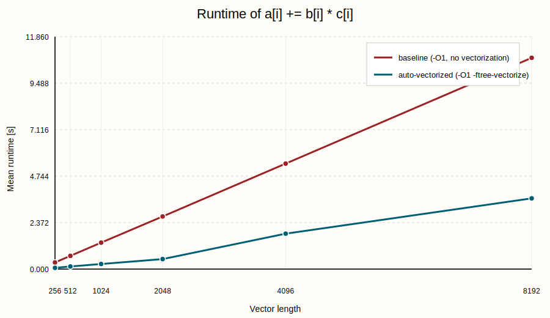
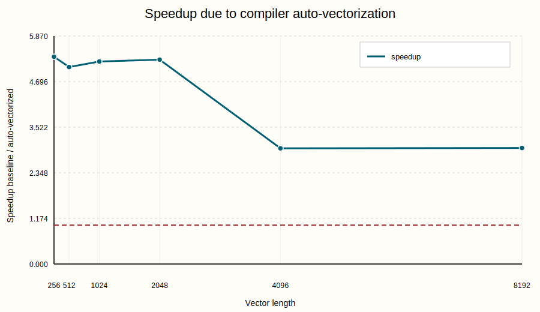
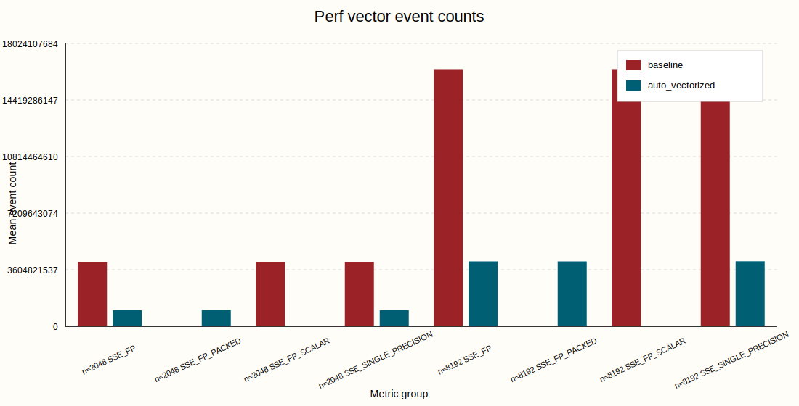

# Assignment 10

Team: Maya Krumholz & Marie Sagerer

## Exercise 1

### 1. Erklärung der Aufgabe

In dieser Aufgabe soll untersucht werden, ob sich eine einfache numerische Schleife allein durch Compiler-Auto-Vektorisierung deutlich beschleunigen lässt.

Die vorgegebene Rechenoperation ist:

```c
a[i] += b[i] * c[i];
```

Diese Schleife soll nicht nur einmal, sondern `1e6` mal ausgeführt werden. Danach soll die Laufzeit der reinen Berechnung gemessen werden. Die Aufgabe verlangt anschließend einen Vergleich zwischen:

- einer sequenziellen Referenzversion
- einer Version mit Compiler-Auto-Vektorisierung

Zusätzlich soll mit `perf` untersucht werden, woher ein möglicher Geschwindigkeitsunterschied kommt.

Die entscheidenden Fragen sind also:

1. Wird die Schleife tatsächlich vektorisiert?
2. Bleibt das Ergebnis korrekt?
3. Wie groß ist der Geschwindigkeitsgewinn?
4. Zeigen die `perf`-Zähler tatsächlich SIMD-Ausführung?


### 2. Was bedeutet Vektorisierung?

Bei einer normalen skalar ausgeführten Schleife wird pro Instruktion typischerweise nur **ein** Wert verarbeitet.

Bei SIMD-Vektorisierung verarbeitet eine Instruktion mehrere Werte gleichzeitig. Bei `float`-Daten kann ein 128-Bit-SSE-Register zum Beispiel vier `float`-Werte parallel verarbeiten.

Statt also konzeptionell nur

```text
a[i] += b[i] * c[i]
```

auszuführen, kann die CPU intern eher etwas in dieser Art machen:

```text
a[i..i+3] += b[i..i+3] * c[i..i+3]
```

Dadurch sinkt die Anzahl der benötigten Instruktionen deutlich.

#### Wann kann ein Compiler gut vektorisieren?

Eine Schleife ist besonders gut geeignet, wenn:

- jede Iteration unabhängig von den anderen ist
- die Speicherzugriffe regelmäßig und zusammenhängend sind
- keine komplizierten Seiteneffekte oder Funktionsaufrufe innerhalb der Schleife vorkommen

Die gegebene Schleife ist genau so ein günstiger Fall:

- `a[i]` hängt nur von `a[i]`, `b[i]` und `c[i]` ab
- es gibt keine offensichtige Abhängigkeit zwischen `i` und `i+1`
- alle Daten werden linear durchlaufen

#### Warum ist der Vergleich mit `-O1` wichtig?

Die Aufgabe verlangt, die Änderung möglichst auf die Vektorisierung zu beschränken. Deshalb wurde nicht einfach auf `-O3` gewechselt, sondern gezielt verglichen:

- `-O1 -fno-tree-vectorize`
- `-O1 -ftree-vectorize`

So bleibt die Grundoptimierung ähnlich, und der Unterschied ist hauptsächlich die Auto-Vektorisierung.

#### Warum ist `perf` hier hilfreich?

Die Laufzeit allein zeigt nur, **dass** eine Version schneller ist.

`perf` hilft dabei zu zeigen, **warum** sie schneller ist.

Besonders interessant sind dabei diese Ereignisse:

- `FP_COMP_OPS_EXE.SSE_FP`
- `FP_COMP_OPS_EXE.SSE_FP_PACKED`
- `FP_COMP_OPS_EXE.SSE_FP_SCALAR`
- `FP_COMP_OPS_EXE.SSE_SINGLE_PRECISION`

Diese Ereignisse zählen nicht einfach nur allgemein Instruktionen, sondern unterscheiden genauer, **in welcher Form Gleitkommaoperationen ausgeführt wurden**.

`FP_COMP_OPS_EXE.SSE_FP` ist dabei der allgemeine Oberbegriff für Gleitkommaoperationen, die über SSE-Instruktionen ausgeführt werden.

`FP_COMP_OPS_EXE.SSE_FP_PACKED` zählt **gepackte** SSE-Gleitkommaoperationen. Gepackt bedeutet hier, dass eine Instruktion mehrere Werte gleichzeitig verarbeitet. Bei `float` und 128-Bit-SSE sind das typischerweise vier Werte auf einmal. Genau das ist der eigentliche SIMD-Effekt: mehrere Datenwerte werden mit einer einzigen Instruktion bearbeitet.

`FP_COMP_OPS_EXE.SSE_FP_SCALAR` zählt dagegen **skalare** SSE-Gleitkommaoperationen. Skalar bedeutet, dass eine Instruktion nur einen einzelnen Wert verarbeitet. Diese Zählung ist deshalb wichtig, weil sie zeigt, ob die Berechnung noch weitgehend elementweise ausgeführt wird.

`FP_COMP_OPS_EXE.SSE_SINGLE_PRECISION` zählt SSE-Gleitkommaoperationen mit einfacher Genauigkeit, also `float`. Dieses Ereignis passt hier besonders gut zur Aufgabe, weil die verwendeten Arrays genau diesen Datentyp besitzen.

Für die Interpretation sind vor allem `SSE_FP_PACKED` und `SSE_FP_SCALAR` entscheidend:

- ein hoher Wert bei `SSE_FP_PACKED` bedeutet, dass viele Gleitkommaoperationen in SIMD-Paketen ausgeführt werden
- ein hoher Wert bei `SSE_FP_SCALAR` bedeutet, dass viele Operationen weiterhin skalar, also einzeln, ausgeführt werden

Wenn die vektorisierte Version wirklich SIMD nutzt, dann sollte deshalb:

- `SSE_FP_PACKED` deutlich steigen
- `SSE_FP_SCALAR` stark sinken

Genau das ist später ein sehr guter Nachweis dafür, dass eine Laufzeitverbesserung nicht zufällig entstanden ist, sondern tatsächlich aus der Umstellung von skalarer auf gepackte SIMD-Ausführung stammt.


### 3. Umsetzung mit dem Code

Verwendete Dateien:

- Programm: [10/ex1/vector_add.c](/Users/mayakrumholz/Desktop/Uni/5_Semester/Parallele_Programmierung/ps_parprog_2026/10/ex1/vector_add.c)
- Build-Datei: [10/ex1/Makefile](/Users/mayakrumholz/Desktop/Uni/5_Semester/Parallele_Programmierung/ps_parprog_2026/10/ex1/Makefile)
- Jobscript: [10/ex1/job.sh](/Users/mayakrumholz/Desktop/Uni/5_Semester/Parallele_Programmierung/ps_parprog_2026/10/ex1/job.sh)
- Auswertung: [10/ex1/analyze_results.py](/Users/mayakrumholz/Desktop/Uni/5_Semester/Parallele_Programmierung/ps_parprog_2026/10/ex1/analyze_results.py)

#### 3.1 Die eigentliche Rechenschleife

```c
__attribute__((noinline))
static void run_kernel(float *restrict a,
                       const float *restrict b,
                       const float *restrict c,
                       int size,
                       int repetitions) {
    for (int run = 0; run < repetitions; ++run) {
        for (int i = 0; i < size; ++i) {
            a[i] += b[i] * c[i];
        }
    }
}
```

Wichtige Punkte:

- `noinline`
  verhindert, dass der Compiler die Funktion einfach in `main` hineinzieht. Dadurch bleibt der zu messende Codebereich klar abgegrenzt.
- `restrict`
  sagt dem Compiler, dass `a`, `b` und `c` nicht auf denselben Speicher zeigen. Das hilft der Vektorisierungsanalyse, weil weniger konservative Alias-Annahmen nötig sind.
- zwei Schleifen
  die äußere Schleife mit `repetitions` sorgt dafür, dass die Laufzeit groß genug wird. Die innere Schleife ist die eigentlich interessante Datenparallelität über `i`.

#### 3.2 Initialisierung der Vektoren

```c
static void initialize_vectors(float *a, float *b, float *c, int size) {
    for (int i = 0; i < size; ++i) {
        a[i] = 1.0f;
        b[i] = 0.5f;
        c[i] = 0.25f;
    }
}
```

Diese Werte wurden bewusst so gewählt, dass:

- die Rechnung leicht nachvollziehbar bleibt
- kein Overflow entsteht
- die Korrektheit einfach überprüft werden kann

Denn pro Iteration gilt:

```text
b[i] * c[i] = 0.5 * 0.25 = 0.125
```

Nach `1e6` Wiederholungen ist damit für jedes Element zu erwarten:

```text
a[i] = 1.0 + 1000000 * 0.125 = 125001.0
```

#### 3.3 Speicherallokation

```c
float *a = xaligned_alloc(64, bytes);
float *b = xaligned_alloc(64, bytes);
float *c = xaligned_alloc(64, bytes);
```

Das ist für die Aufgabe nicht zwingend, aber sinnvoll:

- ausgerichtete Daten sind günstiger für SIMD-Zugriffe
- der Compiler und die Hardware bekommen damit bessere Voraussetzungen für regelmäßige Vektoroperationen

#### 3.4 Zeitmessung nur für die Berechnung

```c
double start = now_seconds();
run_kernel(a, b, c, size, repetitions);
double elapsed = now_seconds() - start;
```

Gemessen wird also nur:

- die eigentliche Schleifenrechnung

Nicht mitgemessen werden:

- Speicherallokation
- Initialisierung
- Korrektheitsprüfung
- Ausgabe

#### 3.5 Korrektheitsprüfung

```c
float expected_value = init_a + (float)repetitions * increment;
double expected_checksum = (double)size * (double)expected_value;
```

Zusätzlich werden Stichprobenwerte geprüft:

- `sample0`
- `samplemid`
- `samplelast`

und als Status `ok` oder `mismatch` ausgegeben.

#### 3.6 Zwei Compiler-Varianten

Der Vergleich wird mit zwei Programmen umgesetzt:

```make
baseline:
	gcc ... -O1 -fno-tree-vectorize ...

auto_vectorized:
	gcc ... -O1 -ftree-vectorize ...
```

Damit entsteht:

- `baseline` als Referenz ohne Auto-Vektorisierung
- `auto_vectorized` mit eingeschalteter Compiler-Vektorisierung

#### 3.7 Was das Jobscript auf LCC3 macht

Es macht im Wesentlichen diese Schritte:

1. beide Varianten bauen
2. mehrere Problemgrößen messen
3. jede Konfiguration `5` mal ausführen
4. alle Rohdaten in `results/time_results.csv` schreiben
5. `perf` für ausgewählte Größen ausführen
6. `perf`-Rohdaten in `results/perf_results.csv` sammeln
7. am Ende Tabellen und Grafiken erzeugen

Gemessene Größen:

```text
256, 512, 1024, 2048, 4096, 8192
```

Zusätzliche `perf`-Messungen:

```text
2048 und 8192
```


### 4. Was man vor den Ergebnissen erwarten kann und warum

Vor der Messung ist fachlich zu erwarten, dass die auto-vektorisierte Version schneller ist.

Der Grund:

- bei `float` kann SSE mehrere Werte gleichzeitig bearbeiten
- die Schleife hat keine problematischen Abhängigkeiten
- die Speicherzugriffe sind zusammenhängend

Man würde also vermuten:

1. Die Baseline nutzt vor allem skalare Gleitkommaoperationen.
2. Die auto-vektorisierte Version nutzt gepackte SIMD-Operationen.
3. Die Laufzeit sinkt deutlich.
4. Der Speedup hängt von der Problemgröße ab.

Warum hängt der Speedup von der Problemgröße ab?

- Bei kleineren Datenmengen dominiert eher die reine Rechenstruktur.
- Bei größeren Datenmengen spielen zusätzlich Speicherzugriffe, Cache-Verhalten und Bandbreite eine größere Rolle.

Deshalb ist kein konstanter Speedup zu erwarten.

Außerdem sollte das Compiler-Reporting zeigen, dass die **innere Schleife** vektorisiert wurde, auch wenn die äußere Wiederholungsschleife selbst nicht vektorisiert wird.


### 5. Ergebnisse und Einordnung

Die Messungen auf LCC3 wurden erfolgreich durchgeführt. Alle Läufe liefern `status=ok`.


#### 5.1 Laufzeitergebnisse

Die gemittelten Laufzeiten sind:

| Size | Baseline mean [s] | Auto-vectorized mean [s] | Speedup |
| --- | ---: | ---: | ---: |
| 256 | 0.338855 | 0.063496 | 5.337 |
| 512 | 0.675002 | 0.133095 | 5.072 |
| 1024 | 1.349851 | 0.258918 | 5.213 |
| 2048 | 2.685649 | 0.510449 | 5.261 |
| 4096 | 5.383164 | 1.807423 | 2.978 |
| 8192 | 10.781906 | 3.609614 | 2.987 |

#### 5.2 Analyse der Laufzeitgrafik

Die Grafik [runtime_by_size.svg](/Users/mayakrumholz/Desktop/Uni/5_Semester/Parallele_Programmierung/ps_parprog_2026/10/ex1/results/plots/runtime_by_size.svg:1) zeigt:



- beide Varianten werden mit wachsender Vektorgröße langsamer
- die auto-vektorisierte Version liegt durchgehend klar unter der Baseline

Das bestätigt, dass der Compiler aus derselben mathematischen Operation deutlich effizienteren Maschinencode erzeugen konnte.

Interessant ist außerdem:

- für `256` bis `2048` liegt der Speedup bei ungefähr Faktor `5`
- ab `4096` fällt er auf ungefähr Faktor `3`

#### 5.3 Analyse der Speedup-Grafik

Die Grafik [speedup_by_size.svg](/Users/mayakrumholz/Desktop/Uni/5_Semester/Parallele_Programmierung/ps_parprog_2026/10/ex1/results/plots/speedup_by_size.svg:1) macht genau diesen Effekt sichtbar.



Interpretation:

- Bei kleineren und mittleren Größen dominiert der Vorteil der SIMD-Rechenoperationen sehr stark.
- Bei größeren Größen begrenzen Speicherzugriffe und Datenbewegung den Gewinn stärker.

Das ist ein typisches Verhalten:

- Rechenoptimierung allein hilft besonders dann stark, wenn die Anwendung eher compute-lastig ist.
- Sobald Speicherverhalten wichtiger wird, sinkt der relative Vorteil.

#### 5.4 Analyse der `perf`-Ergebnisse

Die `perf`-Zusammenfassung zeigt für `size = 2048`:

Baseline:

- `cycles:u = 8221671739`
- `instructions:u = 14340876604`
- `r1010:u = 0`
- `r2010:u = 4096079894`

Auto-vectorized:

- `cycles:u = 1558282112`
- `instructions:u = 4616753590`
- `r1010:u = 1023529106`
- `r2010:u = 4`

Bedeutung:

- `r1010:u` entspricht `SSE_FP_PACKED`
- `r2010:u` entspricht `SSE_FP_SCALAR`

Damit sieht man sehr klar:

- Die Baseline verwendet praktisch **keine** gepackten SIMD-FP-Operationen.
- Die auto-vektorisierte Version verwendet sehr viele gepackte SIMD-FP-Operationen.
- Gleichzeitig verschwinden die skalaren FP-Operationen fast vollständig.

Genau das ist der erwartete Beweis dafür, dass die Beschleunigung wirklich aus Vektorisierung stammt.

Dasselbe Bild zeigt sich auch bei `size = 8192`:

- Baseline: `r1010:u = 0`
- Auto-vectorized: `r1010:u = 4135578372`

Die Grafik [perf_vector_events.svg](/Users/mayakrumholz/Desktop/Uni/5_Semester/Parallele_Programmierung/ps_parprog_2026/10/ex1/results/plots/perf_vector_events.svg:1) visualisiert diesen Unterschied sehr gut:



- rot: Baseline
- blau: auto-vektorisierte Version

Besonders wichtig ist dort:

- blau ist bei `SSE_FP_PACKED` sehr hoch
- rot ist dort praktisch null
- rot ist bei `SSE_FP_SCALAR` sehr hoch
- blau ist dort nahezu null

Diese Grafik eignet sich deshalb besonders gut für die Abgabe, weil sie den Kern der Aufgabe direkt sichtbar macht.

#### 5.5 Compiler-Report zur Vektorisierung

Der Compiler-Report in [10/ex1/report/raw/auto_vec_report.txt](/Users/mayakrumholz/Desktop/Uni/5_Semester/Parallele_Programmierung/ps_parprog_2026/10/ex1/report/raw/auto_vec_report.txt:1) enthält die entscheidenden Zeilen:

```text
vector_add.c:45:27: optimized: loop vectorized using 16 byte vectors
vector_add.c:45:27: optimized: loop vectorized using 8 byte vectors
```

Das zeigt:

- die innere Schleife wurde tatsächlich vektorisiert
- der Compiler hat also genau die relevante Rechenschleife erfolgreich in SIMD-Code umgesetzt

Außerdem steht dort:

```text
vector_add.c:44:27: missed: couldn't vectorize loop
vector_add.c:44:27: missed: not vectorized: control flow in loop.
```

Das ist unkritisch, weil sich diese Meldung auf die äußere Wiederholungsschleife bezieht. Für die Performance ist hier vor allem entscheidend, dass die innere Daten-Schleife vektorisiert wurde.


### 6. Fazit

Die Aufgabe zeigt sehr deutlich, dass Auto-Vektorisierung bei einer geeigneten Schleifenstruktur einen großen Geschwindigkeitsgewinn bringen kann.

Die wichtigsten Ergebnisse sind:

1. Die Berechnung bleibt korrekt.
2. Der Compiler vektorisiert die innere Schleife tatsächlich.
3. Für `size = 2048` ergibt sich ein Speedup von `5.261`.
4. Für kleinere und mittlere Größen liegt der Speedup ungefähr bei Faktor `5`.
5. Für größere Größen sinkt der Speedup auf ungefähr Faktor `3`, was auf stärkeren Einfluss des Speicherverhaltens hinweist.
6. Die `perf`-Zähler bestätigen, dass die auto-vektorisierte Variante gepackte SIMD-Instruktionen nutzt, während die Baseline überwiegend skalare FP-Operationen ausführt.

Insgesamt ist die Beobachtung also konsistent:

- Der Compiler erkennt die Schleife als guten SIMD-Kandidaten.
- Die erzeugten Vektoroperationen reduzieren die Zahl der benötigten Instruktionen und Zyklen deutlich.
- Der Performancegewinn ist real, messbar und durch `perf` sauber nachvollziehbar.


## Exercise 2

### 1. Erklärung der Aufgabe

In Exercise 2 soll dieselbe Grundrechnung nicht mehr durch Compiler-Auto-Vektorisierung, sondern **manuell mit OpenMP-SIMD** vektorisiert werden.

Die Aufgabenstellung verlangt dabei ausdrücklich:

- OpenMP für Vektorisierung zu verwenden
- **keine** thread-basierte Parallelisierung zu benutzen
- die OpenMP-SIMD-Version mit der sequenziellen Referenz und der Compiler-Version aus Exercise 1 zu vergleichen
- den Vergleich zusätzlich für `double` statt `float` zu wiederholen
- die Beobachtungen wieder mit `perf` zu überprüfen

Die Kernfrage ist also diesmal nicht mehr:

- „Kann der Compiler die Schleife selbst vektorisieren?“

sondern:

- „Was passiert, wenn wir dem Compiler die SIMD-Parallelität mit OpenMP explizit vorgeben?“


### 2. Welches Thema man dafür verstehen muss

Der wichtige neue Punkt in Exercise 2 ist der Unterschied zwischen:

- OpenMP für **Threads**
- OpenMP für **SIMD**

Viele verbinden OpenMP zuerst mit `#pragma omp parallel for`. Das würde aber mehrere Threads starten und die Arbeit auf mehrere Kerne verteilen. Genau das ist hier **nicht** erlaubt.

Stattdessen wird hier nur:

```c
#pragma omp simd
```

verwendet.

Diese Direktive sagt dem Compiler:

- die Iterationen dieser Schleife dürfen SIMD-parallel ausgeführt werden
- es sollen aber **keine zusätzlichen Threads** erzeugt werden

Man arbeitet also weiterhin nur auf **einem Kern**, nutzt aber innerhalb dieses Kerns die Vektorregister breiter aus.

Für das Verständnis ist außerdem wichtig:

- `float` bedeutet einfache Genauigkeit und erlaubt bei SSE mehr Werte pro Vektorregister
- `double` bedeutet doppelte Genauigkeit und benötigt pro Wert mehr Platz

Bei 128-Bit-SSE gilt grob:

- `float`: bis zu 4 Werte pro Vektor
- `double`: bis zu 2 Werte pro Vektor

Deshalb ist zu erwarten, dass Vektorisierung bei `double` tendenziell einen geringeren relativen Gewinn zeigt als bei `float`.


### 3. Umsetzung mit dem Code

Verwendete Dateien:

- Programm: [10/ex2/vector_add_typed.c](/Users/mayakrumholz/Desktop/Uni/5_Semester/Parallele_Programmierung/ps_parprog_2026/10/ex2/vector_add_typed.c)
- Build-Datei: [10/ex2/Makefile](/Users/mayakrumholz/Desktop/Uni/5_Semester/Parallele_Programmierung/ps_parprog_2026/10/ex2/Makefile)
- Jobscript: [10/ex2/job.sh](/Users/mayakrumholz/Desktop/Uni/5_Semester/Parallele_Programmierung/ps_parprog_2026/10/ex2/job.sh)
- Auswertung: [10/ex2/analyze_results.py](/Users/mayakrumholz/Desktop/Uni/5_Semester/Parallele_Programmierung/ps_parprog_2026/10/ex2/analyze_results.py)

#### 3.1 Gemeinsames Benchmark-Programm für `float` und `double`

Das Programm ist so aufgebaut, dass derselbe Quellcode für mehrere Varianten kompiliert wird.

Wichtige Makros am Anfang von [10/ex2/vector_add_typed.c](/Users/mayakrumholz/Desktop/Uni/5_Semester/Parallele_Programmierung/ps_parprog_2026/10/ex2/vector_add_typed.c:1):

- `DATA_TYPE`
- `TYPE_NAME`
- `VARIANT_NAME`

Dadurch kann derselbe Code als

- `float`
- `double`
- Baseline
- Auto-Vektorisierung
- OpenMP-SIMD

gebaut werden, ohne Logik doppelt schreiben zu müssen.

#### 3.2 Die SIMD-relevante Schleife

Die zentrale Funktion steht in [10/ex2/vector_add_typed.c](/Users/mayakrumholz/Desktop/Uni/5_Semester/Parallele_Programmierung/ps_parprog_2026/10/ex2/vector_add_typed.c:53):

```c
for (run = 0; run < repetitions; ++run) {
#ifdef USE_OMP_SIMD
#pragma omp simd
#endif
    for (int i = 0; i < size; ++i) {
        a[i] += b[i] * c[i];
    }
}
```

Der entscheidende Punkt ist:

- nur in den OpenMP-SIMD-Varianten ist `USE_OMP_SIMD` gesetzt
- dann wird vor die innere Schleife `#pragma omp simd` gesetzt
- dadurch wird keine Thread-Parallelität aktiviert, sondern nur SIMD-Vektorisierung angefordert

#### 3.3 Warum `-fopenmp-simd` und nicht `-fopenmp`?

In [10/ex2/Makefile](/Users/mayakrumholz/Desktop/Uni/5_Semester/Parallele_Programmierung/ps_parprog_2026/10/ex2/Makefile:1) werden die OpenMP-SIMD-Varianten mit `-fopenmp-simd` kompiliert.

Das ist hier passend, weil:

- SIMD-Direktiven unterstützt werden
- keine vollständige Thread-OpenMP-Laufzeit nötig ist
- die Lösung damit näher an der Aufgabenidee bleibt: SIMD ja, Threads nein

Zusätzlich wird für die OpenMP-SIMD-Varianten wieder `-fno-tree-vectorize` gesetzt. Dadurch soll vermieden werden, dass der Compiler dieselbe Schleife zusätzlich wegen seiner normalen Auto-Vektorisierung optimiert. So bleibt der Unterschied möglichst auf die OpenMP-SIMD-Direktive beschränkt.

#### 3.4 Gebaute Varianten

Das Makefile erzeugt fünf Programme:

- `baseline_float`
- `auto_float`
- `omp_simd_float`
- `baseline_double`
- `omp_simd_double`

Damit lassen sich alle für Exercise 2 wichtigen Vergleiche in einem Durchgang messen:

- `float`: Baseline vs. Auto vs. OpenMP-SIMD
- `double`: Baseline vs. OpenMP-SIMD

#### 3.5 Was das Jobscript misst

Das Jobscript in [10/ex2/job.sh](/Users/mayakrumholz/Desktop/Uni/5_Semester/Parallele_Programmierung/ps_parprog_2026/10/ex2/job.sh:1) misst genau die in der Aufgabe geforderte Größe:

- `size = 2048`
- `repetitions = 1000000`

Jede Variante wird `5` mal ausgeführt.

Zusätzlich wird für jede Variante `perf stat` ausgeführt.

Gemessen werden:

- `cycles`
- `instructions`
- `r0410` = `SSE_FP`
- `r1010` = `SSE_FP_PACKED`
- `r2010` = `SSE_FP_SCALAR`
- `r4010` = `SSE_SINGLE_PRECISION`
- `r8010` = `SSE_DOUBLE_PRECISION`

Dadurch können wir später sowohl die `float`- als auch die `double`-Variante passend interpretieren.

#### 3.6 Automatische Auswertung

Nach dem LCC3-Lauf erzeugt die Auswertung automatisch:

- `10/ex2/results/time_results.csv`
- `10/ex2/results/perf_results.csv`
- `10/ex2/results/summary_table.md`
- `10/ex2/results/perf_summary.md`
- `10/ex2/results/plots/runtime_variants.svg`
- `10/ex2/results/plots/float_variant_comparison.svg`
- `10/ex2/results/plots/perf_variant_events.svg`


### 4. Was man vor den Ergebnissen erwarten kann und warum

Vor der Messung ist fachlich zu erwarten:

1. `omp_simd_float` sollte deutlich schneller sein als `baseline_float`.
2. `omp_simd_float` könnte ähnlich schnell wie `auto_float` sein, eventuell etwas langsamer oder etwas schneller.
3. `omp_simd_double` sollte ebenfalls schneller sein als `baseline_double`.
4. Der relative Gewinn bei `double` dürfte kleiner ausfallen als bei `float`.

Warum könnte OpenMP-SIMD ähnlich wie Auto-Vektorisierung sein?

Weil in beiden Fällen am Ende SIMD-Maschinencode entstehen soll. Der Unterschied liegt eher darin, **wer dem Compiler die Parallelität mitteilt**:

- bei Exercise 1 erkennt der Compiler sie selbst
- bei Exercise 2 geben wir sie explizit mit einer Direktive vor

Vorteil von OpenMP-SIMD:

- man kann dem Compiler klar signalisieren, dass die Schleife SIMD-geeignet ist

Nachteil:

- der Code ist weniger rein „sequenziell“
- man bindet eine Optimierungsabsicht direkt an den Quellcode


### 5. Ergebnisse und Einordnung

Die finale Ergebnisinterpretation wird ergänzt, sobald die echten LCC3-Daten für `10/ex2` vorliegen.

Nach dem Clusterlauf sollen hier eingetragen und besprochen werden:

- mittlere Laufzeit von `baseline_float`
- mittlere Laufzeit von `auto_float`
- mittlere Laufzeit von `omp_simd_float`
- Vergleich `baseline_double` vs. `omp_simd_double`
- Interpretation von `SSE_FP_PACKED` und `SSE_FP_SCALAR`
- Interpretation von `SSE_SINGLE_PRECISION` und `SSE_DOUBLE_PRECISION`
- Einordnung der drei erzeugten Grafiken


### 6. Vorbereitung für den LCC3-Lauf

Für Exercise 2 sind jetzt alle Materialien vorbereitet. Auf dem Cluster sind dann nur diese Schritte nötig:

```bash
cd 10/ex2
sbatch job.sh
```

Wichtige Ergebnisdateien danach:

- `10/ex2/job_ex2.log`
- `10/ex2/results/time_results.csv`
- `10/ex2/results/perf_results.csv`
- `10/ex2/results/summary_table.md`
- `10/ex2/results/perf_summary.md`
- `10/ex2/results/plots/*.svg`
